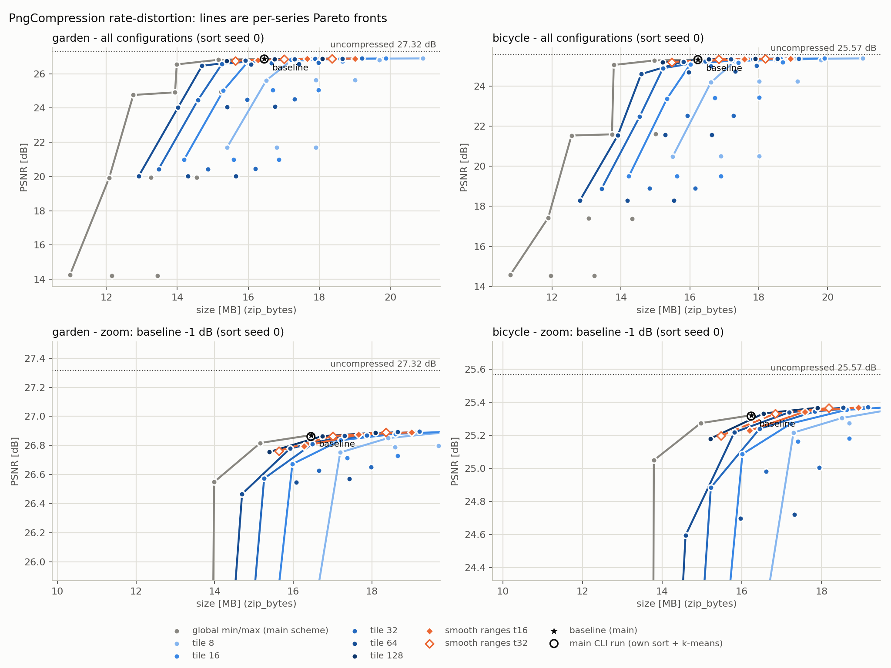
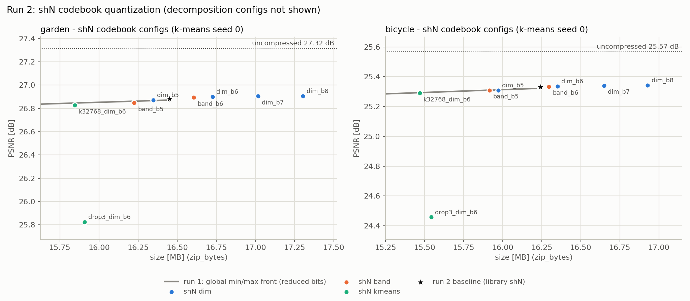
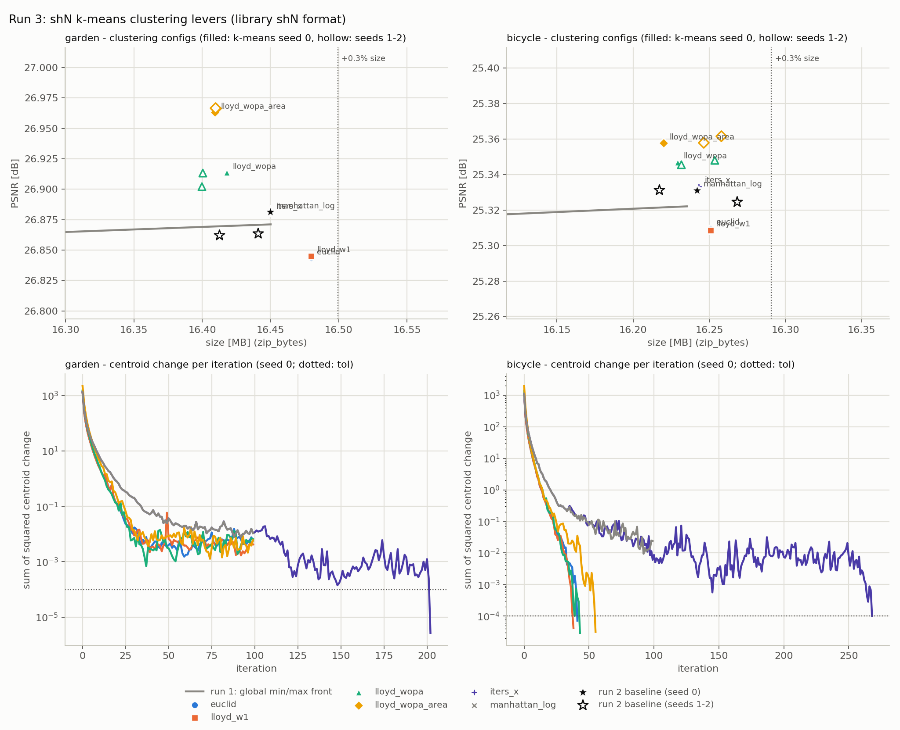
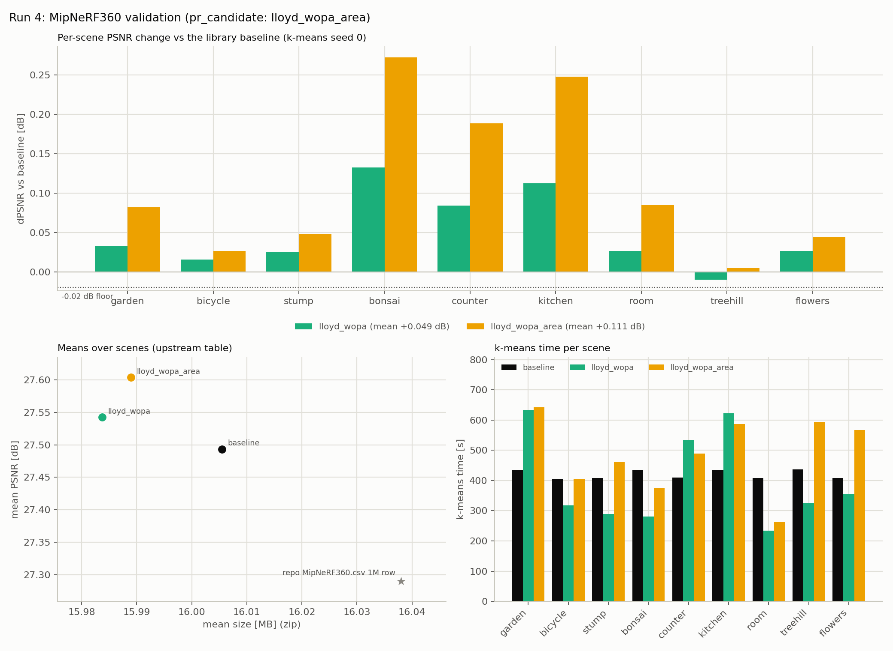
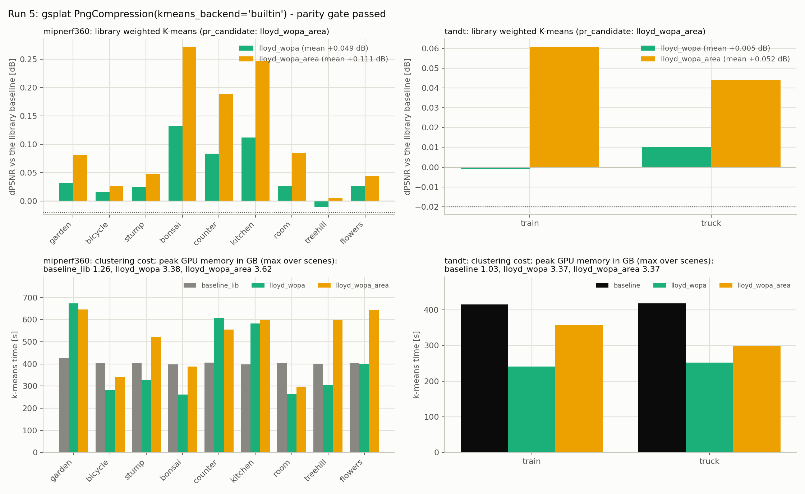

# Findings: tile-wise PNG quantization and the shN codebook in gsplat `PngCompression`

**Runs 1-2 (sections 1-2):** no tile-wise or smooth-range config beats the current global per-channel
min/max scheme, and no shN codebook quantization change beats the library default. Most of the
remaining compression loss is in the shN k-means clustering, not in quantization.

**Run 3 (section 4) found the lever:** weighted Lloyd k-means with opacity x footprint-area weights
(`lloyd_wopa_area`) raises PSNR and lowers LPIPS on garden and bicycle at all 3 k-means seeds
(+0.096 / +0.030 dB mean PSNR). The strict pre-set rule (`pr_worthy`) failed only on two garden SSIM
cells, both inside the baseline's own SSIM spread over k-means seeds.

**Run 4 (section 5) validated it** on all 9 MipNeRF360 scenes of `mcmc.sh`, under a rule fixed before
the run: `lloyd_wopa_area` gains **+0.111 dB** mean PSNR at **-0.10%** mean size and is better on
every scene.

**Run 5 (section 6) measured the library code** (branch `feat/png-weighted-kmeans`). It reproduces
the benchmark rows exactly (parity gate passed, and identical rows on all 9 MipNeRF360 scenes) and
passes the same rule on Tanks & Temples: **+0.052 dB** mean PSNR on train / truck at +0.08% mean size.
Cost: k-means 510 s vs 405 s mean on MipNeRF360 and 328 s vs 416 s on Tanks & Temples; peak GPU
memory 3.37-3.62 GB vs 1.03-1.26 GB.

**E0 (section 8, branch `bench/gn-vq`): pending.** Does a Gauss-Newton metric on shN predict the
rendering error of shN quantization? Pre-registered in `kaggle/PREREG_GN.md`; not run yet.

## Sources

- Sections 1 and 2: every number comes from `kaggle/run2/tilequant/` (one Kaggle session on 2x T4, gsplat
  commit `b0998765`, `bench/tilequant`). That session restored nothing from earlier runs: it rebuilt
  the gsplat wheel, trained both scenes from scratch ("training #2") and ran all run-1 and run-2
  configs on those checkpoints, so the numbers are self-consistent.
- Section 3: training #1 (earlier Kaggle session); numbers from its `decision.json` and CSV,
  as reported by Dace. Its files are not in this repository.
- Section 5: every number comes from `kaggle/run4/tilequant/` (one Kaggle session, gsplat commit
  `f7ce5262`). It restored the run-3 output, reused the garden / bicycle checkpoints and their rows
  (training #2, commits `b0998765` and `f9b61526`) and trained the other 7 scenes itself.
- Section 6: every number comes from `kaggle/run5/tilequant/` (one Kaggle session, gsplat commit
  `3bc8eb6c`). It restored the run-4 output, rebuilt the gsplat wheel, reused the 9 run-4 MipNeRF360
  checkpoints and trained the 2 Tanks & Temples scenes itself. Two bundle files were regenerated
  locally from the bundle's own result files after a label fix (commit `1b4d40f8`):
  `run5_tt_table.csv` (only its reference-row label changes) and `rd_run5.png` (memory in decimal GB,
  titles no longer overlap). Every other file is as downloaded.
- Section 4: every number comes from `kaggle/run3/tilequant/` (one Kaggle session, gsplat commit
  `f9b61526`). That session restored the run-2 output (training #2 checkpoints, seed-0 PLAS sort,
  run-1 / run-2 rows, gsplat wheel) and ran only the run-3 configs, so run-3 rows pair with the
  run-2 rows of the same checkpoints. 14 of its 22 files are byte-identical to `run2/tilequant/`;
  `timings.json` keeps the run-2 entries, with install / smoke / data overwritten by this session and
  the run-3 jobs added.

Setup: MipNeRF360 garden and bicycle, `examples/benchmarks/compression/mcmc.sh` settings (MCMC, 1M
Gaussians, data factor 4, LPIPS VGG). Size = `zip -r` of the compression directory, as in
`summarize_stats.py` (`zip_bytes`); raw file bytes (`size_bytes`) move the same way here. Unless noted:
PLAS sort seed 0, k-means seed 0. U = uncompressed PSNR of the same checkpoint.

### Sanity gate (`run2/tilequant/sanity_gate.json`)

Current-main CLI run (`mcmc.sh` eval command), no failures, no warnings:

| Scene | U (dB) | Compressed (dB) | Drop (dB) | zip bytes | zip vs repo 1M row | #Gaussians |
|---|---|---|---|---|---|---|
| garden | 27.315 | 26.862 | 0.453 | 16,449,239 | +2.6% | 1,000,000 |
| bicycle | 25.568 | 25.317 | 0.251 | 16,233,444 | +1.2% | 1,000,000 |

The repo row (`results/MipNeRF360.csv`, 1M) is a mean over 9 scenes, so only the drop and #Gaussians
are hard checks.

## 1. Tile-wise and smooth ranges (training #2)

Decision (`run2/tilequant/decision.json`): **`pr_worthy` = false, `tile_effect` = false, `global_only` = false.**

### At baseline bits (means 16, others 8)

| Config | garden dPSNR | garden zip | bicycle dPSNR | bicycle zip |
|---|---|---|---|---|
| `baseline` (global min/max) | 26.871 dB | 16,450,113 B | 25.322 dB | 16,235,216 B |
| `t8_m16_o8` | +0.027 | +27.1% | +0.054 | +29.5% |
| `t16_m16_o8` | +0.023 | +20.8% | +0.052 | +22.7% |
| `t32_m16_o8` | +0.025 | +16.7% | +0.050 | +18.1% |
| `t64_m16_o8` | +0.021 | +13.4% | +0.046 | +14.2% |
| `t128_m16_o8` | +0.016 | +9.9% | +0.045 | +10.2% |
| `smooth_t16_m16_o8` | +0.019 | +15.5% | +0.047 | +16.6% |
| `smooth_t32_m16_o8` | +0.020 | +11.6% | +0.044 | +12.0% |

Tiles reduce quantization error a little, and cost far more bytes than they save in PSNR.

### Boundary cost: plain tiles vs smooth ranges

PNG bytes of the plain tile config minus the smooth-range config at the same tile size and bits
(means 16 bits):

| Tile | Other bits | garden | bicycle |
|---|---|---|---|
| 16 | 8 | 0.87 MB | 0.99 MB |
| 16 | 7 | 0.93 MB | 1.05 MB |
| 16 | 6 | 0.92 MB | 1.04 MB |
| 32 | 8 | 0.85 MB | 0.98 MB |
| 32 | 7 | 0.87 MB | 1.00 MB |
| 32 | 6 | 0.85 MB | 0.97 MB |

Removing the range jumps at tile boundaries saves 0.85-1.05 MB of PNG bytes, but smooth ranges are
still +11.6% / +12.0% zip at tile 32 and baseline bits.

### Against the global reduced-bit front

The global front (baseline plus global configs with fewer bits) is `global_m8_o6`, `global_m10_o6`,
`global_m12_o6`, `global_m12_o7`, `global_m16_o6`, `global_m16_o7`, `baseline` on both scenes. All
22 tile and smooth configs whose zip size falls inside the front's size range sit below it at matched
size (linear interpolation):

| Scene | Best tile/smooth config | Margin to the global front |
|---|---|---|
| garden | `smooth_t16_m16_o6` | -0.068 dB |
| bicycle | `t64_m16_o6` | -0.087 dB |

For reference, `global_m16_o7` (other params at 7 bits): -0.054 / -0.048 dB at -7.8% / -7.8% zip.

### The collapse regime

With 8-bit means the global scheme collapses and tiles recover most of it:

| Other bits | garden global | garden tile 8 | bicycle global | bicycle tile 8 |
|---|---|---|---|---|
| 8 | 14.20 dB | 21.70 dB | 14.53 dB | 20.50 dB |
| 7 | 14.20 dB | 21.70 dB | 14.54 dB | 20.50 dB |
| 6 | 14.26 dB | 21.70 dB | 14.57 dB | 20.49 dB |

gsplat stores the log-transformed means with 16 bits, so its default never enters this regime.

### What is left for the PNG params

| Scene | U - baseline | U - best PNG-param config | Best config |
|---|---|---|---|
| garden | 0.444 dB | 0.417 dB | `t8_m16_o8` (+27.1% zip) |
| bicycle | 0.246 dB | 0.192 dB | `t8_m16_o8` (+29.5% zip) |

Even the best PNG-param config leaves most of the loss in place, which points at shN (section 2).

### PLAS sort-seed robustness

Paired deltas against the baseline of the same sort seed, for the 3 configs picked from seed 0:

| Config | Scene | dPSNR (seeds 0 / 1 / 2) | zip (seeds 0 / 1 / 2) |
|---|---|---|---|
| `global_m16_o7` | garden | -0.054 / -0.054 / -0.054 | -7.84% / -7.84% / -7.84% |
| `global_m16_o7` | bicycle | -0.048 / -0.048 / -0.048 | -7.81% / -7.81% / -7.81% |
| `smooth_t16_m16_o6` | garden | -0.075 / -0.086 / -0.081 | -1.06% / -1.02% / -1.03% |
| `smooth_t16_m16_o6` | bicycle | -0.093 / -0.090 / -0.096 | -0.26% / -0.26% / -0.26% |
| `t64_m16_o6` | garden | -0.091 / -0.093 / -0.090 | -3.21% / -3.24% / -3.20% |
| `t64_m16_o6` | bicycle | -0.103 / -0.100 / -0.095 | -2.61% / -2.66% / -2.63% |

Global configs have the same PSNR for every sort order: one min/max per channel, and the extra sort
seeds reuse the seed-0 k-means centroids (baseline PSNR 26.871 / 25.322 dB on all three seeds). None of
the three configs beats the baseline on any seed.

### Why

At 16-bit means the PNG params are not where the loss is: U - baseline is 0.444 / 0.246 dB and the
best PNG-param config closes only 0.027 / 0.054 dB of it. Tile ranges make the PNG files larger
(tile 8 at baseline bits: +3.73 / +4.05 MB of PNG bytes) and add per-tile bounds on top
(0.73 / 0.74 MB). Smooth ranges remove 0.85-1.05 MB of that PNG growth, not enough to get near the
baseline size. At matched size the global scheme with fewer bits gives more PSNR (front comparison).

## 2. shN codebook (training #2)

`_compress_kmeans` clusters shN into 65,536 centroids (torchpq, manhattan) and quantizes the
65,536 x 45 codebook to 6 bits with one scalar min/max. Decision (`run2/tilequant/shn_decision.json`):
**`pr_worthy` = false.**

### Decomposition (approximate; PSNR losses are not additive)

| Term | garden | bicycle |
|---|---|---|
| U - baseline (total) | 0.434 dB | 0.237 dB |
| U - P (shN loss; PNG params raw float32) | 0.403 dB | 0.176 dB |
| U - S (PNG-param loss; shN raw float32) | 0.034 dB | 0.063 dB |
| S - F (clustering; float centroids vs raw shN) | 0.374 dB | 0.163 dB |
| F - baseline (6-bit centroid quantization) | 0.026 dB | 0.011 dB |

This run-2 baseline re-runs k-means with a fixed seed and caches the float centroids, so its PSNR
(26.881 / 25.331 dB) differs slightly from the section-1 baseline, which used the k-means result of
the sort cache (26.871 / 25.322 dB).

### Configs at k-means seed 0 (deltas vs the run-2 baseline)

| Config | garden dPSNR | garden zip | bicycle dPSNR | bicycle zip |
|---|---|---|---|---|
| `baseline` | 26.881 dB | 16,449,880 B | 25.331 dB | 16,242,031 B |
| `F_float_centroids` | +0.026 | +57.8% | +0.011 | +57.6% |
| `dim_b5` (45 min/max, 5 bits) | -0.010 | -0.6% | -0.022 | -1.7% |
| `dim_b6` | +0.018 | +1.7% | +0.005 | +0.7% |
| `dim_b7` | +0.024 | +3.4% | +0.010 | +2.5% |
| `dim_b8` | +0.026 | +5.2% | +0.011 | +4.2% |
| `band_b5` (9 min/max, 5 bits) | -0.033 | -1.4% | -0.022 | -2.0% |
| `band_b6` | +0.013 | +0.9% | +0.003 | +0.3% |
| `k32768_dim_b6` | -0.054 | -3.7% | -0.041 | -4.8% |
| `drop3_dim_b6` (SH band 3 dropped) | -1.057 | -3.3% | -0.873 | -4.3% |

- `dim_b8` recovers the centroid-quantization share (+0.026 / +0.011 dB vs F - baseline
  0.026 / 0.011 dB) at +5.2% / +4.2% zip. This matches the decomposition, which supports the
  implementation.
- `k32768_dim_b6` sits -0.019 / -0.003 dB from the section-1 global front at its zip size, within the
  baseline's k-means seed spread below.
- `drop3_dim_b6` loses 1.06 / 0.87 dB. Section 4 (`sh2_render`) shows that SH band 3 itself carries
  1.37 / 0.99 dB of the uncompressed checkpoint.

### k-means seed robustness

Baseline over k-means seeds 0 / 1 / 2:

| Scene | PSNR (dB) | zip bytes | PSNR spread | zip spread (max - min) / mean |
|---|---|---|---|---|
| garden | 26.881 / 26.862 / 26.864 | 16,449,880 / 16,412,541 / 16,440,902 | 0.019 dB | 0.23% |
| bicycle | 25.331 / 25.331 / 25.325 | 16,242,031 / 16,217,116 / 16,268,202 | 0.007 dB | 0.31% |

The two configs picked from seed 0 (`dim_b5`, `band_b5`; smaller than the baseline but lower PSNR)
stay below the baseline on seeds 1 and 2:

| Config | Scene | dPSNR (seeds 1 / 2) | zip (seeds 1 / 2) |
|---|---|---|---|
| `dim_b5` | garden | -0.009 / -0.010 | -0.50% / -0.54% |
| `dim_b5` | bicycle | -0.016 / -0.012 | -1.40% / -1.72% |
| `band_b5` | garden | -0.046 / -0.033 | -1.30% / -1.31% |
| `band_b5` | bicycle | -0.030 / -0.016 | -1.87% / -2.02% |

### Why

The codebook quantization costs about 0.026 / 0.011 dB, so better ranges (per dimension or per band)
can gain at most about that; `dim_b8` reaches it at +5.2% / +4.2% zip. The large term is the clustering itself
(0.374 / 0.163 dB): 1M Gaussians share 65,536 centroids.

## 3. Replication: training #1

**Training #1 (earlier Kaggle session; numbers from its `decision.json` and CSV, reported by Dace).**
Its files are not in this repository and were not re-checked here. Training #2 values are from
`kaggle/run2/tilequant/`.

| Metric | Training #1 (garden / bicycle) | Training #2 (garden / bicycle) |
|---|---|---|
| `pr_worthy`, `tile_effect`, `global_only` | false, false, false | false, false, false |
| Best margin to the global front | -0.063 / -0.072 dB | -0.068 / -0.087 dB |
| U - baseline | 0.447 / 0.249 dB | 0.444 / 0.246 dB |
| `t8_m16_o8` | +0.024 / +0.055 dB at +25.9% / +30.3% zip | +0.027 / +0.054 dB at +27.1% / +29.5% zip |
| Global 8-bit means -> tile 8 | 14.62 / 14.53 -> 21.69 / 20.52 dB | 14.20 / 14.53 -> 21.70 / 20.50 dB (other params 8 bits) |
| `global_m16_o7` | -0.062 / -0.053 dB at -7.8% zip | -0.054 / -0.048 dB at -7.8% / -7.8% zip |

The conclusions of section 1 hold for both trainings.

## 4. Run 3: shN k-means clustering levers (training #2)

Every config keeps the library shN format (65,536 centroids, 6-bit scalar codebook quantization in the
unchanged `_compress_kmeans`, uint16 labels, unchanged `_decompress_kmeans`, seed-0 PLAS sort); only
the clustering differs. Reference for every delta: the run-2 `baseline` row (`shn_results.csv`) of the
same scene and k-means seed.

| Config | Clustering |
|---|---|
| `manhattan_log` | torchpq `KMeans(distance="manhattan")` as in the library, with its per-iteration log (check, not a candidate) |
| `euclid` | torchpq `distance="euclidean"` |
| `lloyd_w1` | benchmark Lloyd (euclidean assignment, weighted mean update), weights 1 (control for `euclid`) |
| `lloyd_wopa` | same, weights `sigmoid(opacity)` |
| `lloyd_wopa_area` | same, weights `sigmoid(opacity) * exp(sum of the two largest log-scales)` |
| `iters_x` | torchpq manhattan, `max_iter` 300 (ran because `manhattan_log` stopped at `max_iter` 100) |
| `sh2_render` | no compression: uncompressed checkpoint with SH band 3 set to 0 |

The Lloyd runs use torchpq's init (k data points from `np.random.choice` with the same seed), iteration
budget (100), stopping rule (summed squared centroid change <= 1e-4) and empty-cluster rule.

### Decision (`run3/tilequant/run3_decision.json`), as recorded

**`pr_worthy` = false, `pr_worthy_configs` = [].** Rule: PSNR >=, SSIM >=, LPIPS <=, zip bytes and
raw bytes <= 1.003 x the baseline, on both scenes and k-means seeds 0, 1 and 2. Seeds 1 and 2 ran for
the two configs ranked best at seed 0 (`run3_seed_selection.json`: `lloyd_wopa`, `lloyd_wopa_area`),
so the other candidates are incomplete by design.

| Config | complete | beats_all | Cells that fail the rule |
|---|---|---|---|
| `lloyd_wopa` | true | false | garden seed 2 (LPIPS +0.00005) |
| `lloyd_wopa_area` | true | false | garden seed 0 (SSIM -0.00016), garden seed 2 (SSIM -0.00009) |
| `iters_x` | false | false | garden seed 0 (PSNR -0.0003, SSIM -0.000004) |
| `euclid` | false | false | garden and bicycle seed 0 (PSNR, SSIM, LPIPS) |
| `lloyd_w1` | false | false | garden and bicycle seed 0 (PSNR, SSIM, LPIPS) |

### Check: the torchpq manhattan re-run reproduces run 2

`manhattan_log` (k-means seed 0) against the run-2 seed-0 baseline: PSNR, SSIM and LPIPS are identical,
and so are raw bytes, PNG bytes and `shN.npz` bytes, on both scenes. Only the zip size differs, by
+109 / +108 B; `zip -r` also stores the run directory path, which differs between the two scripts
(`/tmp/tilequant_shn_runs/.../baseline` vs `/tmp/tilequant_run3_runs/.../manhattan_log`). torchpq
k-means is deterministic per seed across sessions, so pairing run-3 rows with run-2 baselines is valid.
This was checked at seed 0; seeds 1 and 2 rely on the same determinism. (Correction from run 5,
section 6: across 9 scenes, torchpq reproduces to about 0.002 dB, not always bit-exactly.)

torchpq manhattan did not meet its own stopping rule: after 100 iterations the centroid change was
0.0107 / 0.0238 (tol 1e-4) on garden / bicycle.

### k-means seed 0: all configs (garden / bicycle)

| Config | dPSNR (dB) | dSSIM | dLPIPS | zip | Iterations | k-means time |
|---|---|---|---|---|---|---|
| `manhattan_log` | 0 / 0 | 0 / 0 | 0 / 0 | +109 / +108 B | 100 / 100 | 419 / 432 s |
| `euclid` | -0.038 / -0.022 | -0.00045 / -0.00027 | +0.00025 / +0.00023 | +0.18% / +0.05% | 100 / 42 | 422 / 233 s |
| `lloyd_w1` | -0.036 / -0.023 | -0.00043 / -0.00028 | +0.00024 / +0.00021 | +0.18% / +0.05% | 100 / 39 | 628 / 281 s |
| `lloyd_wopa` | +0.032 / +0.016 | +0.00025 / +0.00054 | -0.00033 / -0.00035 | -0.19% / -0.08% | 100 / 44 | 633 / 317 s |
| `lloyd_wopa_area` | +0.082 / +0.027 | -0.00016 / +0.00005 | -0.00083 / -0.00094 | -0.25% / -0.14% | 100 / 56 | 642 / 405 s |
| `iters_x` | -0.0003 / +0.0022 | -0.000004 / +0.00002 | -0.000007 / -0.000009 | -0.0004% / +0.006% | 203 / 269 | 868 / 1155 s |

- `lloyd_w1` matches `euclid` (PSNR within 0.0017 / 0.0010 dB, zip within 163 / 4 B), which supports
  the Lloyd implementation.
- Unweighted euclidean clustering (torchpq or Lloyd) is worse than manhattan: -0.036 to -0.038 dB on
  garden, -0.022 to -0.023 dB on bicycle (seed 0 only).
- `iters_x` converged (203 / 269 iterations) and changed PSNR by -0.0003 / +0.0022 dB at 2.0x / 2.8x
  the baseline compress time, so convergence is not the lever.

### k-means seeds 0 / 1 / 2: `lloyd_wopa` and `lloyd_wopa_area`

| Config | Scene | dPSNR (dB) | dSSIM | dLPIPS | zip | raw bytes | Passes |
|---|---|---|---|---|---|---|---|
| `lloyd_wopa` | garden | +0.032 / +0.051 / +0.039 | +0.00025 / +0.00030 / +0.00027 | -0.00033 / -0.00036 / +0.00005 | -0.19% / -0.08% / -0.25% | -0.20% / -0.08% / -0.25% | yes / yes / no |
| `lloyd_wopa` | bicycle | +0.016 / +0.017 / +0.021 | +0.00054 / +0.00054 / +0.00057 | -0.00035 / -0.00007 / -0.00062 | -0.08% / +0.22% / -0.23% | -0.08% / +0.22% / -0.23% | yes / yes / yes |
| `lloyd_wopa_area` | garden | +0.082 / +0.104 / +0.103 | -0.00016 / +0.00002 / -0.00009 | -0.00083 / -0.00072 / -0.00045 | -0.25% / -0.02% / -0.19% | -0.25% / -0.02% / -0.19% | no / yes / no |
| `lloyd_wopa_area` | bicycle | +0.027 / +0.031 / +0.033 | +0.00005 / +0.00011 / +0.00015 | -0.00094 / -0.00079 / -0.00100 | -0.14% / +0.25% / -0.14% | -0.14% / +0.25% / -0.14% | yes / yes / yes |

Mean dPSNR over the 3 seeds: `lloyd_wopa` +0.041 / +0.018 dB, `lloyd_wopa_area` +0.096 / +0.030 dB.

k-means time over the 3 seeds: `lloyd_wopa` 585-637 s / 251-318 s, `lloyd_wopa_area` 635-642 s /
405-460 s. For comparison, torchpq manhattan took 419 / 432 s in this session and 433-440 s /
398-404 s for the run-2 baselines. On garden the Lloyd runs used all 100 iterations; on bicycle they
converged in 39-64. The Lloyd code is a benchmark implementation (float64 weighted update, chunked
`addmm` assignment), not an optimized one.

### Interpretation: seed noise (not part of the pre-registered rule)

Noise reference: the run-2 baseline over k-means seeds 0 / 1 / 2 (max - min). PSNR 0.019 / 0.0066 dB,
SSIM 0.000158 / 0.000051, LPIPS 0.00021 / 0.00035, zip 0.23% / 0.31% of the mean.

- **`lloyd_wopa_area`:**
  - PSNR is higher in all 6 cells. The mean gain (+0.096 / +0.030 dB) is 5.1x / 4.6x the baseline
    PSNR seed range.
  - LPIPS is lower in all 6 cells (mean -0.00067 / -0.00091, 3.1x / 2.6x the LPIPS seed range).
  - The two failing cells are garden SSIM -0.000157 (seed 0) and -0.000086 (seed 2). Both lie within
    the garden baseline SSIM range of 0.000158, seed 0 by 0.000001. Bicycle SSIM is higher on all
    three seeds.
  - Zip ranges from -0.246% to +0.251% of the paired baseline, inside the 0.3% tolerance (the baseline
    zip spread over seeds is 0.23% / 0.31%).
- **`lloyd_wopa`:** smaller gains (+0.041 / +0.018 dB mean), SSIM higher in all 6 cells. It fails only
  garden seed 2, on LPIPS by +0.00005, a quarter of the garden LPIPS seed range.
- **The weights carry the gain, not the distance:** unweighted euclidean loses 0.036-0.038 /
  0.022-0.023 dB against manhattan. Opacity weights turn that into a gain, and adding the footprint
  area gains more.
- **Share of the clustering loss:** the mean `lloyd_wopa_area` gain is 26% / 18% of the run-2
  clustering loss S - F (0.374 / 0.163 dB). This mixes a 3-seed mean with a seed-0 decomposition; with
  the seed-0 gains alone it is 22% / 16%.
- **Scope:** 2 scenes, 1 training. Run 4 applies a rule fixed in advance to all 9 MipNeRF360 scenes
  of `mcmc.sh`.

Corrections to the preliminary run-3 summary, checked against the CSVs:
- "zip within +-0.25%": bicycle seed 1 is +0.251%.
- "k-means 635-641 s on garden": the maximum is 641.5 s, so the range rounds to 635-642 s.
- The manhattan re-run zip difference is 109 / 108 B.

### `sh2_render`: SH band 3 matters

| Scene | U (PSNR / SSIM / LPIPS) | `sh2_render` (band 3 = 0, uncompressed) | U - `sh2_render` | run-2 baseline - `drop3_dim_b6` |
|---|---|---|---|---|
| garden | 27.315 / 0.8547 / 0.1338 | 25.947 / 0.8383 / 0.1478 | 1.368 dB | 1.057 dB |
| bicycle | 25.568 / 0.7730 / 0.2167 | 24.581 / 0.7582 / 0.2266 | 0.988 dB | 0.873 dB |

Zeroing band 3 of the uncompressed checkpoint costs 1.37 / 0.99 dB, more than `drop3_dim_b6` lost
against the compressed baseline (1.06 / 0.87 dB). The run-2 drop3 loss was therefore not a bug: band 3
carries that much in these MCMC 1M models (trained with the default `sh_degree` 3).

## 5. Run 4: MipNeRF360 validation (pre-registered)

All 9 MipNeRF360 scenes of `examples/benchmarks/compression/mcmc.sh` (scene list, data factors and the
train command parsed from the script), k-means seed 0 and PLAS sort seed 0, library shN format
unchanged. garden and bicycle reuse the training-#2 checkpoints and their run-1 / run-2 / run-3 rows;
the other 7 scenes were trained in this session with the `mcmc.sh` command.

### The rule, fixed before the run

From `run4/tilequant/run4_decision.json`, as recorded: a candidate passes when, over all scenes,
mean dPSNR > 0 AND dPSNR > 0 on all scenes but at most one AND no scene dPSNR < -0.02 dB AND
mean dLPIPS <= 0 AND mean dSSIM >= -0.0002 AND on every scene zip AND raw bytes <= baseline x 1.003;
with every scene measured, every new scene's sanity gate passed and one checkpoint per scene.
`pr_candidate` = the passing candidate with the higher mean dPSNR. Deltas and means are rounded to
9 decimals before comparing, and the byte limits are integer comparisons. The reference is always the
library baseline on the same checkpoint (`_compress_kmeans`, torchpq manhattan, 65,536 clusters).

### Verdict: both candidates pass, `pr_candidate` = `lloyd_wopa_area`

| Candidate | mean dPSNR | mean dSSIM | mean dLPIPS | Scenes with dPSNR <= 0 | Worst scene dPSNR | Worst zip | Worst raw |
|---|---|---|---|---|---|---|---|
| `lloyd_wopa` | +0.0494 dB | +0.00091 | -0.00048 | 1 (treehill) | -0.0099 dB | +0.009% | +0.008% |
| `lloyd_wopa_area` | +0.1109 dB | +0.00072 | -0.00093 | 0 | +0.0049 dB | +0.267% | +0.266% |

All 7 new scenes passed the sanity gate with no warnings: 1,000,000 Gaussians each, U - baseline
between 0.101 dB (treehill) and 0.859 dB (bonsai), baseline zip 0.98x to 1.02x the repo 1M row.

### 9-scene means, upstream format (`run4/tilequant/run4_table.csv`)

| Submethod | PSNR | SSIM | LPIPS | Size [Bytes] | #Gaussians |
|---|---|---|---|---|---|
| `baseline` (library) | 27.4929 | 0.8192 | 0.2147 | 16,005,532 | 1,000,000 |
| `lloyd_wopa` | 27.5423 | 0.8201 | 0.2143 | 15,983,770 | 1,000,000 |
| `lloyd_wopa_area` | 27.6038 | 0.8199 | 0.2138 | 15,988,981 | 1,000,000 |
| repo `results/MipNeRF360.csv`, 1M row | 27.29 | 0.811 | 0.229 | 16,038,022 | 1,000,000 |
| uncompressed checkpoints (U) | 27.9258 | 0.8289 | 0.2033 | - | 1,000,000 |

**The repo row is context, not a control.** Our baseline is 0.20 dB above it at 0.2% smaller size,
because it comes from a different environment: different training run, torch and gsplat build, and
evaluation setup. Nothing here is compared against it. Every delta in this section is paired: candidate
minus the baseline measured in the same session, on the same checkpoint, with the same sort.

### Per-scene (deltas vs the paired baseline)

| Scene | Data factor | U - baseline | `lloyd_wopa` dPSNR | zip | `lloyd_wopa_area` dPSNR | zip |
|---|---|---|---|---|---|---|
| garden | 4 | 0.434 dB | +0.0324 | -0.19% | +0.0819 | -0.25% |
| bicycle | 4 | 0.237 dB | +0.0158 | -0.08% | +0.0266 | -0.14% |
| stump | 4 | 0.290 dB | +0.0252 | -0.13% | +0.0481 | +0.06% |
| bonsai | 2 | 0.859 dB | +0.1326 | -0.33% | +0.2721 | -0.30% |
| counter | 2 | 0.546 dB | +0.0838 | +0.01% | +0.1885 | +0.25% |
| kitchen | 2 | 0.824 dB | +0.1123 | -0.21% | +0.2474 | -0.47% |
| room | 2 | 0.386 dB | +0.0263 | -0.17% | +0.0846 | -0.21% |
| treehill | 4 | 0.101 dB | -0.0099 | -0.09% | +0.0049 | -0.15% |
| flowers | 4 | 0.219 dB | +0.0262 | -0.04% | +0.0442 | +0.27% |

SSIM and LPIPS per scene are in `run4/tilequant/run4_scene_deltas.csv`. `lloyd_wopa_area` has lower
(better) LPIPS on all 9 scenes and higher SSIM on 8 of 9 (garden -0.00016).

`lloyd_wopa_area` recovers 4.9% (treehill) to 34.6% (counter) of that scene's compression loss
(U - baseline), 21.1% on average. The four indoor scenes at data factor 2, where the loss is largest,
gain the most.

### k-means time (seconds, one T4)

| Scene | `baseline` (torchpq manhattan) | `lloyd_wopa` | `lloyd_wopa_area` | Iterations (wopa / wopa_area) |
|---|---|---|---|---|
| garden | 433 | 633 | 642 | 100 / 100 |
| bicycle | 404 | 317 | 405 | 44 / 56 |
| stump | 408 | 290 | 461 | 51 / 81 |
| bonsai | 435 | 281 | 374 | 41 / 55 |
| counter | 409 | 535 | 490 | 94 / 86 |
| kitchen | 434 | 622 | 587 | 92 / 87 |
| room | 408 | 234 | 263 | 41 / 46 |
| treehill | 437 | 326 | 594 | 48 / 87 |
| flowers | 409 | 355 | 567 | 63 / 100 |
| **mean** | **420** | **399** | **487** | |

torchpq manhattan always runs its full 100 iterations (it never meets `tol`); the Lloyd runs stop at
`tol` on 7 of 9 scenes. `lloyd_wopa_area` costs 0.64x to 1.48x the baseline clustering time, 1.16x on
average, and this is the benchmark implementation (float64 weighted update, chunked `addmm`), not a
tuned one.

### Session

One Kaggle session on 2x T4, 7 new scenes queued over 2 GPUs. Training took 1,932-3,398 s per scene
(data factor 4: 1,932-2,243 s; data factor 2: 2,983-3,398 s), the PLAS sort 69-83 s, and the whole
per-scene job 3,302-5,357 s. The pre-run estimate was 5.70 h for the session
(`run4/tilequant/run4_plan.json`); the jobs summed to 8.3 GPU-hours over 2 GPUs.

## 6. Run 5: the library code on MipNeRF360 and Tanks & Temples

Run 5 measures gsplat's own `PngCompression(kmeans_backend="builtin", kmeans_weighting=...)` from
`feat/png-weighted-kmeans`, with `"opacity"` (row `lloyd_wopa`) and `"opacity_area"`
(`lloyd_wopa_area`), against the library default (TorchPQ manhattan). The rule is the run-4 rule,
unchanged, applied to each dataset separately.

- **MipNeRF360:** the 9 run-4 checkpoints. Candidates are paired against the run-4 baseline rows (same
  checkpoint, same sort). The default path was also re-run (`baseline_lib`) to check it and to measure
  its cost.
- **Tanks & Temples:** `mcmc_tt.sh` (train, truck; data factor 1, 1M Gaussians), trained in this
  session. Candidates are paired against the baseline measured in the same session.

### Parity gate (`run5_parity.json`): passed

The library must reproduce the run-3 benchmark rows (`lloyd_wopa_area`, k-means seed 0). The run-5
rows were written into the run-3 run-directory path, so zip sizes compare directly.

| Scene | PSNR (run 3 = run 5) | zip bytes (both) | raw bytes (both) | k-means time run 3 / run 5 |
|---|---|---|---|---|
| garden | 26.963133 dB | 16,409,335 | 16,405,132 | 641.5 / 645.6 s |
| bicycle | 25.357714 dB | 16,219,981 | 16,216,069 | 404.8 / 339.0 s |

dPSNR, dSSIM and dLPIPS are 0 on both scenes. `iters_equal` is false only because the library does not
report an iteration count: `n_iters` is empty in every run-5 row.

The match goes beyond the gate. On all 9 MipNeRF360 scenes, both library candidates give exactly the
run-4 benchmark rows: PSNR, SSIM, LPIPS, zip bytes and raw bytes. `run5_table.csv` is byte-identical
to `run4_table.csv`.

### Verdict (`run5_decision.json`): both candidates pass on both datasets; `pr_candidate` = `lloyd_wopa_area`

| Dataset | Candidate | mean dPSNR | mean dSSIM | mean dLPIPS | Scenes with dPSNR <= 0 | Worst scene dPSNR | Worst zip | Worst raw |
|---|---|---|---|---|---|---|---|---|
| MipNeRF360 | `lloyd_wopa` | +0.0494 dB | +0.00091 | -0.00048 | 1 (treehill) | -0.0099 dB | +0.009% | +0.008% |
| MipNeRF360 | `lloyd_wopa_area` | +0.1109 dB | +0.00072 | -0.00093 | 0 | +0.0049 dB | +0.267% | +0.266% |
| Tanks & Temples | `lloyd_wopa` | +0.0047 dB | +0.00034 | -0.00013 | 1 (train) | -0.0007 dB | +0.076% | +0.076% |
| Tanks & Temples | `lloyd_wopa_area` | +0.0525 dB | +0.00026 | -0.00028 | 0 | +0.0441 dB | +0.153% | +0.153% |

Both Tanks & Temples sanity gates passed with no warnings: 1,000,000 Gaussians, U - baseline
0.171 / 0.188 dB (train / truck), baseline zip 0.989x / 1.012x the repo `TanksAndTemples.csv` 1M row.

### Means, upstream format, each next to its own repo row

MipNeRF360, 9 scenes (`run5_table.csv`, identical to section 5):

| Submethod | PSNR | SSIM | LPIPS | Size [Bytes] | #Gaussians |
|---|---|---|---|---|---|
| `baseline` (library, run-4 rows) | 27.4929 | 0.8192 | 0.2147 | 16,005,532 | 1,000,000 |
| `lloyd_wopa` | 27.5423 | 0.8201 | 0.2143 | 15,983,770 | 1,000,000 |
| `lloyd_wopa_area` | 27.6038 | 0.8199 | 0.2138 | 15,988,981 | 1,000,000 |
| repo `MipNeRF360.csv` 1M row | 27.29 | 0.811 | 0.229 | 16,038,022 | 1,000,000 |
| uncompressed checkpoints (U) | 27.9258 | 0.8289 | 0.2033 | - | 1,000,000 |

Tanks & Temples, 2 scenes (`run5_tt_table.csv`):

| Submethod | PSNR | SSIM | LPIPS | Size [Bytes] | #Gaussians |
|---|---|---|---|---|---|
| `baseline` (library, this session) | 24.0759 | 0.8549 | 0.1633 | 16,105,621 | 1,000,000 |
| `lloyd_wopa` | 24.0806 | 0.8552 | 0.1632 | 16,107,724 | 1,000,000 |
| `lloyd_wopa_area` | 24.1284 | 0.8551 | 0.1630 | 16,118,242 | 1,000,000 |
| repo `TanksAndTemples.csv` 1M row | 24.03 | 0.857 | 0.163 | 16,100,628 | 1,000,000 |
| uncompressed checkpoints (U) | 24.2557 | 0.8612 | 0.1553 | - | 1,000,000 |

**The repo rows are context, not controls.** They come from a different environment (training run,
torch / gsplat build, evaluation setup). Our baseline is +0.20 dB and -0.20% size against the
MipNeRF360 row, and +0.046 dB, -0.0021 SSIM and +0.03% size against the Tanks & Temples row. Every
delta in this section is paired against our own baseline on the same checkpoints.

### Per-scene deltas (candidate minus the paired baseline)

| Dataset | Scene | U - baseline | `lloyd_wopa` dPSNR | zip | `lloyd_wopa_area` dPSNR | dSSIM | dLPIPS | zip | raw |
|---|---|---|---|---|---|---|---|---|---|
| MipNeRF360 | garden | 0.434 dB | +0.0324 | -0.19% | +0.0819 | -0.00016 | -0.00083 | -0.25% | -0.25% |
| MipNeRF360 | bicycle | 0.237 dB | +0.0158 | -0.08% | +0.0266 | +0.00005 | -0.00094 | -0.14% | -0.14% |
| MipNeRF360 | stump | 0.290 dB | +0.0252 | -0.13% | +0.0481 | +0.00052 | -0.00105 | +0.06% | +0.06% |
| MipNeRF360 | bonsai | 0.859 dB | +0.1326 | -0.33% | +0.2721 | +0.00136 | -0.00020 | -0.30% | -0.30% |
| MipNeRF360 | counter | 0.546 dB | +0.0838 | +0.01% | +0.1885 | +0.00166 | -0.00136 | +0.25% | +0.25% |
| MipNeRF360 | kitchen | 0.824 dB | +0.1123 | -0.21% | +0.2474 | +0.00109 | -0.00127 | -0.47% | -0.47% |
| MipNeRF360 | room | 0.386 dB | +0.0263 | -0.17% | +0.0846 | +0.00066 | -0.00024 | -0.21% | -0.21% |
| MipNeRF360 | treehill | 0.101 dB | -0.0099 | -0.09% | +0.0049 | +0.00040 | -0.00102 | -0.15% | -0.15% |
| MipNeRF360 | flowers | 0.219 dB | +0.0262 | -0.04% | +0.0442 | +0.00090 | -0.00147 | +0.27% | +0.27% |
| T&T | train | 0.171 dB | -0.0007 | +0.076% | +0.0609 | +0.00019 | -0.00038 | +0.001% | +0.001% |
| T&T | truck | 0.188 dB | +0.0101 | -0.048% | +0.0441 | +0.00033 | -0.00017 | +0.153% | +0.153% |

- `lloyd_wopa_area` has lower LPIPS on all 11 scenes and higher SSIM on 10 of 11 (garden -0.00016).
- On Tanks & Temples it recovers 35.6% (train) and 23.4% (truck) of the compression loss
  (U - baseline). The loss there is small (0.17-0.19 dB), so the absolute gain is smaller than on the
  indoor MipNeRF360 scenes.
- `lloyd_wopa` passes the rule on Tanks & Temples too, but only just: +0.0047 dB mean, train
  -0.0007 dB, and truck LPIPS +0.00010.

### Cost (`run5_costs.csv`, one T4 per job)

| Dataset | Config | k-means mean | k-means range | Peak GPU memory |
|---|---|---|---|---|
| MipNeRF360 | `baseline_lib` (TorchPQ) | 405 s | 398-427 s | 1.26 GB |
| MipNeRF360 | `lloyd_wopa` | 411 s | 261-673 s | 3.37-3.38 GB |
| MipNeRF360 | `lloyd_wopa_area` | 510 s | 297-646 s | 3.37-3.62 GB |
| Tanks & Temples | `baseline` (TorchPQ) | 416 s | 415-418 s | 1.03 GB |
| Tanks & Temples | `lloyd_wopa` | 247 s | 241-252 s | 3.37 GB |
| Tanks & Temples | `lloyd_wopa_area` | 328 s | 298-357 s | 3.37 GB |

k-means time per scene (TorchPQ / `lloyd_wopa` / `lloyd_wopa_area`, seconds):

| garden | bicycle | stump | bonsai | counter | kitchen | room | treehill | flowers | train | truck |
|---|---|---|---|---|---|---|---|---|---|---|
| 427 / 673 / 646 | 403 / 283 / 339 | 405 / 326 / 522 | 398 / 261 / 388 | 405 / 608 / 556 | 398 / 583 / 599 | 404 / 264 / 297 | 401 / 303 / 597 | 405 / 402 / 644 | 415 / 241 / 357 | 418 / 252 / 298 |

- `lloyd_wopa_area` takes 0.74x-1.59x the TorchPQ time per MipNeRF360 scene (1.26x on average) and
  0.86x / 0.71x on train / truck. TorchPQ always runs its full 100 iterations; the builtin backend
  stops at `tol` or at 100 iterations.
- **Peak GPU memory** is `torch.cuda.max_memory_allocated()` over `compress()` in the benchmark
  process. It includes everything that process holds on the GPU (the loaded scene, among others), not
  only the clustering. `lloyd_wopa_area` shows 3.61-3.62 GB only on garden and bicycle, whose rows come
  from the parity-gate jobs (that config was the only one in those processes). It shows 3.37-3.38 GB
  everywhere else, with the same inputs and identical output. So that extra 0.24 GB comes from process
  state, not from the clustering.
- The builtin backend's largest buffer is the per-chunk distance matrix, `chunk_size` x `n_clusters`
  float32: 4096 x 65,536 x 4 B = 1.07 GB at the default. That is arithmetic from the code, not a
  measurement. A smaller `chunk_size` shrinks it; the speed cost of doing so was not measured.
  `chunk_size` is an argument of `weighted_kmeans` only: `PngCompression` uses the default and does
  not expose it.
- **Builtin backend reproducibility:** all 18 library candidate rows (9 scenes x 2 weightings) equal
  the run-4 benchmark rows from another session and another implementation of the same algorithm.
  That is measured, not guaranteed: the float64 `index_add_` in the centroid update uses CUDA atomics,
  whose order is not fixed.
- Decompression is unchanged: 0.82-1.30 s for every config.

### Baseline reproduction (`baseline_reproduced_mipnerf360`): to about 0.002 dB, not bit-exact

`baseline_lib` re-ran the unchanged TorchPQ path on the 9 run-4 checkpoints:

| Scene | dPSNR | dSSIM | dLPIPS | raw bytes | zip bytes |
|---|---|---|---|---|---|
| bonsai, counter, kitchen, room, treehill, flowers | 0 | 0 | 0 | 0 | +72 |
| garden | 0 | 0 | 0 | 0 | +90 |
| bicycle | +0.0024 dB | +0.00002 | -0.000005 | +41 (`shN.npz`) | +145 |
| stump | +0.00006 dB | -0.0000002 | +0.000009 | +3 (`shN.npz`) | +78 |

- 7 of 9 scenes are identical. On bicycle and stump the shN codebook itself differs (PNG files and
  `meta.json` are identical), so the difference is in the clustering, not in rendering or evaluation.
- The zip differences come from run-directory path lengths. `zip -r` stores the path in 9 entries
  (the directory and its 8 files), twice each (local header and central directory). `baseline_lib`
  is 4 characters longer than `baseline`: 4 x 9 x 2 = 72 B, exactly the difference on the 6 identical
  run-4-trained scenes. garden's reference is the run-2 row (`tilequant_shn_runs`, 1 character
  shorter than `tilequant_run5_runs`): 5 x 18 = 90 B. bicycle (145 B, also a run-2 reference) and
  stump (78 B) add the changed `shN.npz` on top of 90 / 72 B.
- **Conclusion:** TorchPQ k-means reproduces to about 0.002 dB across sessions, not bit-exactly. This
  corrects "deterministic per seed across sessions" (section 4), which held for the one seed-0
  re-run of garden and bicycle in run 3.
- Side check, not part of the rule: paired against `baseline_lib` instead of the run-4 rows, both
  candidates still pass and `lloyd_wopa_area` gains +0.1106 dB (bicycle +0.0242, stump +0.0481).

### CPU smoke test (`run5_cpu_smoke.json`): passed

On CPU, with TorchPQ blocked (its import raises `ModuleNotFoundError`), the builtin backend compressed
and decompressed 4,096 Gaussians in 0.21 s / 0.013 s. It wrote the 8 usual files (199,335 B), the
decoded shapes match and every value is finite. The codebook has 4,096 centroids:
`PngCompression` asks for 65,536, and the builtin path clamps that to the number of splats.

### Session

One Kaggle session on 2x T4. The gsplat wheel was rebuilt (4,404 s), because run 5 changes
`gsplat/`. Jobs:

- parity gate: 990 / 660 s (garden / bicycle)
- MipNeRF360: 750-2,055 s per scene
- Tanks & Temples: 3,286 / 3,106 s (train / truck), including training (1,599 / 1,736 s)

The jobs summed to 6.05 GPU-hours over the 2 GPUs. The notebook's pre-run estimate was 7.55 h
(`run5_plan.json`).

## 7. Open items

- **PR:** open as [nerfstudio-project/gsplat#1063](https://github.com/nerfstudio-project/gsplat/pull/1063)
  (opened 2026-09-18, branch `feat/png-weighted-kmeans` at `61cd1baf`), with the run-5 numbers.
- **Default flip:** written as the PR's last commit (`61cd1baf`: `kmeans_backend="builtin"`,
  `kmeans_weighting="opacity_area"` as defaults), droppable on its own. `benchmarks/compression/results/*.csv`
  still hold the TorchPQ numbers; regenerating them is left to a follow-up.
- **CUDA checks:** `lint/format-code.sh` and the test suite on a CUDA machine. Locally only CPU tests
  run (`tests/test_compression.py` skips its CUDA test).

## 8. E0 — pending: a Gauss-Newton metric for the shN codebook (`bench/gn-vq`)

**Status: not run.** This section has no results yet. The questions, definitions and decision rules
were fixed before any E0 code or result, in `kaggle/PREREG_GN.md`:

- the original text (commit `464c46a5`);
- Amendment 1: the toy exactness check (commit `223faf91`);
- Amendment 2: G0 over more codebooks with tie-exempt pairs, and the exact-assignment refines (commit
  `48fa5823`);
- Amendment 3: the G0 verdict is the ranking alone, with the predicted/measured ratio reported as
  calibration; an end-to-end exactness validity check; a new criterion for the lifted-assignment
  check; a proximal-objective rise marks that refine invalid instead of stopping the run (commit
  `86e5f35f`).

The sections:

- **Question (G0, Amendment 3):** on garden and bicycle, does the per-splat GN metric
  `M_i = sum_v s_iv y y^T`, accumulated over the train views, rank codebooks by their measured
  shN-only render error? This is tested on 9 codebooks per scene: `upstream_l1` (TorchPQ manhattan),
  `plain_l2` (unweighted Lloyd) and `lloyd_wopa_area`, each at three codebook sizes K.
  - **Ranking (the verdict):** within each K, every config pair whose measured errors are not tied
    must be ordered the same way by the prediction, on train and on test views. A minimum number of
    non-tied pairs is required, otherwise the verdict is inconclusive; an inconclusive G0 is
    re-judged in E1 over the non-GN rungs.
  - **Calibration (reported, not judged):** predicted/measured on train views, clamped and unclamped,
    flagged when it is within the pre-registered range, and the cross/diagonal term ratio. The GN
    model drops cross-splat terms, and neighbouring splats that share a centroid have correlated
    residuals, so the ratio measures how well that approximation fits, not the ranking.
  - **Validity:** the SH basis, the toy Hutchinson check, the end-to-end exactness check (on
    non-overlapping toy splats the prediction must equal the measured error), render parity and, where
    the run-3 row exists, reproduction.
- **Exploratory:**
  - the spectrum of `M_i`;
  - rank correlations between `tr(M_i)`, the `opacity_area` weight, the footprint `F_i` and a
    C3DGS-style weight;
  - exact Mahalanobis assignment (checked against brute force on real splats; a failed check skips
    only the refines) and how often its argmin falls inside the plain-L2 top-64 shortlist;
  - two refines of the `lloyd_wopa_area` codebook, ridge and proximal, excluded from G0: objective
    per step, bytes per `shN.npz` member, and train and test metrics; a refine row marked invalid is
    reported as such, not as a result;
  - per-channel out-of-range pixels of the original render.
- **G1** (GN-VQ vs `lloyd_wopa_area` at equal size) is judged in E1, not in E0.
- **Where results will come from:** the E0 notebook (`kaggle/gn_bench.ipynb`, built by
  `kaggle/build_gn_bench.py`) writes `gn_bundle.zip`; its files will be committed under
  `kaggle/gn_e0/gn/`, and this section will quote them.
