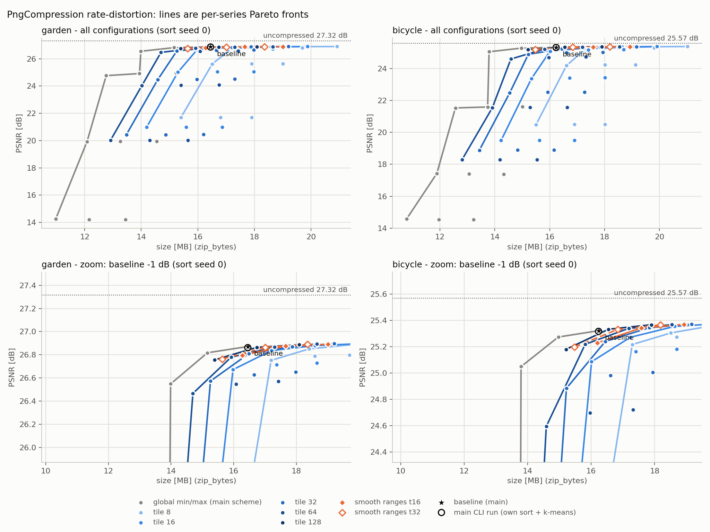
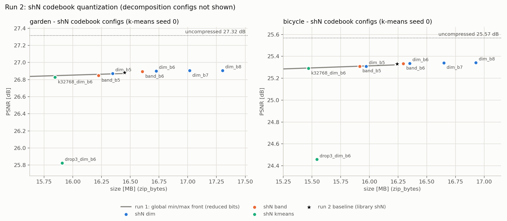
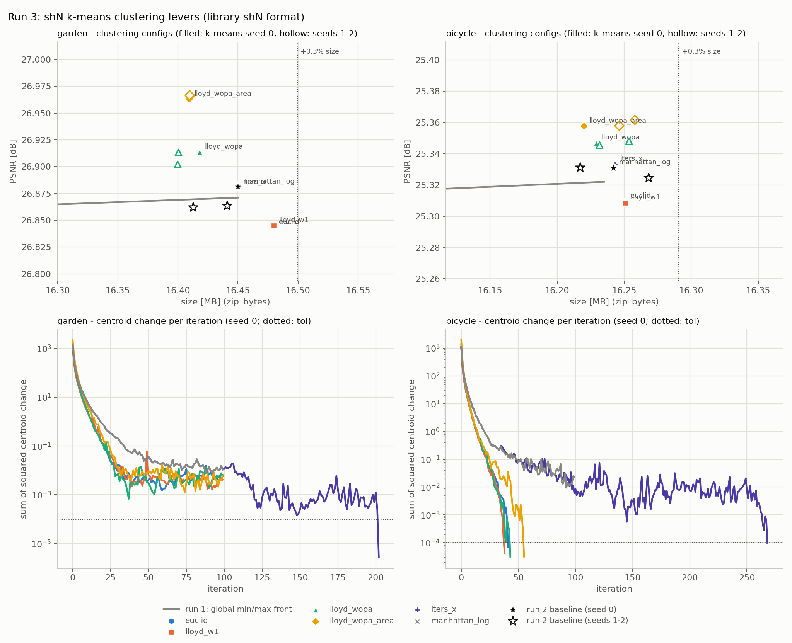
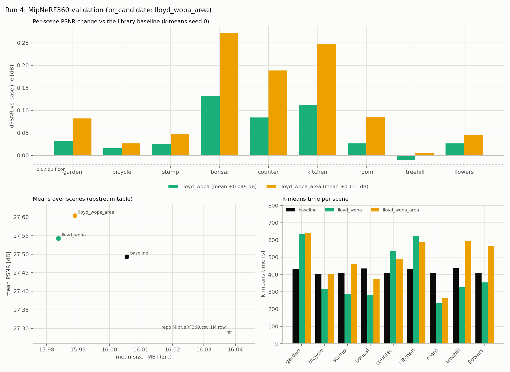
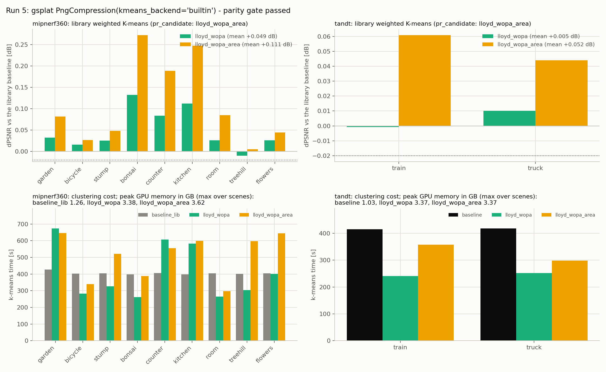

# Findings: tile-wise PNG quantization and the shN codebook in gsplat `PngCompression`

**Runs 1-2 (sections 1-2):** no tile-wise or smooth-range config beats the current global per-channel
min/max scheme, and no shN codebook quantization change beats the library default. Most of the
remaining compression loss is in the shN k-means clustering, not in quantization.

**Run 3 (section 4) found the lever:** weighted Lloyd k-means with opacity x footprint-area weights
(`lloyd_wopa_area`) raises PSNR and lowers LPIPS on garden and bicycle at all 3 k-means seeds
(+0.096 / +0.030 dB mean PSNR). The strict pre-set rule (`pr_worthy`) failed only on two garden SSIM
cells, both inside the baseline's own SSIM spread over k-means seeds.

**Run 4 (section 5) validated it** on all 9 MipNeRF360 scenes of `mcmc.sh`, under a rule fixed before
the run: `lloyd_wopa_area` gains **+0.111 dB** mean PSNR at **-0.10%** mean size and is better on
every scene.

**Run 5 (section 6) measured the library code** (branch `feat/png-weighted-kmeans`). It reproduces
the benchmark rows exactly (parity gate passed, and identical rows on all 9 MipNeRF360 scenes) and
passes the same rule on Tanks & Temples: **+0.052 dB** mean PSNR on train / truck at +0.08% mean size.
Cost: k-means 510 s vs 405 s mean on MipNeRF360 and 328 s vs 416 s on Tanks & Temples; peak GPU
memory 3.37-3.62 GB vs 1.03-1.26 GB.

**E0 (section 8, branch `bench/gn-vq`): G0 passed.** A per-splat Gauss-Newton metric on shN ranks
codebooks by their rendering error: 34 non-tied pairs of 36, none misordered, on both view sets and at
all three codebook sizes, and calibrated within 0.5-2x everywhere. Its two exploratory refines cut the
GN objective by 3.7-4.0x and still lose 0.04-0.53 dB after the codec's centroid quantizer, which E1
(pre-registered in Amendment 5) tests with a range clip.

**E1 (section 9, branch `bench/gn-vq`): G1 failed, on the size rule.** GN-VQ beat `lloyd_wopa_area` at
K = 65,536 on every seed in test PSNR, by +0.195 to +0.201 dB on garden and +0.087 to +0.091 dB on
bicycle, but it was +2.37% and +0.98% to +1.01% larger, beyond the pre-registered 0.5%, so all six
seeds count as negative. The extra bytes are the codebook codes, which compress worse at the same
quantizer step. The pre-registered rate-distortion secondary favours GN-VQ on both scenes (bicycle
BD-rate -9.84%; on garden every GN-VQ point is above every `lloyd_wopa_area` point in PSNR), at seed 0
on the two scenes GN-VQ was designed on.

**E2 (section 10, branch `bench/gn-vq`): G2a passed.** On 9 held-out scenes, GN-VQ with ridge
eps = 1e-2 beat `lloyd_wopa_area` in rate-distortion on all 9, with a mean BD-rate of -5.37% against the
pre-registered -5%. H2b (against the scalar `tr(M)` weighting, reported) holds with 8 of 9 scenes
counted: treehill's computed win is an artifact of the cubic fit. Post hoc, PCHIP interpolation gives
8 of 9 and -5.66% for G2a, and the codebook stream alone (`shN.npz`) shows about -31%.

**E2b (section 11, branch `bench/gn-vq`, exploratory): the floor works in fidelity terms, not by the
PSNR criterion.** E2's GN-VQ with the floored metric `M_i + rho * tr(M_i) / 15 * I`, `rho` chosen by
train-view cross-validation, has a lower test dMSE ratio against `lloyd_trace` than without the floor in
all 6 cells of treehill, flowers and stump (treehill at K = 65,536: 1.1253 to 0.6602), and garden, the
control, stays within its 5%. Amendment 10 f requires both for the claim. By Amendment 9's PSNR
criterion it does not work: treehill stays below `lloyd_trace` at both K (-0.0016 and -0.0120 dB).
`rho_cv` is 1e-1, the top of the grid, in all six cells.

**E2c (section 12, branch `bench/gn-vq`): G2c passed.** GN-VQ with the cross-validated floor
(`gn_vq_cvfloor`, frozen in Amendment 11 b) beat `lloyd_trace` on all 5 of the last unused scenes (bonsai,
counter, kitchen, room, truck). Its mean BD-rate against `lloyd_wopa_area` is -6.17%, and its BD-PSNR
against E2's `gn_vq` is -0.0013 to +0.0141 dB, above the -0.01 dB no-harm bound. The floor was selected in
all 20 cells (`rho_cv` 1e-3 to 1e-1). Against E2's GN-VQ it changed little except on room, whose test
dMSE fell to 0.7603 of `gn_vq`'s at K = 65,536.

**E3p (section 13, branch `bench/gn-vq`): exploratory engineering pilot, no verdict (Amendment 12).** The
frozen pipeline ran at K = 65,536 on INRIA's 30k checkpoints of bicycle (6,131,954 splats) and train
(1,026,508) with no step out of memory: bicycle peaked at 11.51 GB of allocated GPU memory, its GN-VQ runs at
8.49 GB, and its job took 19,699.0 s. Under INRIA's protocol the uncompressed models read 25.196 dB (bicycle)
and 21.293 dB (train), against INRIA's published 25.246 and 21.097; this project's own protocol reads bicycle
0.598 dB lower. `rho_cv` was 3e-1 on bicycle, the first selection above 1e-1. The C3DGS build failed before
compiling (no `ensurepip` for a venv).

**E3q (section 14, branch `bench/gn-vq`): exploratory smoke test of the C3DGS host, no verdicts (Amendment
13).**
- **The runs:** C3DGS built into the session's Python and ran its own compression on INRIA's train model. Attempt
  1 failed in a cuSOLVER batched eigendecomposition. Attempt 2, with `eigh` and `det` chunked (Amendment 13 g, no
  refusal at 8,192), ran both runs.
- **The fine-tuned run:** 13.267 MiB, and 21.843 dB in C3DGS's own evaluation against its published 21.863 dB.
- **Protocol ii** reads the compressed models 0.410-0.523 dB lower than C3DGS's own evaluation; the files do not
  say why.
- **Cost:** each run took 351.6 s without fine-tuning and 666.4 s with it.

**E3r (section 15, branch `bench/gn-vq`): exploratory pilot of the C3DGS host, no verdicts (Amendment 14).**
- **The runs:** every step ran on train and bicycle, and nothing failed. Bicycle measured only its 16 x 16 GN passes
  (Amendment 14 g).
- **The rate knobs on train:** the colour threshold spans 2.49x in `.npz` bytes (protocol ii 20.733-21.205 dB), K
  only 1.02x (20.971-21.024 dB).
- **GN-VQ injected into C3DGS's own run** completed end to end, with and without fine-tuning; `rho_cv` was 1e-2, and
  all 9 GN-VQ runs stopped at the 20-iteration cap.
- **The injected row** read +0.127 dB in protocol ii at +1.485% bytes against the probe run. It cannot be read as
  GN-VQ's effect: seeded C3DGS runs are not reproduced on the GPU, so the geometry and C3DGS's own colour codebook differ too.

**E4p (section 16, branch `bench/gn-vq`): exploratory pilot of E4's fork on train, no verdict (Amendment 15 f).**
- **The fork held:** three C3DGS processes each saved nine rows from one shared state, every primary save passed its
  keep-mask, label and geometry checks, and nothing ran out of memory (9.43 GB at the peak, OGC's assignment chunk).
- **Inside one process, on the standard test views:** `gnvq_cv` beat C3DGS's own VQ by +0.1326 dB at +1.51% bytes. D1
  (`rho_cv` against rho = 0) was +0.0007 dB with `SE_noise` 0.0020. D2 (against OGC's VQ) was -0.0403 dB in all three
  processes, against a row using all 4,096 codewords to `gnvq_cv`'s 2,310-2,592 and 275,459 more bytes.
- **OGC's released code** reproduces its Table 19 train row to two decimals; our 16-probe metric's total trace is 0.919
  of their exact Gram's.

**E4q (section 17, branch `bench/gn-vq`): exploratory dissection inside C3DGS on train and treehill, no verdict
(Amendment 16 b).**
- **OGC's lead over GN-VQ is codebook use:** OGC's choices in GN-VQ's code (`lad_all`) come within 0.0013 dB (train)
  and 0.0009 dB (treehill) of OGC's VQ. Reseeding empty clusters (+0.0394 dB, train) and OGC's start (+0.0179 dB,
  treehill) are the large single steps; the regularization choices are each 0.0097 dB or less.
- **At equal bytes on train** OGC needs 14.42% fewer bytes than GN-VQ (BD-PSNR +0.0228 dB). `lam_cv` is OGC's default,
  1e-3, on both scenes.
- **C3DGS's own evaluation fails with the images on the CPU,** so treehill has none; protocol ii is unaffected.

## Sources

- Sections 1 and 2: every number comes from `kaggle/run2/tilequant/` (one Kaggle session on 2x T4, gsplat
  commit `b0998765`, `bench/tilequant`). That session restored nothing from earlier runs: it rebuilt
  the gsplat wheel, trained both scenes from scratch ("training #2") and ran all run-1 and run-2
  configs on those checkpoints, so the numbers are self-consistent.
- Section 3: training #1 (earlier Kaggle session); numbers from its `decision.json` and CSV,
  as reported by Dace. Its files are not in this repository.
- Section 5: every number comes from `kaggle/run4/tilequant/` (one Kaggle session, gsplat commit
  `f7ce5262`). It restored the run-3 output, reused the garden / bicycle checkpoints and their rows
  (training #2, commits `b0998765` and `f9b61526`) and trained the other 7 scenes itself.
- Section 6: every number comes from `kaggle/run5/tilequant/` (one Kaggle session, gsplat commit
  `3bc8eb6c`). It restored the run-4 output, rebuilt the gsplat wheel, reused the 9 run-4 MipNeRF360
  checkpoints and trained the 2 Tanks & Temples scenes itself. Two bundle files were regenerated
  locally from the bundle's own result files after a label fix (commit `1b4d40f8`):
  `run5_tt_table.csv` (only its reference-row label changes) and `rd_run5.png` (memory in decimal GB,
  titles no longer overlap). Every other file is as downloaded.
- Section 8: every number comes from `kaggle/gn_e0/gn/` (one Kaggle session on 2x T4, 2026-09-20,
  gsplat commit `cd3139c2` on `bench/gn-vq`, the run-5 wheel reused). It restored the run-5 output:
  the garden / bicycle checkpoints, the seed-0 PLAS order, the run-3 clustering caches (used for
  K = 65,536) and `run3_results.csv`. The bundle is unpacked unchanged in `kaggle/gn_e0/gn/`.
- Section 9: every number comes from `kaggle/gn_e1/gn1/` (one Kaggle session on 2x T4, rows timestamped
  2026-09-20, gsplat commit `9b6c5bab` on `bench/gn-vq`, the run-5 wheel reused). It restored the run-5
  output (the garden / bicycle checkpoints, the seed-0 PLAS order, the run-3 `lloyd_wopa_area` caches
  for seeds 0-2) and E0's GN cache. The bundle is unpacked unchanged in `kaggle/gn_e1/gn1/`. A script
  recomputed every number in the section from those files and checked each against the text.
- Section 10: every number comes from `kaggle/gn_e2/gn2/` (one Kaggle session on 2x T4, rows
  timestamped 2026-09-21T23:03 to 2026-09-22T03:49, gsplat commit `515ca4a1` on `bench/gn-vq`, the run-5
  wheel reused) and, for the post-hoc items, from `kaggle/gn_e2/bd_sensitivity.json`, which
  `bench/gn/bd_sensitivity.py` computes from that bundle alone. The session restored the run-5 output
  (the 11 checkpoints, their seed-0 PLAS orders, the run-3 / run-4 `lloyd_wopa_area` K = 65,536 caches)
  and a GN cache for garden and bicycle from an earlier output. The bundle is unpacked unchanged in
  `kaggle/gn_e2/gn2/`. A script recomputed every number in the section from those two sources and
  checked each against the text.
- Section 11: every number comes from `kaggle/gn_e2b/gn2b/` (one Kaggle session on 2x T4, rows
  timestamped 2026-09-25T19:02 to 20:28, gsplat commit `0d180360` on `bench/gn-vq`, a restored wheel
  reused) and, for E2's comparator rows, from `kaggle/gn_e2/gn2/`. Every row used E2's full `M` and E2's
  warm starts, restored from E2's notebook output (`m_source`, `warm_start_source`). The bundle is
  unpacked unchanged in `kaggle/gn_e2b/gn2b/`. `bench/gn/check_s11.py` recomputes every number in the
  section from those two sources and checks each against the text (`python bench/gn/check_s11.py`,
  0 failures).
- Section 13: every number comes from `kaggle/gn_e3p/gn3p/` (one Kaggle session on 2x T4, rows
  timestamped 2026-09-27T21:11 to 2026-09-28T02:32, gsplat commit `12774353` on `bench/gn-vq`, a restored
  wheel reused), except the published PSNRs (arXiv 2308.04079v1, Tables 5 and 8), the pre-run estimate
  (HANDOFF, "E3p notebook") and, in the post-hoc cost estimate, E2c's and E2's per-K times
  (`kaggle/gn_e2c/gn2c/`, `kaggle/gn_e2/gn2/`) and the 13 scenes' splat counts (kaggle/E3_SCOUTING.md a).
  The bundle is unpacked unchanged in `kaggle/gn_e3p/gn3p/` (`25f2133a`). `bench/gn/check_s13.py`
  recomputes every number in the section from those files and checks each against the text.
- Section 14: every number comes from the two E3q bundles, each unpacked unchanged:
  - attempt 1: `kaggle/gn_e3q/attempt1/gn3q/` (`59303486`; one Kaggle session, 2026-09-28, gsplat commit
    `27ea27db`);
  - attempt 2: `kaggle/gn_e3q/attempt2/gn3q/` (`a6c6f725`; one Kaggle session, rows timestamped
    2026-09-28T20:08, gsplat commit `b7125673`).

  Both sessions reused a restored wheel and E3p's fetched members. The exceptions are C3DGS's published row (arXiv
  2401.02436v2, Table 9, row train), E3p's rows and its protocol gap (`kaggle/gn_e3p/gn3p/`, section 13), and the
  note on `load_npz` / `save_ply`, which was read from C3DGS's source at `2a234af5`. Every number was recomputed
  from those files by a script and checked against the text.
- Section 15: every number comes from `kaggle/gn_e3r/gn3r/` (`9c28cc89`; one Kaggle session on 2x T4, rows timestamped
  2026-09-30T12:15 to 14:11, gsplat commit `b27e1421`, a restored wheel and E3p's fetched members reused), unpacked
  unchanged. The exceptions are E3p's and E3q's rows (`kaggle/gn_e3p/gn3p/`, `kaggle/gn_e3q/attempt2/gn3q/`), E2c's
  iteration counts (`kaggle/gn_e2c/gn2c/`), the memory check (`kaggle/gn_e3r_memory/e3r_memory.json`), the runtime
  estimate (`bench/gn/e3r_estimate.py`), and the geometry diagnosis, read from this repository's hooks, wrapper and
  `bench/gn/` and from C3DGS's source at `2a234af5`. `bench/gn/check_s15.py` recomputes every number in the section
  from those files and checks each against the text.
- Section 16: every number comes from `kaggle/gn_e4p/gn4p/` (`60c4839b`; one Kaggle session on 2x T4, rows timestamped
  2026-10-01T18:02 to 20:16, gsplat commit `24950320`, a restored wheel and E3p's fetched members reused), unpacked
  unchanged. The exceptions are the pre-run estimate (HANDOFF, "E4p notebook"), E3r's rows and section 15's numbers
  (`kaggle/gn_e3r/gn3r/`), note i's feasibility (PREREG_GN.md Amendment 15 i) and the readings of code: this repository's
  job, hooks, wrapper and `bench/gn/`, OGC's `vq.py` at `49ccae72` and C3DGS's source at `2a234af5`.
  `bench/gn/check_s16.py` recomputes every number in the section from those files and checks each against the text.
- Section 17: every number comes from `kaggle/gn_e4q/gn4q/` (`1d986d1a`; one Kaggle session on 2x T4, rows timestamped
  2026-10-02T11:54 to 15:48, gsplat commit `c0e34e8e`, a restored wheel and E3p's fetched train members reused),
  unpacked unchanged. The exceptions are E4p's rows in the post hoc chain (`kaggle/gn_e4p/gn4p/`), Amendment 16 e's
  estimate and note i's feasibility (PREREG_GN.md), the test of `lad_all` against OGC's code (`bench/gn/test_gn.py`),
  and the readings of code: this repository's job, hooks and stand-in, OGC's `vq.py` at `49ccae72` and C3DGS's source
  at `2a234af5`. The post hoc BD checks use `bench/gn/g2.py`'s fit. `bench/gn/check_s17.py` recomputes every number in
  the section from those files and checks each against the text.
- Section 12: every number comes from `kaggle/gn_e2c/gn2c/` (one Kaggle session on 2x T4, rows
  timestamped 2026-09-26T17:57 to 21:45, gsplat commit `7617468e` on `bench/gn-vq`, a restored wheel
  reused) and, for E2's comparator rows and E2's own BD values, from `kaggle/gn_e2/gn2/`. Every row
  used E2's full `M` and E2's warm starts (`m_source`, `warm_start_source`). The bundle is unpacked
  unchanged in `kaggle/gn_e2c/gn2c/`. A script recomputed every number in the section from those two
  sources and checked each against the text.
- Section 4: every number comes from `kaggle/run3/tilequant/` (one Kaggle session, gsplat commit
  `f9b61526`). That session restored the run-2 output (training #2 checkpoints, seed-0 PLAS sort,
  run-1 / run-2 rows, gsplat wheel) and ran only the run-3 configs, so run-3 rows pair with the
  run-2 rows of the same checkpoints. 14 of its 22 files are byte-identical to `run2/tilequant/`;
  `timings.json` keeps the run-2 entries, with install / smoke / data overwritten by this session and
  the run-3 jobs added.

Setup: MipNeRF360 garden and bicycle, `examples/benchmarks/compression/mcmc.sh` settings (MCMC, 1M
Gaussians, data factor 4, LPIPS VGG). Size = `zip -r` of the compression directory, as in
`summarize_stats.py` (`zip_bytes`); raw file bytes (`size_bytes`) move the same way here. Unless noted:
PLAS sort seed 0, k-means seed 0. U = uncompressed PSNR of the same checkpoint.

### Sanity gate (`run2/tilequant/sanity_gate.json`)

Current-main CLI run (`mcmc.sh` eval command), no failures, no warnings:

| Scene | U (dB) | Compressed (dB) | Drop (dB) | zip bytes | zip vs repo 1M row | #Gaussians |
|---|---|---|---|---|---|---|
| garden | 27.315 | 26.862 | 0.453 | 16,449,239 | +2.6% | 1,000,000 |
| bicycle | 25.568 | 25.317 | 0.251 | 16,233,444 | +1.2% | 1,000,000 |

The repo row (`results/MipNeRF360.csv`, 1M) is a mean over 9 scenes, so only the drop and #Gaussians
are hard checks.

## 1. Tile-wise and smooth ranges (training #2)

Decision (`run2/tilequant/decision.json`): **`pr_worthy` = false, `tile_effect` = false, `global_only` = false.**

### At baseline bits (means 16, others 8)

| Config | garden dPSNR | garden zip | bicycle dPSNR | bicycle zip |
|---|---|---|---|---|
| `baseline` (global min/max) | 26.871 dB | 16,450,113 B | 25.322 dB | 16,235,216 B |
| `t8_m16_o8` | +0.027 | +27.1% | +0.054 | +29.5% |
| `t16_m16_o8` | +0.023 | +20.8% | +0.052 | +22.7% |
| `t32_m16_o8` | +0.025 | +16.7% | +0.050 | +18.1% |
| `t64_m16_o8` | +0.021 | +13.4% | +0.046 | +14.2% |
| `t128_m16_o8` | +0.016 | +9.9% | +0.045 | +10.2% |
| `smooth_t16_m16_o8` | +0.019 | +15.5% | +0.047 | +16.6% |
| `smooth_t32_m16_o8` | +0.020 | +11.6% | +0.044 | +12.0% |

Tiles reduce quantization error a little, and cost far more bytes than they save in PSNR.

### Boundary cost: plain tiles vs smooth ranges

PNG bytes of the plain tile config minus the smooth-range config at the same tile size and bits
(means 16 bits):

| Tile | Other bits | garden | bicycle |
|---|---|---|---|
| 16 | 8 | 0.87 MB | 0.99 MB |
| 16 | 7 | 0.93 MB | 1.05 MB |
| 16 | 6 | 0.92 MB | 1.04 MB |
| 32 | 8 | 0.85 MB | 0.98 MB |
| 32 | 7 | 0.87 MB | 1.00 MB |
| 32 | 6 | 0.85 MB | 0.97 MB |

Removing the range jumps at tile boundaries saves 0.85-1.05 MB of PNG bytes, but smooth ranges are
still +11.6% / +12.0% zip at tile 32 and baseline bits.

### Against the global reduced-bit front

The global front (baseline plus global configs with fewer bits) is `global_m8_o6`, `global_m10_o6`,
`global_m12_o6`, `global_m12_o7`, `global_m16_o6`, `global_m16_o7`, `baseline` on both scenes. All
22 tile and smooth configs whose zip size falls inside the front's size range sit below it at matched
size (linear interpolation):

| Scene | Best tile/smooth config | Margin to the global front |
|---|---|---|
| garden | `smooth_t16_m16_o6` | -0.068 dB |
| bicycle | `t64_m16_o6` | -0.087 dB |

For reference, `global_m16_o7` (other params at 7 bits): -0.054 / -0.048 dB at -7.8% / -7.8% zip.

### The collapse regime

With 8-bit means the global scheme collapses and tiles recover most of it:

| Other bits | garden global | garden tile 8 | bicycle global | bicycle tile 8 |
|---|---|---|---|---|
| 8 | 14.20 dB | 21.70 dB | 14.53 dB | 20.50 dB |
| 7 | 14.20 dB | 21.70 dB | 14.54 dB | 20.50 dB |
| 6 | 14.26 dB | 21.70 dB | 14.57 dB | 20.49 dB |

gsplat stores the log-transformed means with 16 bits, so its default never enters this regime.

### What is left for the PNG params

| Scene | U - baseline | U - best PNG-param config | Best config |
|---|---|---|---|
| garden | 0.444 dB | 0.417 dB | `t8_m16_o8` (+27.1% zip) |
| bicycle | 0.246 dB | 0.192 dB | `t8_m16_o8` (+29.5% zip) |

Even the best PNG-param config leaves most of the loss in place, which points at shN (section 2).

### PLAS sort-seed robustness

Paired deltas against the baseline of the same sort seed, for the 3 configs picked from seed 0:

| Config | Scene | dPSNR (seeds 0 / 1 / 2) | zip (seeds 0 / 1 / 2) |
|---|---|---|---|
| `global_m16_o7` | garden | -0.054 / -0.054 / -0.054 | -7.84% / -7.84% / -7.84% |
| `global_m16_o7` | bicycle | -0.048 / -0.048 / -0.048 | -7.81% / -7.81% / -7.81% |
| `smooth_t16_m16_o6` | garden | -0.075 / -0.086 / -0.081 | -1.06% / -1.02% / -1.03% |
| `smooth_t16_m16_o6` | bicycle | -0.093 / -0.090 / -0.096 | -0.26% / -0.26% / -0.26% |
| `t64_m16_o6` | garden | -0.091 / -0.093 / -0.090 | -3.21% / -3.24% / -3.20% |
| `t64_m16_o6` | bicycle | -0.103 / -0.100 / -0.095 | -2.61% / -2.66% / -2.63% |

Global configs have the same PSNR for every sort order: one min/max per channel, and the extra sort
seeds reuse the seed-0 k-means centroids (baseline PSNR 26.871 / 25.322 dB on all three seeds). None of
the three configs beats the baseline on any seed.

### Why

At 16-bit means the PNG params are not where the loss is: U - baseline is 0.444 / 0.246 dB and the
best PNG-param config closes only 0.027 / 0.054 dB of it. Tile ranges make the PNG files larger
(tile 8 at baseline bits: +3.73 / +4.05 MB of PNG bytes) and add per-tile bounds on top
(0.73 / 0.74 MB). Smooth ranges remove 0.85-1.05 MB of that PNG growth, not enough to get near the
baseline size. At matched size the global scheme with fewer bits gives more PSNR (front comparison).

## 2. shN codebook (training #2)

`_compress_kmeans` clusters shN into 65,536 centroids (torchpq, manhattan) and quantizes the
65,536 x 45 codebook to 6 bits with one scalar min/max. Decision (`run2/tilequant/shn_decision.json`):
**`pr_worthy` = false.**

### Decomposition (approximate; PSNR losses are not additive)

| Term | garden | bicycle |
|---|---|---|
| U - baseline (total) | 0.434 dB | 0.237 dB |
| U - P (shN loss; PNG params raw float32) | 0.403 dB | 0.176 dB |
| U - S (PNG-param loss; shN raw float32) | 0.034 dB | 0.063 dB |
| S - F (clustering; float centroids vs raw shN) | 0.374 dB | 0.163 dB |
| F - baseline (6-bit centroid quantization) | 0.026 dB | 0.011 dB |

This run-2 baseline re-runs k-means with a fixed seed and caches the float centroids, so its PSNR
(26.881 / 25.331 dB) differs slightly from the section-1 baseline, which used the k-means result of
the sort cache (26.871 / 25.322 dB).

### Configs at k-means seed 0 (deltas vs the run-2 baseline)

| Config | garden dPSNR | garden zip | bicycle dPSNR | bicycle zip |
|---|---|---|---|---|
| `baseline` | 26.881 dB | 16,449,880 B | 25.331 dB | 16,242,031 B |
| `F_float_centroids` | +0.026 | +57.8% | +0.011 | +57.6% |
| `dim_b5` (45 min/max, 5 bits) | -0.010 | -0.6% | -0.022 | -1.7% |
| `dim_b6` | +0.018 | +1.7% | +0.005 | +0.7% |
| `dim_b7` | +0.024 | +3.4% | +0.010 | +2.5% |
| `dim_b8` | +0.026 | +5.2% | +0.011 | +4.2% |
| `band_b5` (9 min/max, 5 bits) | -0.033 | -1.4% | -0.022 | -2.0% |
| `band_b6` | +0.013 | +0.9% | +0.003 | +0.3% |
| `k32768_dim_b6` | -0.054 | -3.7% | -0.041 | -4.8% |
| `drop3_dim_b6` (SH band 3 dropped) | -1.057 | -3.3% | -0.873 | -4.3% |

- `dim_b8` recovers the centroid-quantization share (+0.026 / +0.011 dB vs F - baseline
  0.026 / 0.011 dB) at +5.2% / +4.2% zip. This matches the decomposition, which supports the
  implementation.
- `k32768_dim_b6` sits -0.019 / -0.003 dB from the section-1 global front at its zip size, within the
  baseline's k-means seed spread below.
- `drop3_dim_b6` loses 1.06 / 0.87 dB. Section 4 (`sh2_render`) shows that SH band 3 itself carries
  1.37 / 0.99 dB of the uncompressed checkpoint.

### k-means seed robustness

Baseline over k-means seeds 0 / 1 / 2:

| Scene | PSNR (dB) | zip bytes | PSNR spread | zip spread (max - min) / mean |
|---|---|---|---|---|
| garden | 26.881 / 26.862 / 26.864 | 16,449,880 / 16,412,541 / 16,440,902 | 0.019 dB | 0.23% |
| bicycle | 25.331 / 25.331 / 25.325 | 16,242,031 / 16,217,116 / 16,268,202 | 0.007 dB | 0.31% |

The two configs picked from seed 0 (`dim_b5`, `band_b5`; smaller than the baseline but lower PSNR)
stay below the baseline on seeds 1 and 2:

| Config | Scene | dPSNR (seeds 1 / 2) | zip (seeds 1 / 2) |
|---|---|---|---|
| `dim_b5` | garden | -0.009 / -0.010 | -0.50% / -0.54% |
| `dim_b5` | bicycle | -0.016 / -0.012 | -1.40% / -1.72% |
| `band_b5` | garden | -0.046 / -0.033 | -1.30% / -1.31% |
| `band_b5` | bicycle | -0.030 / -0.016 | -1.87% / -2.02% |

### Why

The codebook quantization costs about 0.026 / 0.011 dB, so better ranges (per dimension or per band)
can gain at most about that; `dim_b8` reaches it at +5.2% / +4.2% zip. The large term is the clustering itself
(0.374 / 0.163 dB): 1M Gaussians share 65,536 centroids.

## 3. Replication: training #1

**Training #1 (earlier Kaggle session; numbers from its `decision.json` and CSV, reported by Dace).**
Its files are not in this repository and were not re-checked here. Training #2 values are from
`kaggle/run2/tilequant/`.

| Metric | Training #1 (garden / bicycle) | Training #2 (garden / bicycle) |
|---|---|---|
| `pr_worthy`, `tile_effect`, `global_only` | false, false, false | false, false, false |
| Best margin to the global front | -0.063 / -0.072 dB | -0.068 / -0.087 dB |
| U - baseline | 0.447 / 0.249 dB | 0.444 / 0.246 dB |
| `t8_m16_o8` | +0.024 / +0.055 dB at +25.9% / +30.3% zip | +0.027 / +0.054 dB at +27.1% / +29.5% zip |
| Global 8-bit means -> tile 8 | 14.62 / 14.53 -> 21.69 / 20.52 dB | 14.20 / 14.53 -> 21.70 / 20.50 dB (other params 8 bits) |
| `global_m16_o7` | -0.062 / -0.053 dB at -7.8% zip | -0.054 / -0.048 dB at -7.8% / -7.8% zip |

The conclusions of section 1 hold for both trainings.

## 4. Run 3: shN k-means clustering levers (training #2)

Every config keeps the library shN format (65,536 centroids, 6-bit scalar codebook quantization in the
unchanged `_compress_kmeans`, uint16 labels, unchanged `_decompress_kmeans`, seed-0 PLAS sort); only
the clustering differs. Reference for every delta: the run-2 `baseline` row (`shn_results.csv`) of the
same scene and k-means seed.

| Config | Clustering |
|---|---|
| `manhattan_log` | torchpq `KMeans(distance="manhattan")` as in the library, with its per-iteration log (check, not a candidate) |
| `euclid` | torchpq `distance="euclidean"` |
| `lloyd_w1` | benchmark Lloyd (euclidean assignment, weighted mean update), weights 1 (control for `euclid`) |
| `lloyd_wopa` | same, weights `sigmoid(opacity)` |
| `lloyd_wopa_area` | same, weights `sigmoid(opacity) * exp(sum of the two largest log-scales)` |
| `iters_x` | torchpq manhattan, `max_iter` 300 (ran because `manhattan_log` stopped at `max_iter` 100) |
| `sh2_render` | no compression: uncompressed checkpoint with SH band 3 set to 0 |

The Lloyd runs use torchpq's init (k data points from `np.random.choice` with the same seed), iteration
budget (100), stopping rule (summed squared centroid change <= 1e-4) and empty-cluster rule.

### Decision (`run3/tilequant/run3_decision.json`), as recorded

**`pr_worthy` = false, `pr_worthy_configs` = [].** Rule: PSNR >=, SSIM >=, LPIPS <=, zip bytes and
raw bytes <= 1.003 x the baseline, on both scenes and k-means seeds 0, 1 and 2. Seeds 1 and 2 ran for
the two configs ranked best at seed 0 (`run3_seed_selection.json`: `lloyd_wopa`, `lloyd_wopa_area`),
so the other candidates are incomplete by design.

| Config | complete | beats_all | Cells that fail the rule |
|---|---|---|---|
| `lloyd_wopa` | true | false | garden seed 2 (LPIPS +0.00005) |
| `lloyd_wopa_area` | true | false | garden seed 0 (SSIM -0.00016), garden seed 2 (SSIM -0.00009) |
| `iters_x` | false | false | garden seed 0 (PSNR -0.0003, SSIM -0.000004) |
| `euclid` | false | false | garden and bicycle seed 0 (PSNR, SSIM, LPIPS) |
| `lloyd_w1` | false | false | garden and bicycle seed 0 (PSNR, SSIM, LPIPS) |

### Check: the torchpq manhattan re-run reproduces run 2

`manhattan_log` (k-means seed 0) against the run-2 seed-0 baseline: PSNR, SSIM and LPIPS are identical,
and so are raw bytes, PNG bytes and `shN.npz` bytes, on both scenes. Only the zip size differs, by
+109 / +108 B; `zip -r` also stores the run directory path, which differs between the two scripts
(`/tmp/tilequant_shn_runs/.../baseline` vs `/tmp/tilequant_run3_runs/.../manhattan_log`). torchpq
k-means is deterministic per seed across sessions, so pairing run-3 rows with run-2 baselines is valid.
This was checked at seed 0; seeds 1 and 2 rely on the same determinism. (Correction from run 5,
section 6: across 9 scenes, torchpq reproduces to about 0.002 dB, not always bit-exactly.)

torchpq manhattan did not meet its own stopping rule: after 100 iterations the centroid change was
0.0107 / 0.0238 (tol 1e-4) on garden / bicycle.

### k-means seed 0: all configs (garden / bicycle)

| Config | dPSNR (dB) | dSSIM | dLPIPS | zip | Iterations | k-means time |
|---|---|---|---|---|---|---|
| `manhattan_log` | 0 / 0 | 0 / 0 | 0 / 0 | +109 / +108 B | 100 / 100 | 419 / 432 s |
| `euclid` | -0.038 / -0.022 | -0.00045 / -0.00027 | +0.00025 / +0.00023 | +0.18% / +0.05% | 100 / 42 | 422 / 233 s |
| `lloyd_w1` | -0.036 / -0.023 | -0.00043 / -0.00028 | +0.00024 / +0.00021 | +0.18% / +0.05% | 100 / 39 | 628 / 281 s |
| `lloyd_wopa` | +0.032 / +0.016 | +0.00025 / +0.00054 | -0.00033 / -0.00035 | -0.19% / -0.08% | 100 / 44 | 633 / 317 s |
| `lloyd_wopa_area` | +0.082 / +0.027 | -0.00016 / +0.00005 | -0.00083 / -0.00094 | -0.25% / -0.14% | 100 / 56 | 642 / 405 s |
| `iters_x` | -0.0003 / +0.0022 | -0.000004 / +0.00002 | -0.000007 / -0.000009 | -0.0004% / +0.006% | 203 / 269 | 868 / 1155 s |

- `lloyd_w1` matches `euclid` (PSNR within 0.0017 / 0.0010 dB, zip within 163 / 4 B), which supports
  the Lloyd implementation.
- Unweighted euclidean clustering (torchpq or Lloyd) is worse than manhattan: -0.036 to -0.038 dB on
  garden, -0.022 to -0.023 dB on bicycle (seed 0 only).
- `iters_x` converged (203 / 269 iterations) and changed PSNR by -0.0003 / +0.0022 dB at 2.0x / 2.8x
  the baseline compress time, so convergence is not the lever.

### k-means seeds 0 / 1 / 2: `lloyd_wopa` and `lloyd_wopa_area`

| Config | Scene | dPSNR (dB) | dSSIM | dLPIPS | zip | raw bytes | Passes |
|---|---|---|---|---|---|---|---|
| `lloyd_wopa` | garden | +0.032 / +0.051 / +0.039 | +0.00025 / +0.00030 / +0.00027 | -0.00033 / -0.00036 / +0.00005 | -0.19% / -0.08% / -0.25% | -0.20% / -0.08% / -0.25% | yes / yes / no |
| `lloyd_wopa` | bicycle | +0.016 / +0.017 / +0.021 | +0.00054 / +0.00054 / +0.00057 | -0.00035 / -0.00007 / -0.00062 | -0.08% / +0.22% / -0.23% | -0.08% / +0.22% / -0.23% | yes / yes / yes |
| `lloyd_wopa_area` | garden | +0.082 / +0.104 / +0.103 | -0.00016 / +0.00002 / -0.00009 | -0.00083 / -0.00072 / -0.00045 | -0.25% / -0.02% / -0.19% | -0.25% / -0.02% / -0.19% | no / yes / no |
| `lloyd_wopa_area` | bicycle | +0.027 / +0.031 / +0.033 | +0.00005 / +0.00011 / +0.00015 | -0.00094 / -0.00079 / -0.00100 | -0.14% / +0.25% / -0.14% | -0.14% / +0.25% / -0.14% | yes / yes / yes |

Mean dPSNR over the 3 seeds: `lloyd_wopa` +0.041 / +0.018 dB, `lloyd_wopa_area` +0.096 / +0.030 dB.

k-means time over the 3 seeds: `lloyd_wopa` 585-637 s / 251-318 s, `lloyd_wopa_area` 635-642 s /
405-460 s. For comparison, torchpq manhattan took 419 / 432 s in this session and 433-440 s /
398-404 s for the run-2 baselines. On garden the Lloyd runs used all 100 iterations; on bicycle they
converged in 39-64. The Lloyd code is a benchmark implementation (float64 weighted update, chunked
`addmm` assignment), not an optimized one.

### Interpretation: seed noise (not part of the pre-registered rule)

Noise reference: the run-2 baseline over k-means seeds 0 / 1 / 2 (max - min). PSNR 0.019 / 0.0066 dB,
SSIM 0.000158 / 0.000051, LPIPS 0.00021 / 0.00035, zip 0.23% / 0.31% of the mean.

- **`lloyd_wopa_area`:**
  - PSNR is higher in all 6 cells. The mean gain (+0.096 / +0.030 dB) is 5.1x / 4.6x the baseline
    PSNR seed range.
  - LPIPS is lower in all 6 cells (mean -0.00067 / -0.00091, 3.1x / 2.6x the LPIPS seed range).
  - The two failing cells are garden SSIM -0.000157 (seed 0) and -0.000086 (seed 2). Both lie within
    the garden baseline SSIM range of 0.000158, seed 0 by 0.000001. Bicycle SSIM is higher on all
    three seeds.
  - Zip ranges from -0.246% to +0.251% of the paired baseline, inside the 0.3% tolerance (the baseline
    zip spread over seeds is 0.23% / 0.31%).
- **`lloyd_wopa`:** smaller gains (+0.041 / +0.018 dB mean), SSIM higher in all 6 cells. It fails only
  garden seed 2, on LPIPS by +0.00005, a quarter of the garden LPIPS seed range.
- **The weights carry the gain, not the distance:** unweighted euclidean loses 0.036-0.038 /
  0.022-0.023 dB against manhattan. Opacity weights turn that into a gain, and adding the footprint
  area gains more.
- **Share of the clustering loss:** the mean `lloyd_wopa_area` gain is 26% / 18% of the run-2
  clustering loss S - F (0.374 / 0.163 dB). This mixes a 3-seed mean with a seed-0 decomposition; with
  the seed-0 gains alone it is 22% / 16%.
- **Scope:** 2 scenes, 1 training. Run 4 applies a rule fixed in advance to all 9 MipNeRF360 scenes
  of `mcmc.sh`.

Corrections to the preliminary run-3 summary, checked against the CSVs:
- "zip within +-0.25%": bicycle seed 1 is +0.251%.
- "k-means 635-641 s on garden": the maximum is 641.5 s, so the range rounds to 635-642 s.
- The manhattan re-run zip difference is 109 / 108 B.

### `sh2_render`: SH band 3 matters

| Scene | U (PSNR / SSIM / LPIPS) | `sh2_render` (band 3 = 0, uncompressed) | U - `sh2_render` | run-2 baseline - `drop3_dim_b6` |
|---|---|---|---|---|
| garden | 27.315 / 0.8547 / 0.1338 | 25.947 / 0.8383 / 0.1478 | 1.368 dB | 1.057 dB |
| bicycle | 25.568 / 0.7730 / 0.2167 | 24.581 / 0.7582 / 0.2266 | 0.988 dB | 0.873 dB |

Zeroing band 3 of the uncompressed checkpoint costs 1.37 / 0.99 dB, more than `drop3_dim_b6` lost
against the compressed baseline (1.06 / 0.87 dB). The run-2 drop3 loss was therefore not a bug: band 3
carries that much in these MCMC 1M models (trained with the default `sh_degree` 3).

## 5. Run 4: MipNeRF360 validation (pre-registered)

All 9 MipNeRF360 scenes of `examples/benchmarks/compression/mcmc.sh` (scene list, data factors and the
train command parsed from the script), k-means seed 0 and PLAS sort seed 0, library shN format
unchanged. garden and bicycle reuse the training-#2 checkpoints and their run-1 / run-2 / run-3 rows;
the other 7 scenes were trained in this session with the `mcmc.sh` command.

### The rule, fixed before the run

From `run4/tilequant/run4_decision.json`, as recorded: a candidate passes when, over all scenes,
mean dPSNR > 0 AND dPSNR > 0 on all scenes but at most one AND no scene dPSNR < -0.02 dB AND
mean dLPIPS <= 0 AND mean dSSIM >= -0.0002 AND on every scene zip AND raw bytes <= baseline x 1.003;
with every scene measured, every new scene's sanity gate passed and one checkpoint per scene.
`pr_candidate` = the passing candidate with the higher mean dPSNR. Deltas and means are rounded to
9 decimals before comparing, and the byte limits are integer comparisons. The reference is always the
library baseline on the same checkpoint (`_compress_kmeans`, torchpq manhattan, 65,536 clusters).

### Verdict: both candidates pass, `pr_candidate` = `lloyd_wopa_area`

| Candidate | mean dPSNR | mean dSSIM | mean dLPIPS | Scenes with dPSNR <= 0 | Worst scene dPSNR | Worst zip | Worst raw |
|---|---|---|---|---|---|---|---|
| `lloyd_wopa` | +0.0494 dB | +0.00091 | -0.00048 | 1 (treehill) | -0.0099 dB | +0.009% | +0.008% |
| `lloyd_wopa_area` | +0.1109 dB | +0.00072 | -0.00093 | 0 | +0.0049 dB | +0.267% | +0.266% |

All 7 new scenes passed the sanity gate with no warnings: 1,000,000 Gaussians each, U - baseline
between 0.101 dB (treehill) and 0.859 dB (bonsai), baseline zip 0.98x to 1.02x the repo 1M row.

### 9-scene means, upstream format (`run4/tilequant/run4_table.csv`)

| Submethod | PSNR | SSIM | LPIPS | Size [Bytes] | #Gaussians |
|---|---|---|---|---|---|
| `baseline` (library) | 27.4929 | 0.8192 | 0.2147 | 16,005,532 | 1,000,000 |
| `lloyd_wopa` | 27.5423 | 0.8201 | 0.2143 | 15,983,770 | 1,000,000 |
| `lloyd_wopa_area` | 27.6038 | 0.8199 | 0.2138 | 15,988,981 | 1,000,000 |
| repo `results/MipNeRF360.csv`, 1M row | 27.29 | 0.811 | 0.229 | 16,038,022 | 1,000,000 |
| uncompressed checkpoints (U) | 27.9258 | 0.8289 | 0.2033 | - | 1,000,000 |

**The repo row is context, not a control.** Our baseline is 0.20 dB above it at 0.2% smaller size,
because it comes from a different environment: different training run, torch and gsplat build, and
evaluation setup. Nothing here is compared against it. Every delta in this section is paired: candidate
minus the baseline measured in the same session, on the same checkpoint, with the same sort.

### Per-scene (deltas vs the paired baseline)

| Scene | Data factor | U - baseline | `lloyd_wopa` dPSNR | zip | `lloyd_wopa_area` dPSNR | zip |
|---|---|---|---|---|---|---|
| garden | 4 | 0.434 dB | +0.0324 | -0.19% | +0.0819 | -0.25% |
| bicycle | 4 | 0.237 dB | +0.0158 | -0.08% | +0.0266 | -0.14% |
| stump | 4 | 0.290 dB | +0.0252 | -0.13% | +0.0481 | +0.06% |
| bonsai | 2 | 0.859 dB | +0.1326 | -0.33% | +0.2721 | -0.30% |
| counter | 2 | 0.546 dB | +0.0838 | +0.01% | +0.1885 | +0.25% |
| kitchen | 2 | 0.824 dB | +0.1123 | -0.21% | +0.2474 | -0.47% |
| room | 2 | 0.386 dB | +0.0263 | -0.17% | +0.0846 | -0.21% |
| treehill | 4 | 0.101 dB | -0.0099 | -0.09% | +0.0049 | -0.15% |
| flowers | 4 | 0.219 dB | +0.0262 | -0.04% | +0.0442 | +0.27% |

SSIM and LPIPS per scene are in `run4/tilequant/run4_scene_deltas.csv`. `lloyd_wopa_area` has lower
(better) LPIPS on all 9 scenes and higher SSIM on 8 of 9 (garden -0.00016).

`lloyd_wopa_area` recovers 4.9% (treehill) to 34.6% (counter) of that scene's compression loss
(U - baseline), 21.1% on average. The four indoor scenes at data factor 2, where the loss is largest,
gain the most.

### k-means time (seconds, one T4)

| Scene | `baseline` (torchpq manhattan) | `lloyd_wopa` | `lloyd_wopa_area` | Iterations (wopa / wopa_area) |
|---|---|---|---|---|
| garden | 433 | 633 | 642 | 100 / 100 |
| bicycle | 404 | 317 | 405 | 44 / 56 |
| stump | 408 | 290 | 461 | 51 / 81 |
| bonsai | 435 | 281 | 374 | 41 / 55 |
| counter | 409 | 535 | 490 | 94 / 86 |
| kitchen | 434 | 622 | 587 | 92 / 87 |
| room | 408 | 234 | 263 | 41 / 46 |
| treehill | 437 | 326 | 594 | 48 / 87 |
| flowers | 409 | 355 | 567 | 63 / 100 |
| **mean** | **420** | **399** | **487** | |

torchpq manhattan always runs its full 100 iterations (it never meets `tol`); the Lloyd runs stop at
`tol` on 7 of 9 scenes. `lloyd_wopa_area` costs 0.64x to 1.48x the baseline clustering time, 1.16x on
average, and this is the benchmark implementation (float64 weighted update, chunked `addmm`), not a
tuned one.

### Session

One Kaggle session on 2x T4, 7 new scenes queued over 2 GPUs. Training took 1,932-3,398 s per scene
(data factor 4: 1,932-2,243 s; data factor 2: 2,983-3,398 s), the PLAS sort 69-83 s, and the whole
per-scene job 3,302-5,357 s. The pre-run estimate was 5.70 h for the session
(`run4/tilequant/run4_plan.json`); the jobs summed to 8.3 GPU-hours over 2 GPUs.

## 6. Run 5: the library code on MipNeRF360 and Tanks & Temples

Run 5 measures gsplat's own `PngCompression(kmeans_backend="builtin", kmeans_weighting=...)` from
`feat/png-weighted-kmeans`, with `"opacity"` (row `lloyd_wopa`) and `"opacity_area"`
(`lloyd_wopa_area`), against the library default (TorchPQ manhattan). The rule is the run-4 rule,
unchanged, applied to each dataset separately.

- **MipNeRF360:** the 9 run-4 checkpoints. Candidates are paired against the run-4 baseline rows (same
  checkpoint, same sort). The default path was also re-run (`baseline_lib`) to check it and to measure
  its cost.
- **Tanks & Temples:** `mcmc_tt.sh` (train, truck; data factor 1, 1M Gaussians), trained in this
  session. Candidates are paired against the baseline measured in the same session.

### Parity gate (`run5_parity.json`): passed

The library must reproduce the run-3 benchmark rows (`lloyd_wopa_area`, k-means seed 0). The run-5
rows were written into the run-3 run-directory path, so zip sizes compare directly.

| Scene | PSNR (run 3 = run 5) | zip bytes (both) | raw bytes (both) | k-means time run 3 / run 5 |
|---|---|---|---|---|
| garden | 26.963133 dB | 16,409,335 | 16,405,132 | 641.5 / 645.6 s |
| bicycle | 25.357714 dB | 16,219,981 | 16,216,069 | 404.8 / 339.0 s |

dPSNR, dSSIM and dLPIPS are 0 on both scenes. `iters_equal` is false only because the library does not
report an iteration count: `n_iters` is empty in every run-5 row.

The match goes beyond the gate. On all 9 MipNeRF360 scenes, both library candidates give exactly the
run-4 benchmark rows: PSNR, SSIM, LPIPS, zip bytes and raw bytes. `run5_table.csv` is byte-identical
to `run4_table.csv`.

### Verdict (`run5_decision.json`): both candidates pass on both datasets; `pr_candidate` = `lloyd_wopa_area`

| Dataset | Candidate | mean dPSNR | mean dSSIM | mean dLPIPS | Scenes with dPSNR <= 0 | Worst scene dPSNR | Worst zip | Worst raw |
|---|---|---|---|---|---|---|---|---|
| MipNeRF360 | `lloyd_wopa` | +0.0494 dB | +0.00091 | -0.00048 | 1 (treehill) | -0.0099 dB | +0.009% | +0.008% |
| MipNeRF360 | `lloyd_wopa_area` | +0.1109 dB | +0.00072 | -0.00093 | 0 | +0.0049 dB | +0.267% | +0.266% |
| Tanks & Temples | `lloyd_wopa` | +0.0047 dB | +0.00034 | -0.00013 | 1 (train) | -0.0007 dB | +0.076% | +0.076% |
| Tanks & Temples | `lloyd_wopa_area` | +0.0525 dB | +0.00026 | -0.00028 | 0 | +0.0441 dB | +0.153% | +0.153% |

Both Tanks & Temples sanity gates passed with no warnings: 1,000,000 Gaussians, U - baseline
0.171 / 0.188 dB (train / truck), baseline zip 0.989x / 1.012x the repo `TanksAndTemples.csv` 1M row.

### Means, upstream format, each next to its own repo row

MipNeRF360, 9 scenes (`run5_table.csv`, identical to section 5):

| Submethod | PSNR | SSIM | LPIPS | Size [Bytes] | #Gaussians |
|---|---|---|---|---|---|
| `baseline` (library, run-4 rows) | 27.4929 | 0.8192 | 0.2147 | 16,005,532 | 1,000,000 |
| `lloyd_wopa` | 27.5423 | 0.8201 | 0.2143 | 15,983,770 | 1,000,000 |
| `lloyd_wopa_area` | 27.6038 | 0.8199 | 0.2138 | 15,988,981 | 1,000,000 |
| repo `MipNeRF360.csv` 1M row | 27.29 | 0.811 | 0.229 | 16,038,022 | 1,000,000 |
| uncompressed checkpoints (U) | 27.9258 | 0.8289 | 0.2033 | - | 1,000,000 |

Tanks & Temples, 2 scenes (`run5_tt_table.csv`):

| Submethod | PSNR | SSIM | LPIPS | Size [Bytes] | #Gaussians |
|---|---|---|---|---|---|
| `baseline` (library, this session) | 24.0759 | 0.8549 | 0.1633 | 16,105,621 | 1,000,000 |
| `lloyd_wopa` | 24.0806 | 0.8552 | 0.1632 | 16,107,724 | 1,000,000 |
| `lloyd_wopa_area` | 24.1284 | 0.8551 | 0.1630 | 16,118,242 | 1,000,000 |
| repo `TanksAndTemples.csv` 1M row | 24.03 | 0.857 | 0.163 | 16,100,628 | 1,000,000 |
| uncompressed checkpoints (U) | 24.2557 | 0.8612 | 0.1553 | - | 1,000,000 |

**The repo rows are context, not controls.** They come from a different environment (training run,
torch / gsplat build, evaluation setup). Our baseline is +0.20 dB and -0.20% size against the
MipNeRF360 row, and +0.046 dB, -0.0021 SSIM and +0.03% size against the Tanks & Temples row. Every
delta in this section is paired against our own baseline on the same checkpoints.

### Per-scene deltas (candidate minus the paired baseline)

| Dataset | Scene | U - baseline | `lloyd_wopa` dPSNR | zip | `lloyd_wopa_area` dPSNR | dSSIM | dLPIPS | zip | raw |
|---|---|---|---|---|---|---|---|---|---|
| MipNeRF360 | garden | 0.434 dB | +0.0324 | -0.19% | +0.0819 | -0.00016 | -0.00083 | -0.25% | -0.25% |
| MipNeRF360 | bicycle | 0.237 dB | +0.0158 | -0.08% | +0.0266 | +0.00005 | -0.00094 | -0.14% | -0.14% |
| MipNeRF360 | stump | 0.290 dB | +0.0252 | -0.13% | +0.0481 | +0.00052 | -0.00105 | +0.06% | +0.06% |
| MipNeRF360 | bonsai | 0.859 dB | +0.1326 | -0.33% | +0.2721 | +0.00136 | -0.00020 | -0.30% | -0.30% |
| MipNeRF360 | counter | 0.546 dB | +0.0838 | +0.01% | +0.1885 | +0.00166 | -0.00136 | +0.25% | +0.25% |
| MipNeRF360 | kitchen | 0.824 dB | +0.1123 | -0.21% | +0.2474 | +0.00109 | -0.00127 | -0.47% | -0.47% |
| MipNeRF360 | room | 0.386 dB | +0.0263 | -0.17% | +0.0846 | +0.00066 | -0.00024 | -0.21% | -0.21% |
| MipNeRF360 | treehill | 0.101 dB | -0.0099 | -0.09% | +0.0049 | +0.00040 | -0.00102 | -0.15% | -0.15% |
| MipNeRF360 | flowers | 0.219 dB | +0.0262 | -0.04% | +0.0442 | +0.00090 | -0.00147 | +0.27% | +0.27% |
| T&T | train | 0.171 dB | -0.0007 | +0.076% | +0.0609 | +0.00019 | -0.00038 | +0.001% | +0.001% |
| T&T | truck | 0.188 dB | +0.0101 | -0.048% | +0.0441 | +0.00033 | -0.00017 | +0.153% | +0.153% |

- `lloyd_wopa_area` has lower LPIPS on all 11 scenes and higher SSIM on 10 of 11 (garden -0.00016).
- On Tanks & Temples it recovers 35.6% (train) and 23.4% (truck) of the compression loss
  (U - baseline). The loss there is small (0.17-0.19 dB), so the absolute gain is smaller than on the
  indoor MipNeRF360 scenes.
- `lloyd_wopa` passes the rule on Tanks & Temples too, but only just: +0.0047 dB mean, train
  -0.0007 dB, and truck LPIPS +0.00010.

### Cost (`run5_costs.csv`, one T4 per job)

| Dataset | Config | k-means mean | k-means range | Peak GPU memory |
|---|---|---|---|---|
| MipNeRF360 | `baseline_lib` (TorchPQ) | 405 s | 398-427 s | 1.26 GB |
| MipNeRF360 | `lloyd_wopa` | 411 s | 261-673 s | 3.37-3.38 GB |
| MipNeRF360 | `lloyd_wopa_area` | 510 s | 297-646 s | 3.37-3.62 GB |
| Tanks & Temples | `baseline` (TorchPQ) | 416 s | 415-418 s | 1.03 GB |
| Tanks & Temples | `lloyd_wopa` | 247 s | 241-252 s | 3.37 GB |
| Tanks & Temples | `lloyd_wopa_area` | 328 s | 298-357 s | 3.37 GB |

k-means time per scene (TorchPQ / `lloyd_wopa` / `lloyd_wopa_area`, seconds):

| garden | bicycle | stump | bonsai | counter | kitchen | room | treehill | flowers | train | truck |
|---|---|---|---|---|---|---|---|---|---|---|
| 427 / 673 / 646 | 403 / 283 / 339 | 405 / 326 / 522 | 398 / 261 / 388 | 405 / 608 / 556 | 398 / 583 / 599 | 404 / 264 / 297 | 401 / 303 / 597 | 405 / 402 / 644 | 415 / 241 / 357 | 418 / 252 / 298 |

- `lloyd_wopa_area` takes 0.74x-1.59x the TorchPQ time per MipNeRF360 scene (1.26x on average) and
  0.86x / 0.71x on train / truck. TorchPQ always runs its full 100 iterations; the builtin backend
  stops at `tol` or at 100 iterations.
- **Peak GPU memory** is `torch.cuda.max_memory_allocated()` over `compress()` in the benchmark
  process. It includes everything that process holds on the GPU (the loaded scene, among others), not
  only the clustering. `lloyd_wopa_area` shows 3.61-3.62 GB only on garden and bicycle, whose rows come
  from the parity-gate jobs (that config was the only one in those processes). It shows 3.37-3.38 GB
  everywhere else, with the same inputs and identical output. So that extra 0.24 GB comes from process
  state, not from the clustering.
- The builtin backend's largest buffer is the per-chunk distance matrix, `chunk_size` x `n_clusters`
  float32: 4096 x 65,536 x 4 B = 1.07 GB at the default. That is arithmetic from the code, not a
  measurement. A smaller `chunk_size` shrinks it; the speed cost of doing so was not measured.
  `chunk_size` is an argument of `weighted_kmeans` only: `PngCompression` uses the default and does
  not expose it.
- **Builtin backend reproducibility:** all 18 library candidate rows (9 scenes x 2 weightings) equal
  the run-4 benchmark rows from another session and another implementation of the same algorithm.
  That is measured, not guaranteed: the float64 `index_add_` in the centroid update uses CUDA atomics,
  whose order is not fixed.
- Decompression is unchanged: 0.82-1.30 s for every config.

### Baseline reproduction (`baseline_reproduced_mipnerf360`): to about 0.002 dB, not bit-exact

`baseline_lib` re-ran the unchanged TorchPQ path on the 9 run-4 checkpoints:

| Scene | dPSNR | dSSIM | dLPIPS | raw bytes | zip bytes |
|---|---|---|---|---|---|
| bonsai, counter, kitchen, room, treehill, flowers | 0 | 0 | 0 | 0 | +72 |
| garden | 0 | 0 | 0 | 0 | +90 |
| bicycle | +0.0024 dB | +0.00002 | -0.000005 | +41 (`shN.npz`) | +145 |
| stump | +0.00006 dB | -0.0000002 | +0.000009 | +3 (`shN.npz`) | +78 |

- 7 of 9 scenes are identical. On bicycle and stump the shN codebook itself differs (PNG files and
  `meta.json` are identical), so the difference is in the clustering, not in rendering or evaluation.
- The zip differences come from run-directory path lengths. `zip -r` stores the path in 9 entries
  (the directory and its 8 files), twice each (local header and central directory). `baseline_lib`
  is 4 characters longer than `baseline`: 4 x 9 x 2 = 72 B, exactly the difference on the 6 identical
  run-4-trained scenes. garden's reference is the run-2 row (`tilequant_shn_runs`, 1 character
  shorter than `tilequant_run5_runs`): 5 x 18 = 90 B. bicycle (145 B, also a run-2 reference) and
  stump (78 B) add the changed `shN.npz` on top of 90 / 72 B.
- **Conclusion:** TorchPQ k-means reproduces to about 0.002 dB across sessions, not bit-exactly. This
  corrects "deterministic per seed across sessions" (section 4), which held for the one seed-0
  re-run of garden and bicycle in run 3.
- Side check, not part of the rule: paired against `baseline_lib` instead of the run-4 rows, both
  candidates still pass and `lloyd_wopa_area` gains +0.1106 dB (bicycle +0.0242, stump +0.0481).

### CPU smoke test (`run5_cpu_smoke.json`): passed

On CPU, with TorchPQ blocked (its import raises `ModuleNotFoundError`), the builtin backend compressed
and decompressed 4,096 Gaussians in 0.21 s / 0.013 s. It wrote the 8 usual files (199,335 B), the
decoded shapes match and every value is finite. The codebook has 4,096 centroids:
`PngCompression` asks for 65,536, and the builtin path clamps that to the number of splats.

### Session

One Kaggle session on 2x T4. The gsplat wheel was rebuilt (4,404 s), because run 5 changes
`gsplat/`. Jobs:

- parity gate: 990 / 660 s (garden / bicycle)
- MipNeRF360: 750-2,055 s per scene
- Tanks & Temples: 3,286 / 3,106 s (train / truck), including training (1,599 / 1,736 s)

The jobs summed to 6.05 GPU-hours over the 2 GPUs. The notebook's pre-run estimate was 7.55 h
(`run5_plan.json`).

## 7. Open items

- **PR:** open as [nerfstudio-project/gsplat#1063](https://github.com/nerfstudio-project/gsplat/pull/1063)
  (opened 2026-09-18, branch `feat/png-weighted-kmeans` at `61cd1baf`), with the run-5 numbers.
- **Default flip:** written as the PR's last commit (`61cd1baf`: `kmeans_backend="builtin"`,
  `kmeans_weighting="opacity_area"` as defaults), droppable on its own. `benchmarks/compression/results/*.csv`
  still hold the TorchPQ numbers; regenerating them is left to a follow-up.
- **CUDA checks:** `lint/format-code.sh` and the test suite on a CUDA machine. Locally only CPU tests
  run (`tests/test_compression.py` skips its CUDA test).

## 8. E0: a Gauss-Newton metric for the shN codebook (`bench/gn-vq`) — G0 passed

The questions, definitions and decision rules were fixed before any E0 code or result, in
`kaggle/PREREG_GN.md`:

- the original text (commit `464c46a5`);
- Amendment 1: the toy exactness check (commit `223faf91`);
- Amendment 2: G0 over more codebooks with tie-exempt pairs, and the exact-assignment refines (commit
  `48fa5823`);
- Amendment 3: the G0 verdict is the ranking alone, with the predicted/measured ratio reported as
  calibration; an end-to-end exactness validity check; a new criterion for the lifted-assignment
  check; a proximal-objective rise marks that refine invalid instead of stopping the run (commit
  `86e5f35f`);
- Amendment 4: the toy and end-to-end checks render committed scene fixtures whose hashes are asserted
  before rendering; end-to-end preconditions read from gsplat's own render; a report-only probe-noise
  diagnostic (commit `a8f4d9ae`).

The run before this one crashed in cuSOLVER's batched eigendecomposition and produced no rows; the
batch limit is handled in `bench/gn/batched.py` (see the fallback sequence below).

### Verdict (`gn_g0.json`): `pass`

The rule is Amendment 3: the ranking alone decides. Within each K, the 3 config pairs on train and
test views of both scenes give 36 pair checks.

| | Value |
|---|---|
| Verdict | **pass** |
| Pair checks | 36 |
| Non-tied pairs | 34 (minimum required: 6) |
| Misordered non-tied pairs | 0 |
| Ties (exempt, < 5% relative) | 2 |
| Same on unclamped renders | 34 non-tied, 0 misordered, `pass` |
| Validity checks | all 7 true: `sh_basis`, `toy_exactness`, `e2e_exactness`, render parity and reproduction per scene |

Both ties are on bicycle at K = 4,096, test views: `upstream_l1` vs `plain_l2`
(D 3.02307e-4 vs 3.15594e-4) and `upstream_l1` vs `lloyd_wopa_area` (3.02307e-4 vs 2.93374e-4). So
the metric ordered every pair it was asked about, on both view sets, at all three codebook sizes.

### Predicted vs measured (`gn_results_<scene>.csv`)

`P` is the GN prediction, `D` the measured shN-only dMSE on clamped renders; PSNR and bytes are the
full compressed pipeline. Uncompressed reference: garden 27.3150 dB, bicycle 25.5682 dB.

| Scene | K | Config | P | D train | D test | PSNR (dB) | Raw bytes |
|---|---|---|---|---|---|---|---|
| garden | 4,096 | `upstream_l1` | 2.4782e-4 | 3.1545e-4 | 3.1185e-4 | 26.5670 | 14,783,177 |
| garden | 4,096 | `plain_l2` | 2.6277e-4 | 3.4596e-4 | 3.4524e-4 | 26.5222 | 14,790,495 |
| garden | 4,096 | `lloyd_wopa_area` | 2.3429e-4 | 2.8137e-4 | 2.7905e-4 | 26.6977 | 14,778,950 |
| garden | 16,384 | `upstream_l1` | 1.9968e-4 | 2.3623e-4 | 2.3315e-4 | 26.7419 | 15,251,769 |
| garden | 16,384 | `plain_l2` | 2.1723e-4 | 2.6340e-4 | 2.6263e-4 | 26.6851 | 15,243,082 |
| garden | 16,384 | `lloyd_wopa_area` | 1.7895e-4 | 2.0010e-4 | 1.9953e-4 | 26.8461 | 15,244,312 |
| garden | 65,536 | `upstream_l1` | 1.5600e-4 | 1.7412e-4 | 1.7293e-4 | 26.8813 | 16,445,885 |
| garden | 65,536 | `plain_l2` | 1.6645e-4 | 1.8738e-4 | 1.8650e-4 | 26.8450 | 16,475,746 |
| garden | 65,536 | `lloyd_wopa_area` | 1.3508e-4 | 1.4224e-4 | 1.4174e-4 | 26.9631 | 16,405,132 |
| bicycle | 4,096 | `upstream_l1` | 2.2973e-4 | 2.8155e-4 | 3.0231e-4 | 25.1183 | 14,385,340 |
| bicycle | 4,096 | `plain_l2` | 2.4533e-4 | 3.0694e-4 | 3.1559e-4 | 25.1276 | 14,396,759 |
| bicycle | 4,096 | `lloyd_wopa_area` | 2.1216e-4 | 2.5289e-4 | 2.9337e-4 | 25.1487 | 14,396,171 |
| bicycle | 16,384 | `upstream_l1` | 1.6521e-4 | 1.8341e-4 | 2.0492e-4 | 25.2528 | 14,891,479 |
| bicycle | 16,384 | `plain_l2` | 1.7960e-4 | 2.0264e-4 | 2.1649e-4 | 25.2374 | 14,893,593 |
| bicycle | 16,384 | `lloyd_wopa_area` | 1.4590e-4 | 1.6126e-4 | 1.8788e-4 | 25.2782 | 14,909,318 |
| bicycle | 65,536 | `upstream_l1` | 1.1884e-4 | 1.2432e-4 | 1.4107e-4 | 25.3311 | 16,238,295 |
| bicycle | 65,536 | `plain_l2` | 1.2825e-4 | 1.3701e-4 | 1.5018e-4 | 25.3086 | 16,246,985 |
| bicycle | 65,536 | `lloyd_wopa_area` | 9.8475e-5 | 1.0186e-4 | 1.2195e-4 | 25.3577 | 16,216,069 |

`lloyd_wopa_area` has both the lowest `P` and the lowest measured error at every K on both scenes, and
the highest PSNR, which is run 3's and run 4's result seen through the metric.

### Calibration (reported, not judged)

| Quantity | Range over the 18 codebooks |
|---|---|
| `P / D` train, clamped | 0.7595 - 0.9668 |
| `P / D` train, unclamped | 0.7586 - 0.9491 |
| `P / D` test, clamped | 0.7232 - 0.9530 |
| Calibrated (within 0.5-2x) | 18 of 18, clamped and unclamped |
| Cross/diagonal term ratio `D_train_unclamped / P - 1` | 0.0536 - 0.3182 |

The prediction is below the measurement everywhere, and the gap shrinks as K grows:

| K | Cross/diagonal ratio |
|---|---|
| 4,096 | 0.2017 - 0.3182 |
| 16,384 | 0.1189 - 0.2142 |
| 65,536 | 0.0536 - 0.1271 |

That is the direction and the ordering Amendment 3 gave as its reason for dropping the ratio from the
verdict: the GN model is block-diagonal, so the cross terms of neighbouring splats that share a
centroid are missing from `P`, and they matter most where the most neighbours share one.

### Validity checks

| Check | Result |
|---|---|
| `sh_basis` (vs gsplat's CUDA `spherical_harmonics`) | max abs error 6.50e-6 (rule: < 1e-5) |
| `toy_exactness`, 64 probes | summed estimate off by 2.87% (rule: < 5%); per-splat median 12.4%, p90 27.7%, max 58.6% |
| `toy_exactness` plumbing | gradient vs Hutchinson formula 4.84e-7, all-ones channel 2.01e-7 (rule: < 1e-4 each) |
| `e2e_exactness`, non-overlapping | relative error 6.85e-8 (rule: <= 1e-4); preconditions all held |
| Render parity, both scenes | max abs difference 0.0 |
| Reproduction, both scenes | all three K = 65,536 rows equal to run 3: PSNR within 3.6e-15 dB, identical raw bytes |

The reproduction check is exact because the K = 65,536 codebooks came from the restored run-3 caches
(`source` = `run3_cache`); K = 4,096 and 16,384 were clustered in this run (`recomputed`).

Report-only, outside every verdict: the toy check's exact probe-noise `sigma_rel` is 0.014806, whose
implied false-fail probability for the 5% rule under a normal approximation is 7.33e-4. The
overlapping end-to-end variants, also report-only: `P / D` 0.9614 with cross/diagonal +0.0402 for
independent perturbations, and 0.5855 with +0.7079 when all splats share one perturbation - the
correlated case Amendment 3 describes.

### The GN pass (`gn_meta_<scene>.json`)

| | garden | bicycle |
|---|---|---|
| Train / test views | 161 / 24 | 169 / 25 |
| Train pixels | 175,406,280 | 171,702,648 |
| GN pass | 11.75 s | 11.51 s |
| Splats visible in any train view | 998,603 | 986,233 |
| Splats with `tr(M) = 0` | 1,397 | 13,776 |
| Clamp fraction (`SH + 0.5 < 0`, logged only) | 2.894% | 10.328% |
| max abs entry of M, all finite | 18,842.88 | 36,533.97 |
| Original render above 1 before clamping, train | 0.0217-0.0235% per channel | 2.177-3.233% |
| Original render above 1 before clamping, test | 0.0394-0.0445% | 0.136-0.187% |
| Train-metric code vs `Runner.eval` on test views | 0.0 on PSNR, SSIM, LPIPS | 0.0 |

No pixel of either original render fell below 0.

The lifted fp32 assignment against the exhaustive float64 minimum, on 10,000 sampled splats:

| | garden | bicycle |
|---|---|---|
| Evaluated (`tr(M) > 0`) / sampled | 9,989 / 10,000 | 9,866 / 10,000 |
| `sum excess / sum d_min` (rule: <= 1e-4) | 4.07e-13 | 3.43e-10 |
| Worst `excess / scale` (rule: <= 1e-4) | 1.99e-12 | 9.89e-10 |
| Splats over the tolerance | 0 | 0 |
| Same index as brute force | 99.95% | 98.90% |
| Splats with `d_min = 0` | 61 | 75 |
| Splats with `d_min < 1e-3 * scale` | 8,197 | 9,489 |
| Time | 29.05 s | 28.77 s |

Amendment 3 replaced the Amendment-2 criterion (excess relative to `d_min`) for exactly this reason,
and the run shows why: that measure reaches 0.197 on garden and 90,600.9 on bicycle, because for
thousands of splats `d_min` is at or near 0, while the criterion actually used is met with 5 to 8
orders of magnitude of margin.

### Spectrum of `M_i` (`gn_spectrum_<scene>.csv`), over splats with `tr(M) > 0`

| Metric | garden unweighted | garden trace-weighted | bicycle unweighted | bicycle trace-weighted |
|---|---|---|---|---|
| Participation ratio, mean | 2.221 | 2.403 | 2.846 | 2.222 |
| Participation ratio, median | 1.946 | 2.014 | 2.307 | 1.280 |
| Participation ratio, p95 | 4.505 | 5.460 | 5.721 | 5.573 |
| Top-1 eigenvalue fraction, mean | 0.673 | 0.660 | 0.623 | 0.741 |
| Top-1 fraction, median | 0.665 | 0.647 | 0.573 | 0.877 |
| Top-3 fraction, mean | 0.932 | 0.916 | 0.875 | 0.919 |
| Top-3 fraction, median | 0.973 | 0.970 | 0.955 | 0.998 |

Out of 15 possible directions, a splat's metric occupies 2-3, and its top 3 eigenvalues carry about
90% of the energy. The metric is strongly anisotropic, which is what a Mahalanobis codebook can use
and plain L2 cannot.

### Rank correlations (`gn_spearman_<scene>.csv`)

Spearman over all 1,000,000 splats; the `tr(M) > 0` subsets differ by at most 0.011.

| Pair | garden | bicycle |
|---|---|---|
| `tr(M)` vs `opacity_area` (run 3's weight) | 0.5678 | 0.5373 |
| `tr(M)` vs `F` (footprint) | 0.9330 | 0.9479 |
| `tr(M)` vs C3DGS-style weight | 0.9362 | 0.9434 |
| `opacity_area` vs `F` | 0.5988 | 0.5799 |
| `opacity_area` vs C3DGS-style | 0.6383 | 0.6513 |
| `F` vs C3DGS-style | 0.9944 | 0.9923 |

`tr(M)` is close to the footprint and to the C3DGS-style weight, and only moderately related to the
weight that won run 3. So the scalar part of the metric is not what `opacity_area` measures.

### The two exploratory refines (`gn_refine_<variant>_<scene>.json`, excluded from G0)

Both warm-started from the `lloyd_wopa_area` K = 65,536 seed-0 codebook, 3 iterations, both **valid**
(the proximal objective never rose).

| | garden ridge | garden prox | bicycle ridge | bicycle prox |
|---|---|---|---|---|
| Objective at the warm start | 1.22224e-4 | 1.22224e-4 | 9.07304e-5 | 9.07304e-5 |
| After iteration 1 (assign / update) | 5.60388e-5 / 3.68247e-5 | 5.60388e-5 / 3.68244e-5 | 4.72653e-5 / 3.01872e-5 | 4.72653e-5 / 3.01867e-5 |
| After iteration 2 | 3.48557e-5 / 3.19806e-5 | 3.48570e-5 / 3.19574e-5 | 2.84626e-5 / 2.60212e-5 | 2.84630e-5 / 2.60165e-5 |
| After iteration 3 | 3.15780e-5 / 3.05895e-5 | 3.15614e-5 / 3.05785e-5 | 2.56508e-5 / 2.47791e-5 | 2.56475e-5 / 2.47794e-5 |
| **Unquantized objective, final** | 3.05895e-5 | 3.05785e-5 | 2.47791e-5 | 2.47794e-5 |
| **After the codec's centroid quantization (= `P`)** | 1.38351e-4 | 3.58568e-4 | 2.21117e-4 | 2.98634e-4 |
| Warm start's own quantized `P` | 1.35080e-4 | 1.35080e-4 | 9.84749e-5 | 9.84749e-5 |
| Measured D train (clamped) | 1.4502e-4 | 3.6931e-4 | 2.1080e-4 | 2.6484e-4 |
| PSNR (dB) | 26.9261 | 26.4300 | 25.1850 | 25.0972 |
| PSNR minus `lloyd_wopa_area` (dB) | -0.0371 | -0.5331 | -0.1727 | -0.2605 |
| Raw bytes | 16,211,546 | 16,041,615 | 15,496,773 | 15,537,571 |
| vs `lloyd_wopa_area` bytes | -1.18% | -2.22% | -4.43% | -4.18% |
| `centroids.npy` in `shN.npz` | 1,235,196 | 1,065,266 | 874,221 | 914,982 |
| vs `lloyd_wopa_area` centroid bytes | -13.5% | -25.4% | -45.2% | -42.6% |
| Refine time | 73.6 s | 73.4 s | 72.4 s | 72.1 s |

Per iteration, for the ridge variant: labels changed 84.9% / 37.0% / 18.0% on garden and 78.0% /
43.7% / 24.4% on bicycle; the assignment guard kept the current centroid for 168 / 241 / 448 splats on
garden and 9,240 / 9,239 / 9,534 on bicycle; clusters with `tr(sum M) = 0` that kept `q_old`:
65 / 27 / 18 and 420 / 278 / 257.

The share of exact argmins inside the plain-L2 top-64 shortlist falls from 0.431 to 0.075 to 0.060 on
garden, and from 0.510 to 0.303 to 0.269 on bicycle. A shortlist of 64 would have missed most of the
exact assignments after the first update, which is why Amendment 2 replaced it with the exact lifted
assignment. The shortlist diagnostic cost 12.4-13.0 s per iteration against 9.4-9.5 s for the
assignment it checks, and the centroid update 1.3 s.

**So the exact-Mahalanobis refine works on the objective it optimizes and loses on the objective that
matters:** the unquantized GN objective falls by 4.0x (garden) and 3.7x (bicycle), while after the
codec's centroid quantization every refined row is worse than its own warm start, by 0.04 to 0.53 dB.
The refines are also smaller, by 1.2-4.4% of total bytes, with the `centroids.npy` member 13-45%
smaller.

**Hypothesis (not tested by this run):** the refines' loss comes from the range of the shN centroid
quantizer. gsplat's `_compress_kmeans` quantizes the whole codebook with **one global scalar min/max
and 6 bits** (`mins = min(centroids) + 1e-6`, `maxs = max(centroids)`, step `(maxs - mins) / 63`, 64
levels for all K x 45 coordinates). The GN update is only constrained where `M` has curvature, so it
is free to move centroid coordinates far in weakly constrained directions; a few such coordinates
widen `maxs - mins`, and the step coarsens for every coordinate at once. Two observations from this
run are consistent with it, and neither proves it: the quantized objective gets worse while the
unquantized one improves 3.7-4.0x, and the `centroids.npy` member shrinks by 13-45%, which is what a
coarser step does when many centroids collapse onto the same codes. The proximal variant, which pulls
weakly constrained directions to the old centroid rather than to 0, ends up worse than the ridge
variant on both scenes, which also fits: ridge at least shrinks those coordinates toward 0. E1 tests
this directly by clipping every centroid coordinate to the warm-start codebook's range, per
`PREREG_GN.md` Amendment 5.

### The eigvalsh batch fallback

`bench/gn/batched.py` starts each batched linalg call at `LINALG_MAX_BATCH` = 32,768 and halves on a
backend error. What the run recorded:

| Where | Sequence | Result |
|---|---|---|
| Smoke cell, `linalg_scale`, 1,000,000 float64 matrices | 32,768 -> `CUSOLVER_STATUS_INVALID_VALUE` -> 16,384 -> CUDA out of memory (9.49 GiB requested; 9.82 GiB for the last, odd chunk) -> 8,192 | 8,192 worked; 30 reductions logged (15 cuSOLVER, 15 out-of-memory); eigvalsh over 1M matrices 6.545 s, the 65,536-system solve 0.222 s |
| Both scene jobs, `eigen_stats` over 1,000,000 splats | 32,768 -> `CUSOLVER_STATUS_INVALID_VALUE` -> 16,384 | 16,384 worked (the job process held less memory); 15 reductions in each job's last 200 log lines, one per chunk; spectrum step 8.21 s garden, 8.39 s bicycle |

So 32,768 is refused outright by cuSOLVER's batched eigendecomposition on a T4, and 16,384 only fits
when little else is allocated. The helper recovered every time, but it re-discovered the same
reduction on every chunk, which is why E1 starts at 8,192 and remembers the batch that worked.

### Timings (`timings.json`, `gn_meta_<scene>.json`, `gn_results_<scene>.csv`)

| Step | Seconds |
|---|---|
| Restore inputs | 15.6 |
| Install (restored run-5 wheel, no build) | 151.2 |
| Smoke tests (including the 1M-matrix scale check) | 14.5 |
| MipNeRF360 data for both scenes | 130.1 |
| `gn_e0_garden` job | 2,145.1 |
| `gn_e0_bicycle` job | 2,085.1 |

The two jobs ran in parallel, one T4 each; the timed steps sum to about 41 minutes. Inside a job: GN pass
11.7 / 11.5 s, spectrum 8.2 / 8.4 s, Spearman 4.8 / 4.8 s, lifted check 29.0 / 28.8 s, the two refines
73.6 + 73.4 s (garden) and 72.4 + 72.1 s (bicycle). The rest is clustering and the 12 evaluated rows
per scene.

Clustering time per codebook (garden / bicycle):

| Config | K = 4,096 | K = 16,384 | K = 65,536 |
|---|---|---|---|
| `upstream_l1` (TorchPQ manhattan, 100 iterations) | 102.5 / 99.0 | 104.7 / 105.4 | 419.1 / 432.1 |
| `plain_l2` (library Lloyd) | 37.0 / 34.1 | 149.6 / 141.5 | 628.1 / 281.3 |
| `lloyd_wopa_area` (library Lloyd, weighted) | 36.2 / 34.1 | 150.1 / 141.9 | 641.5 / 404.8 |

The K = 65,536 columns are the recomputation cost only; those rows used the restored run-3 codebooks.
Lloyd stopped early on bicycle at K = 65,536 (39 iterations for `plain_l2`, 56 for `lloyd_wopa_area`),
which is why its times there are below garden's 100-iteration runs.

### What E0 settles, and what it does not

- **G0 passed:** the GN metric ranks these codebooks by rendering error, on both view sets, at all
  three sizes, with no misordered pair.
- It is also calibrated within 0.5-2x everywhere, though that was not part of the verdict, and the
  missing cross terms account for the gap in the direction Amendment 3 predicted.
- **G1 is untouched.** The refines show that lowering the GN objective does not by itself beat
  `lloyd_wopa_area` once the codec's quantizer has its say; that is what E1 is for, with the range
  clip and the size rule pre-registered in Amendment 5 before any E1 code.

## 9. E1: GN-VQ against `lloyd_wopa_area` at equal size (`bench/gn-vq`) — G1 failed

**G1 failed.** Every GN-VQ seed was more than 0.5% larger than `lloyd_wopa_area` at the same seed:
+2.37% on garden and +0.98% to +1.01% on bicycle. Under Amendment 5 b a seed that breaks the size rule
counts as negative whatever its PSNR did, so all six seeds are negative and G1 fails on both scenes.
The PSNR half of the rule held on its own: GN-VQ gained +0.195 to +0.201 dB on garden and +0.087 to
+0.091 dB on bicycle, no seed below zero, means +0.1972 and +0.0893 dB against the +0.05 dB threshold.
No seed dominates (smaller and better). The extra bytes are all in the shN codebook file, at a
quantizer range and step identical to `lloyd_wopa_area`'s.

The rules were fixed before any E1 code or result: G1 in the original `PREREG_GN.md` (commit
`464c46a5`); the GN-VQ variant, the one-sided size rule, the secondaries and the ablations in
Amendment 5 (`48b6c0fe`); the two ridge rows and the extra quantizer logging in Amendment 6
(`d35c4492`). The verdict below is `bench/gn/g1.py`'s, written by the notebook into `gn1_g1.json`;
nothing here re-judges it.

### Verdict (`gn1_g1.json`): `fail`

K = 65,536, raw bytes of the compressed directory, test PSNR of the full compressed pipeline.

| Scene | Seed | GN-VQ bytes | `lloyd_wopa_area` bytes | Size | GN-VQ PSNR | `lloyd_wopa_area` PSNR | dPSNR (dB) | Negative | Dominates |
|---|---|---|---|---|---|---|---|---|---|
| garden | 0 | 16,793,118 | 16,405,132 | +2.37% | 27.1642 | 26.9631 | +0.2011 | True | False |
| garden | 1 | 16,794,029 | 16,405,784 | +2.37% | 27.1618 | 26.9665 | +0.1953 | True | False |
| garden | 2 | 16,794,112 | 16,405,503 | +2.37% | 27.1620 | 26.9667 | +0.1953 | True | False |
| bicycle | 0 | 16,380,637 | 16,216,069 | +1.01% | 25.4445 | 25.3577 | +0.0868 | True | False |
| bicycle | 1 | 16,412,866 | 16,253,928 | +0.98% | 25.4520 | 25.3618 | +0.0902 | True | False |
| bicycle | 2 | 16,402,556 | 16,242,429 | +0.99% | 25.4488 | 25.3580 | +0.0908 | True | False |

| Scene | Mean dPSNR (dB) | Negative seeds | Size violations | Dominating seeds |
|---|---|---|---|---|
| garden | +0.1972 | 3 | 3 | 0 |
| bicycle | +0.0893 | 3 | 3 | 0 |

The paired difference barely moves with the k-means seed: its spread over seeds 0-2 is 0.0058 dB on
garden and 0.0040 dB on bicycle. Every seed is negative for the same reason, the size.

### Where the extra bytes are

Between a GN-VQ row and `lloyd_wopa_area` at the same seed, only `shN.npz` differs (`file_bytes`), and
inside it almost all of the difference is `centroids.npy`, the 6-bit codebook codes stored with
`np.savez_compressed` (the member's compressed size):

| Scene | Seed | Size difference (B) | `centroids.npy` (B) | Change | `labels.npy` change (B) |
|---|---|---|---|---|---|
| garden | 0 | +387,986 | 1,428,796 -> 1,816,769 | +27.2% | +13 |
| garden | 1 | +388,245 | 1,429,456 -> 1,817,674 | +27.2% | +27 |
| garden | 2 | +388,609 | 1,429,172 -> 1,817,760 | +27.2% | +21 |
| bicycle | 0 | +164,568 | 1,594,007 -> 1,759,141 | +10.4% | -566 |
| bicycle | 1 | +158,938 | 1,631,935 -> 1,791,627 | +9.8% | -754 |
| bicycle | 2 | +160,127 | 1,620,433 -> 1,781,013 | +9.9% | -453 |

The clip held exactly: each GN-VQ row wrote the same quantizer min and max as `lloyd_wopa_area` at the
same seed (garden seed 0: [-1.076333, 1.078585], step 0.034205; bicycle seed 0: [-0.802158, 0.883134],
step 0.026751), and so the same step. GN-VQ did not lose bytes to a wider or coarser quantizer. At the
same step its codes compress worse.

### Rate-distortion (Amendment 5 d; seed 0, reported, not gating)

| Scene | Config | K | Raw bytes | PSNR (dB) |
|---|---|---|---|---|
| garden | `lloyd_wopa_area` | 4,096 | 14,778,950 | 26.6977 |
| garden | `lloyd_wopa_area` | 16,384 | 15,244,312 | 26.8461 |
| garden | `lloyd_wopa_area` | 65,536 | 16,405,132 | 26.9631 |
| garden | `gn_vq` | 4,096 | 14,803,113 | 27.0065 |
| garden | `gn_vq` | 16,384 | 15,318,406 | 27.0959 |
| garden | `gn_vq` | 65,536 | 16,793,118 | 27.1642 |
| bicycle | `lloyd_wopa_area` | 4,096 | 14,396,171 | 25.1487 |
| bicycle | `lloyd_wopa_area` | 16,384 | 14,909,318 | 25.2782 |
| bicycle | `lloyd_wopa_area` | 65,536 | 16,216,069 | 25.3577 |
| bicycle | `gn_vq` | 4,096 | 14,429,045 | 25.3335 |
| bicycle | `gn_vq` | 16,384 | 14,959,165 | 25.4016 |
| bicycle | `gn_vq` | 65,536 | 16,380,637 | 25.4445 |

| Scene | BD-rate of `gn_vq` vs `lloyd_wopa_area` | PSNR overlap of the two curves |
|---|---|---|
| garden | undefined (NaN) | none |
| bicycle | **-9.84%** | 25.3335-25.3577 dB (0.0242 dB) |

**Why garden's BD-rate is undefined.** BD-rate averages the log-byte difference between the two
curves over the PSNR range both of them cover, and `g1.bd_rate` returns NaN when there is no such range
rather than extrapolate (a choice recorded before the run). On garden there is none: GN-VQ's lowest
point (K = 4,096, 27.0065 dB) is above `lloyd_wopa_area`'s highest (K = 65,536, 26.9631 dB), so the
whole GN-VQ curve lies above the whole baseline curve. It is undefined in GN-VQ's favour: GN-VQ at
K = 4,096 (14,803,113 B) is 9.77% smaller than `lloyd_wopa_area` at K = 65,536 (16,405,132 B) and
+0.0434 dB better.

**Bicycle's -9.84%** comes from a narrow overlap, 0.0242 dB wide, which lies inside both measured
curves (the bottom of GN-VQ's, the top of `lloyd_wopa_area`'s), so both are interpolated there, not
extrapolated. Recomputing it from the bundled points with the same function gives the bundled value
(-9.8445%). Across K on bicycle, GN-VQ at K = 16,384 is 7.75% smaller than `lloyd_wopa_area` at
K = 65,536 and +0.0438 dB better, and GN-VQ at K = 4,096 is 3.22% smaller than `lloyd_wopa_area` at
K = 16,384 and +0.0554 dB better.

**At equal K, the size premium grows with K and the PSNR gain shrinks:**

| Scene | K | GN-VQ bytes vs `lloyd_wopa_area` | dPSNR (dB) |
|---|---|---|---|
| garden | 4,096 | +0.16% | +0.3089 |
| garden | 16,384 | +0.49% | +0.2499 |
| garden | 65,536 | +2.37% | +0.2011 |
| bicycle | 4,096 | +0.23% | +0.1848 |
| bicycle | 16,384 | +0.33% | +0.1234 |
| bicycle | 65,536 | +1.01% | +0.0868 |

At K = 4,096 and 16,384 GN-VQ was within 0.5% of `lloyd_wopa_area`'s bytes on both scenes; G1 was
judged at K = 65,536 only, as pre-registered.

### The scalar weightings (Amendment 5 d; reported, not gating)

GN-VQ against the `tr(M)`-weighted and the C3DGS-weighted Lloyd, same K, same seeds, same size rule.
Both comparisons `fail` for the same reason G1 does:

| Comparison | Scene | Mean dPSNR (dB) | GN-VQ size vs the weighting | Negative | Size violations | Dominating |
|---|---|---|---|---|---|---|
| GN-VQ vs `lloyd_trace` | garden | +0.1519 | +2.28% to +2.46% | 3 | 3 | 0 |
| GN-VQ vs `lloyd_trace` | bicycle | +0.0520 | +0.94% to +1.06% | 3 | 3 | 0 |
| GN-VQ vs `lloyd_c3dgs` | garden | +0.1621 | +2.12% to +2.47% | 3 | 3 | 0 |
| GN-VQ vs `lloyd_c3dgs` | bicycle | +0.0613 | +0.98% to +1.05% | 3 | 3 | 0 |

**Post hoc, not pre-registered:** the scalar weightings themselves against `lloyd_wopa_area`, with the
same `judge_pair` code. Neither pays in bytes:

| Weighting | Scene | dPSNR vs `lloyd_wopa_area` (dB), seeds 0-2 | Mean (dB) | Size vs `lloyd_wopa_area` | Dominating seeds |
|---|---|---|---|---|---|
| `lloyd_trace` | garden | +0.0398 to +0.0521 | +0.0454 | -0.089% to +0.081% | 2 |
| `lloyd_trace` | bicycle | +0.0364 to +0.0382 | +0.0373 | -0.073% to +0.077% | 2 |
| `lloyd_c3dgs` | garden | +0.0312 to +0.0420 | +0.0351 | -0.102% to +0.242% | 2 |
| `lloyd_c3dgs` | bicycle | +0.0258 to +0.0302 | +0.0280 | -0.067% to +0.033% | 2 |

So a scalar per-splat weight taken from `M` (its trace) already beats `lloyd_wopa_area` on all six
seeds at about equal bytes, by less than GN-VQ does.

### Ablations and ridge rows (Amendments 5 e and 6; seed 0, K = 65,536, reported only)

| Scene | Config | Raw bytes | vs `lloyd_wopa_area` | `centroids.npy` | PSNR | dPSNR (dB) | Quantizer range | Step | Iterations | Clusters rejected by the clip |
|---|---|---|---|---|---|---|---|---|---|---|
| garden | `lloyd_wopa_area` | 16,405,132 | | 1,428,796 | 26.9631 | | [-1.0763, 1.0786] | 0.03421 | | |
| garden | `gn_vq` | 16,793,118 | +2.37% | 1,816,769 | 27.1642 | +0.2011 | [-1.0763, 1.0786] | 0.03421 | 10 (rel_tol) | 262,736 |
| garden | `gn_vq_noclip` | 16,224,242 | -1.10% | 1,247,887 | 27.0655 | +0.1023 | [-3.5480, 3.1656] | 0.10656 | 10 (rel_tol) | 0 |
| garden | `gn_vq_noqassign` | 16,793,099 | +2.36% | 1,816,769 | 27.1614 | +0.1982 | [-1.0763, 1.0786] | 0.03421 | 10 (rel_tol) | 262,789 |
| garden | `gn_vq_eps1e3` | 16,619,127 | +1.30% | 1,642,786 | 27.1620 | +0.1989 | [-1.0763, 1.0786] | 0.03421 | 10 (rel_tol) | 265,205 |
| garden | `gn_vq_eps1e2` | 16,495,694 | +0.55% | 1,519,339 | 27.1581 | +0.1950 | [-0.9133, 1.0215] | 0.03071 | 10 (rel_tol) | 290,509 |
| bicycle | `lloyd_wopa_area` | 16,216,069 | | 1,594,007 | 25.3577 | | [-0.8022, 0.8831] | 0.02675 | | |
| bicycle | `gn_vq` | 16,380,637 | +1.01% | 1,759,141 | 25.4445 | +0.0868 | [-0.8022, 0.8831] | 0.02675 | 10 (rel_tol) | 220,728 |
| bicycle | `gn_vq_noclip` | 15,816,038 | -2.47% | 1,195,222 | 25.4104 | +0.0527 | [-2.4160, 2.5484] | 0.07880 | 10 (rel_tol) | 0 |
| bicycle | `gn_vq_noqassign` | 16,381,718 | +1.02% | 1,759,141 | 25.4430 | +0.0853 | [-0.8022, 0.8831] | 0.02675 | 10 (rel_tol) | 220,902 |
| bicycle | `gn_vq_eps1e3` | 16,301,438 | +0.53% | 1,679,910 | 25.4502 | +0.0925 | [-0.8022, 0.8831] | 0.02675 | 10 (rel_tol) | 251,419 |
| bicycle | `gn_vq_eps1e2` | 16,213,719 | -0.01% | 1,592,107 | 25.4478 | +0.0901 | [-0.8022, 0.8831] | 0.02675 | 9 (rel_tol) | 266,304 |

The warm start for every GN-VQ row here is the `lloyd_wopa_area` codebook in the first row of its
scene, so its range and step are the warm-start range and step (`warm_quant_*`).

- **No clip** widened the range about threefold: to [-3.5480, 3.1656] on garden (step 0.10656,
  3.1155 times the warm step) and [-2.4160, 2.5484] on bicycle (0.07880, 2.9458 times). Against the
  clipped GN-VQ it lost 0.0987 dB on garden and 0.0341 dB on bicycle, and it was 3.39% and 3.45%
  smaller. That is section 8's quantizer hypothesis seen from both sides: the widened range costs
  PSNR, and the coarser step makes the codes compress better. It still beat `lloyd_wopa_area` by
  +0.1023 / +0.0527 dB while being 1.10% / 2.47% smaller, so it **dominates `lloyd_wopa_area` on both
  scenes**, at this single seed.
- **No final quantized assignment:** within 0.01% of GN-VQ's bytes, -0.0029 / -0.0015 dB. Its objective
  after quantization was higher (garden 4.0827e-05 against GN-VQ's 3.8165e-05; bicycle 3.1020e-05
  against 2.8409e-05), so the final assignment did what it was for, by a small margin in PSNR.
- **eps = 1e-3:** 1.04% / 0.48% smaller than GN-VQ, -0.0022 / +0.0057 dB, range unchanged. Against
  `lloyd_wopa_area`: +1.30% and +0.53%, both outside the 0.5% tolerance.
- **eps = 1e-2:** 1.77% / 1.02% smaller than GN-VQ, -0.0061 / +0.0033 dB. On garden the range
  **shrank** to [-0.9133, 1.0215], step 0.03071 (0.8979 of the warm step); on bicycle it kept the warm
  range. Against `lloyd_wopa_area`: +0.55% on garden (outside the 0.5% tolerance) and -0.01% on bicycle
  at +0.0901 dB, so on bicycle it **dominates `lloyd_wopa_area`**.

None of these rows enters a verdict. Each is one seed.

One reading note on the logged steps. `quant_*` is computed from the written codebook on the CPU and
`warm_quant_*` from the warm-start codebook on the GPU. Where the two ranges are identical, the two
steps still differ by up to 3.73e-09 (float32 rounding on the two devices), which is not a range
change; compare the min and max, or compare `quant_step` with the `lloyd_wopa_area` row's, which is
computed the same way (they are equal).

### Measured error, train vs test views (against `lloyd_wopa_area` at the same K and seed)

`D` is the measured shN-only dMSE on clamped renders, as in E0. The ratio is the row's `D` over
`lloyd_wopa_area`'s; the PSNR columns are the row's gain over `lloyd_wopa_area`. Rows marked (s0) are
compared with `lloyd_wopa_area` K = 65,536 seed 0.

| Scene | Config | K | Seed | `D` ratio, train | `D` ratio, test | Train PSNR gain (dB) | Test PSNR gain (dB) |
|---|---|---|---|---|---|---|---|
| garden | `gn_vq` | 65,536 | 0 | 0.314 | 0.337 | +0.2729 | +0.2011 |
| garden | `gn_vq` | 65,536 | 1 | 0.316 | 0.338 | +0.2761 | +0.1953 |
| garden | `gn_vq` | 65,536 | 2 | 0.316 | 0.338 | +0.2724 | +0.1953 |
| garden | `gn_vq` | 4,096 | 0 | 0.391 | 0.413 | +0.4356 | +0.3089 |
| garden | `gn_vq` | 16,384 | 0 | 0.360 | 0.381 | +0.3440 | +0.2499 |
| garden | `gn_vq_noclip` (s0) | 65,536 | 0 | 0.581 | 0.613 | +0.1444 | +0.1023 |
| garden | `gn_vq_noqassign` (s0) | 65,536 | 0 | 0.328 | 0.348 | +0.2686 | +0.1982 |
| garden | `gn_vq_eps1e3` (s0) | 65,536 | 0 | 0.317 | 0.339 | +0.2698 | +0.1989 |
| garden | `gn_vq_eps1e2` (s0) | 65,536 | 0 | 0.329 | 0.353 | +0.2579 | +0.1950 |
| garden | `lloyd_trace` | 65,536 | 0 | 0.858 | 0.863 | +0.0604 | +0.0521 |
| garden | `lloyd_c3dgs` | 65,536 | 0 | 0.881 | 0.886 | +0.0501 | +0.0420 |
| bicycle | `gn_vq` | 65,536 | 0 | 0.308 | 0.463 | +0.1092 | +0.0868 |
| bicycle | `gn_vq` | 65,536 | 1 | 0.306 | 0.468 | +0.1078 | +0.0902 |
| bicycle | `gn_vq` | 65,536 | 2 | 0.309 | 0.465 | +0.1069 | +0.0908 |
| bicycle | `gn_vq` | 4,096 | 0 | 0.380 | 0.531 | +0.2082 | +0.1848 |
| bicycle | `gn_vq` | 16,384 | 0 | 0.347 | 0.517 | +0.1524 | +0.1234 |
| bicycle | `gn_vq_noclip` (s0) | 65,536 | 0 | 0.484 | 0.674 | +0.0709 | +0.0527 |
| bicycle | `gn_vq_noqassign` (s0) | 65,536 | 0 | 0.326 | 0.469 | +0.1091 | +0.0853 |
| bicycle | `gn_vq_eps1e3` (s0) | 65,536 | 0 | 0.313 | 0.472 | +0.1068 | +0.0925 |
| bicycle | `gn_vq_eps1e2` (s0) | 65,536 | 0 | 0.339 | 0.491 | +0.0956 | +0.0901 |
| bicycle | `lloyd_trace` | 65,536 | 0 | 0.782 | 0.777 | +0.0382 | +0.0382 |
| bicycle | `lloyd_c3dgs` | 65,536 | 0 | 0.825 | 0.813 | +0.0344 | +0.0279 |

- GN-VQ cuts the shN-only error to about a third of `lloyd_wopa_area`'s on train views on both scenes
  (0.306-0.316 at K = 65,536). **Out of sample the cut is smaller, much more so on bicycle:** 0.337-0.338
  on garden's test views, 0.463-0.468 on bicycle's. That is the pattern Amendment 6 recorded from E0,
  where bicycle's weighting advantage also shrank from train to test views.
- The train PSNR gain exceeds the test PSNR gain for every GN-VQ row on both scenes.
- The ridge rows did not narrow bicycle's train/test gap: the `D` ratios are 0.308 / 0.463 at
  eps = 1e-4, 0.313 / 0.472 at 1e-3 and 0.339 / 0.491 at 1e-2. What the larger ridge changed was the
  bytes (previous section).
- The scalar weightings show no such gap on bicycle (`lloyd_trace` 0.782 train, 0.777 test).

Uncompressed reference (`uncompressed` rows): garden 27.3150 dB test, 28.5197 dB train; bicycle
25.5682 dB test, 24.2350 dB train.

### GN-VQ iterations (`gn1_<config>_k<K>_s<seed>_<scene>.json`)

- At K = 65,536 every row stopped on the 1e-3 relative-drop rule, at iteration 10 (iteration 9 for
  bicycle at eps = 1e-2). At K = 4,096 and 16,384 GN-VQ ran into the 10-iteration cap on both scenes.
- The GN objective, warm start -> before quantization -> after quantization, for GN-VQ at K = 65,536
  seed 0: garden 1.2222e-04 -> 2.9381e-05 -> 3.8165e-05; bicycle 9.0730e-05 -> 2.3698e-05 ->
  2.8409e-05.
- The clip's per-cluster acceptance rejected more clusters every iteration: on garden seed 0, from 785
  at iteration 1 to 54,463 at iteration 10 (262,736 in total); on bicycle from 665 to 49,571 (220,728).
- The top-64 L2 share at iteration 1, K = 65,536: 0.431-0.433 on garden, 0.510-0.511 on bicycle.

### Validity and engineering checks

| Check | Result |
|---|---|
| CUDA smoke tests (`gn1_selftest.json`) | pass: `sh_basis` 6.50e-06, toy check 2.87%, end-to-end `pass`, `linalg_scale` pass |
| Render parity, both scenes | max abs difference 0.0 |
| GN metric | E0's cache reused on both scenes (neither job ran a GN pass), `M` finite |
| Lifted check (10,000 splats) | pass; sum excess / sum d_min 4.07e-13 garden, 2.82e-09 bicycle; worst excess / scale 1.99e-12, 9.89e-10 |
| Writer codes | `writer_codes_equal` True on all 40 compressed rows; `valid` True on all 42 rows |
| Batched linalg | no fallbacks in either job |
| Warm starts | `lloyd_wopa_area` K = 65,536 seeds 0-2 from the run-3 caches on both scenes (none reclustered); K = 4,096 and 16,384 clustered in the job |
| Both jobs | exit code 0, `gsplat_commit` `9b6c5babdf24` |

### Timings (`timings.json`, `gn1_meta_<scene>.json`, `gn1_results_<scene>.csv`)

| Step | Seconds |
|---|---|
| Restore inputs | 23.2 |
| Install (restored run-5 wheel, no build) | 170.5 |
| Smoke tests | 15.8 |
| MipNeRF360 data for both scenes | 149.0 |
| `gn_e1_garden` job | 6,450.4 |
| `gn_e1_bicycle` job | 4,455.3 |

The two jobs ran in parallel, one T4 each. Inside them:

- `lloyd_trace` / `lloyd_c3dgs` clustering at K = 65,536: 651.7-655.7 s per run on garden, 266.6-451.8 s
  on bicycle, six runs per scene, 3,921.6 s and 1,997.3 s in total: 60.9% of garden's job and 44.9% of
  bicycle's.
- `lloyd_wopa_area` clustering: 39.8 / 37.7 s at K = 4,096 and 165.2 / 158.4 s at K = 16,384 (garden /
  bicycle).
- GN-VQ per row: 143.5-156.7 s on garden and 138.9-153.7 s on bicycle at K = 65,536; 62.7 / 61.8 s at
  K = 4,096; 80.8 / 78.8 s at K = 16,384.

### What E1 settles, and what it does not

- **G1 failed, as pre-registered, on the size rule, on all six seeds.** The PSNR condition was met with
  room to spare; the bytes were not.
- **Equal K is not equal bytes.** GN-VQ's codes compress worse than `lloyd_wopa_area`'s at the same
  quantizer step, and the premium grows with K. The rate-distortion secondary of Amendment 5 d was
  pre-registered for exactly this case, and it favours GN-VQ on both scenes: bicycle's BD-rate is
  -9.84%, and on garden every GN-VQ point is above every `lloyd_wopa_area` point in PSNR.
- **Limits of that evidence:** it is seed 0, two scenes, and three points per curve, and those two
  scenes are the ones GN-VQ was designed and tuned on. On bicycle the gain also shrinks markedly from
  train to test views. E1 cannot say whether the rate-distortion advantage holds on scenes GN-VQ has
  not seen.
- **Exploratory, one seed:** without the clip GN-VQ dominated `lloyd_wopa_area` on both scenes, and at
  eps = 1e-2 on bicycle; a scalar `tr(M)` weight beat `lloyd_wopa_area` at about equal bytes on all six
  seeds (post hoc).

## 10. E2: GN-VQ against `lloyd_wopa_area` on 9 held-out scenes (`bench/gn-vq`) — G2a passed

**G2a passed.** E2's GN-VQ (ridge eps = 1e-2, at most 20 iterations) won on all 9 held-out scenes, and
its mean BD-rate against `lloyd_wopa_area` over the 9 is **-5.37%**, inside the pre-registered -5%.
Every scene had a defined BD-rate, so no Amendment 8 substitute entered the mean. The margins are
thin: the mean clears the threshold by 0.37 percentage points, and treehill wins at -1.20%.

**H2b (reported, its own verdict) passed as computed, 9 of 9 against `lloyd_trace`, but treehill's
win is an artifact of the cubic fit, so any claim uses 8 of 9**, which still meets H2b's 7.

The rules were fixed before any E2 code or data: the variant, the scenes, the configs, G2a and H2b in
Amendment 7 (`3e074edd`); G2a's mean over all 9 scenes with substitutes, and the exploratory
eps = 1e-4 rows, in Amendment 8 (`3061cd6f`). The verdicts below are `bench/gn/g2.py`'s, written by
the notebook into `gn2_g2.json`; nothing here re-judges them. Items marked **post hoc** were computed
after the results, by `bench/gn/bd_sensitivity.py` (`kaggle/gn_e2/bd_sensitivity.json`) or from the
result CSVs.

### Verdicts (`gn2_g2.json`)

Degree-3 Bjontegaard over the four points per curve (K = 1,024, 4,096, 16,384 and 65,536, seed 0):
raw bytes of the compressed directory against test PSNR of the full compressed pipeline. A negative
BD-rate and a positive BD-PSNR favour GN-VQ.

| | G2a (gate): GN-VQ vs `lloyd_wopa_area` | H2b (reported): GN-VQ vs `lloyd_trace` |
|---|---|---|
| Verdict | **pass** | pass as computed; 8 of 9 counted (below) |
| Wins | 9 of 9 (needs 8) | 9 of 9 (needs 7) |
| Mean BD-rate over the 9 held-out scenes | **-5.37%** (needs at most -5%) | -6.64% (reported; no condition) |
| Scenes with a defined BD-rate / substituted | 9 / 0 | 9 / 0 |

| Scene | G2a BD-rate | G2a BD-PSNR (dB) | G2a | H2b BD-rate | H2b BD-PSNR (dB) | H2b |
|---|---|---|---|---|---|---|
| stump | -7.32% | +0.2014 | win | -5.61% | +0.1272 | win |
| bonsai | -5.79% | +0.4485 | win | -5.53% | +0.3752 | win |
| counter | -4.06% | +0.2660 | win | -3.10% | +0.1921 | win |
| kitchen | -5.60% | +0.3837 | win | -4.88% | +0.2971 | win |
| room | -7.76% | +0.3038 | win | -6.61% | +0.2348 | win |
| treehill | -1.20% | +0.0320 | win | -24.04% | -0.0303 | win |
| flowers | -5.26% | +0.0767 | win | -3.46% | +0.0393 | win |
| train | -4.92% | +0.1130 | win | -2.35% | +0.0446 | win |
| truck | -6.45% | +0.1479 | win | -4.19% | +0.0797 | win |

Every scene was decided by its BD-rate; the BD-PSNR is reported alongside, as Amendment 7 h asks.

### Treehill against `lloyd_trace`: a fit artifact, so H2b counts 8 of 9

- **GN-VQ's treehill curve is not monotone:** its test PSNR is 23.2453 dB at K = 16,384
  (14,701,250 B) and 23.2302 dB at K = 65,536 (15,843,536 B). It is the only one of E2's 46 curves
  whose PSNR does not rise with K (`bd_sensitivity.json`, `monotonicity`).
- **The cubic's two measures disagree:** BD-rate -24.04% says GN-VQ needs fewer bytes, BD-PSNR
  -0.0303 dB says it has the lower PSNR. This is the only one of the 39 comparisons in `gn2_g2.json`
  where BD-rate and BD-PSNR name different curves as the better one (`sign_disagreement`).
- **At equal K, `lloyd_trace` has the higher PSNR at all four K** (by 0.0489, 0.0477, 0.0279 and
  0.0444 dB), **but fewer bytes at only three:** at K = 65,536 it has 0.42% more bytes than GN-VQ, so
  it does not dominate there.
- With PCHIP instead of the cubic (post hoc, below) treehill is a loss on both measures: +9.34% and
  -0.0371 dB.

So treehill is not counted as a win: **H2b holds with 8 of 9 scenes**, and the mean BD-rate over the
other 8 is -4.47% (post hoc, the bundle's values; `held_out_without_flagged_scenes_post_hoc`). G2a has
no such case: none of its 9 comparisons is flagged under the cubic.

### The numbers of record, and how exactly they reproduce

`bd_sensitivity.py` recomputes every value in `gn2_g2.json` from the committed CSVs with `g2`'s own
functions. All 39 comparisons reproduce every outcome, deciding measure, win, mean-term source, sign,
count and verdict; the values agree within 1.77e-3 percentage points (BD-rate, at H2b treehill) and
1.60e-7 dB (BD-PSNR), inside the tolerances of 2e-3 pp and 1e-6 dB. They do not agree bit for bit,
because `g2`'s cubic is `np.polyfit` on uncentred PSNR (and on uncentred log10 bytes), whose last digits
depend on the machine's LAPACK. Against the exact interpolating cubic in 50-digit arithmetic, the
bundle's values are within 6.09e-4 pp and 1.46e-7 dB, and this machine's within 1.16e-3 pp and
1.13e-7 dB. **The bundle's values are the numbers of record**, and they are the ones quoted here; at the
precision quoted (0.01 pp, 0.0001 dB) the exact cubic gives the same figures.

### PCHIP instead of the cubic (post hoc)

The same BD-rate and BD-PSNR with a monotone piecewise-cubic interpolant (`scipy`'s
`PchipInterpolator` on the same axes, integrated exactly), and the same per-scene rule and Amendment 8
substitute:

| Scene | G2a cubic | G2a PCHIP | G2a PCHIP BD-PSNR (dB) | H2b cubic | H2b PCHIP | H2b PCHIP BD-PSNR (dB) |
|---|---|---|---|---|---|---|
| stump | -7.32% | -7.61% | +0.1632 | -5.61% | -5.90% | +0.1199 |
| bonsai | -5.79% | -6.39% | +0.4031 | -5.53% | -5.92% | +0.3440 |
| counter | -4.06% | -4.35% | +0.2606 | -3.10% | -3.39% | +0.1865 |
| kitchen | -5.60% | -6.00% | +0.3547 | -4.88% | -5.26% | +0.2942 |
| room | -7.76% | -9.00% | +0.2757 | -6.61% | -7.54% | +0.2207 |
| treehill | -1.20% | +0.51% | +0.0156 | -24.04% | +9.34% | -0.0371 |
| flowers | -5.26% | -5.46% | +0.0710 | -3.46% | -3.64% | +0.0427 |
| train | -4.92% | -5.89% | +0.0996 | -2.35% | -3.57% | +0.0488 |
| truck | -6.45% | -6.74% | +0.1357 | -4.19% | -4.49% | +0.0757 |
| **Wins / mean** | 9 / -5.37% | **8 / -5.66%** | | 9 / -6.64% | 8 / -3.38% | |

- **G2a with PCHIP: 8 of 9 wins, mean -5.66%**, which would still meet both of G2a's thresholds.
  Treehill's BD-rate becomes +0.51% while its BD-PSNR stays positive (+0.0156 dB); that is the only
  comparison PCHIP's two measures disagree on.
- H2b with PCHIP: 8 of 9 (treehill is the loss), mean -3.38%.
- On the other 8 held-out scenes PCHIP's BD-rate is more negative than the cubic's, in both
  comparisons.

### The shN stream alone (post hoc)

At equal K, a GN-VQ row and the `lloyd_wopa_area` row differ only in `shN.npz` (the codebook codes and
the labels); the PNG files have identical sizes, and `meta.json` differs by at most 2 bytes
(`file_bytes`). The `shN_bytes` column is **10.0-22.9% of `size_bytes`** across the 184 compressed rows
(mean 15.0%). BD-rate of GN-VQ against `lloyd_wopa_area` with `shN_bytes` as the rate:

| Scene | Cubic (`g2.bd_rate`) | PCHIP |
|---|---|---|
| stump | -39.23% | -40.02% |
| bonsai | -33.56% | -35.43% |
| counter | -24.55% | -25.56% |
| kitchen | -32.02% | -33.19% |
| room | -42.30% | -46.22% |
| treehill | -8.35% | +0.70% |
| flowers | -30.88% | -31.39% |
| train | -30.60% | -33.90% |
| truck | -36.19% | -37.26% |
| **Mean of the 9** | -30.85% | -31.37% |

- **Cubic:** -24.5% to -42.3% on the 8 scenes other than treehill; treehill -8.35%.
- **PCHIP:** -25.6% to -46.2% on those 8; treehill +0.70%.
- The mean is about -31% either way. The whole-file BD-rates above are smaller in magnitude because the
  other 77-90% of each file's bytes (the PNG files and `meta.json`) have the same size for both configs.

### Equal K (Amendment 7 h, reported)

PSNR difference of GN-VQ against the baseline at the same K, then GN-VQ's bytes against the
baseline's; "dominates" means bytes `<=` and PSNR `>=` (`gn2_g2.json`, `reported.equal_k`).

Against `lloyd_wopa_area`:

| Scene | K = 1,024 | K = 4,096 | K = 16,384 | K = 65,536 |
|---|---|---|---|---|
| stump | +0.4459 / +0.52% | +0.2120 / +0.14% | +0.1590 / +0.16% | +0.1221 / +0.07% |
| bonsai | +1.0013 / +0.55% | +0.5797 / +0.26% | +0.4062 / +0.12% | +0.2696 / +0.17% |
| counter | +0.6757 / +0.32% | +0.4305 / +0.12% | +0.2572 / +0.15% | +0.1439 / +0.29% |
| kitchen | +0.8855 / +0.51% | +0.5112 / +0.16% | +0.3466 / +0.07% | +0.2408 / +0.23% |
| room | +0.6782 / +0.59% | +0.4078 / +0.29% | +0.2819 / +0.03% | +0.1526 / -0.09% (dominates) |
| treehill | +0.0617 / +0.44% | +0.0192 / +0.20% | +0.0284 / +0.17% | -0.0083 / -0.04% |
| flowers | +0.1372 / +0.31% | +0.0900 / +0.13% | +0.0701 / +0.14% | +0.0600 / +0.18% |
| train | +0.4414 / +0.85% | +0.1859 / +0.42% | +0.0798 / +0.14% | +0.0513 / +0.10% |
| truck | +0.4314 / +0.55% | +0.2355 / +0.21% | +0.1270 / +0.08% | +0.0632 / -0.15% (dominates) |
| garden (dev) | +0.4074 / +0.33% | +0.2982 / +0.10% | +0.2363 / +0.16% | +0.1949 / +0.55% |
| bicycle (dev) | +0.3642 / +0.56% | +0.1835 / +0.20% | +0.1235 / +0.15% | +0.0897 / -0.01% (dominates) |

Against `lloyd_trace`:

| Scene | K = 1,024 | K = 4,096 | K = 16,384 | K = 65,536 |
|---|---|---|---|---|
| stump | +0.2005 / +0.25% | +0.1522 / +0.26% | +0.1266 / +0.41% | +0.1013 / +0.56% |
| bonsai | +0.7387 / +0.40% | +0.5130 / +0.23% | +0.3817 / +0.12% | +0.1788 / +0.24% |
| counter | +0.4395 / +0.27% | +0.2950 / +0.14% | +0.1953 / +0.20% | +0.1124 / +0.38% |
| kitchen | +0.5534 / +0.17% | +0.4117 / +0.08% | +0.2983 / +0.13% | +0.2045 / +0.15% |
| room | +0.5106 / +0.45% | +0.3379 / +0.26% | +0.2253 / +0.02% | +0.1156 / -0.08% (dominates) |
| treehill | -0.0489 / +0.33% | -0.0477 / +0.16% | -0.0279 / +0.08% | -0.0444 / -0.42% |
| flowers | +0.0723 / +0.27% | +0.0613 / +0.17% | +0.0444 / +0.18% | +0.0334 / +0.21% |
| train | +0.1322 / +0.49% | +0.0876 / +0.33% | +0.0424 / +0.18% | +0.0312 / +0.11% |
| truck | +0.2009 / +0.47% | +0.1250 / +0.24% | +0.0765 / +0.15% | +0.0412 / +0.14% |
| garden (dev) | +0.3092 / +0.23% | +0.2445 / +0.12% | +0.1936 / +0.23% | +0.1428 / +0.47% |
| bicycle (dev) | +0.1640 / +0.45% | +0.1096 / +0.27% | +0.0730 / +0.21% | +0.0516 / -0.09% (dominates) |

- Against `lloyd_wopa_area`, GN-VQ has the higher PSNR in every cell except treehill at K = 65,536
  (-0.0083 dB), and the gain falls as K grows on every scene except treehill. Its byte premium is
  largest at K = 1,024 (+0.31% to +0.85% on the held-out scenes) and between -0.15% and +0.29% at
  K = 65,536; it dominates in two held-out cells (room and truck at K = 65,536).
- Against `lloyd_trace`, GN-VQ has the higher PSNR in every cell except the four of treehill.

### Train and test views against `lloyd_trace` (post hoc)

At K = 65,536, GN-VQ's PSNR gain over `lloyd_trace` on the test views and on the train views (`PSNR`
and `train_PSNR` columns), and their ratio:

| Scene | Train views | Data factor | Test PSNR gain (dB) | Train PSNR gain (dB) | Test / train |
|---|---|---|---|---|---|
| stump | 109 | 4 | +0.1013 | +0.1933 | 0.52 |
| bonsai | 255 | 2 | +0.1788 | +0.2300 | 0.78 |
| counter | 210 | 2 | +0.1124 | +0.1555 | 0.72 |
| kitchen | 244 | 2 | +0.2045 | +0.2396 | 0.85 |
| room | 272 | 2 | +0.1156 | +0.1894 | 0.61 |
| treehill | 123 | 4 | -0.0444 | +0.0420 | -1.06 |
| flowers | 151 | 4 | +0.0334 | +0.1049 | 0.32 |
| train | 263 | 1 | +0.0312 | +0.0669 | 0.47 |
| truck | 219 | 1 | +0.0412 | +0.0739 | 0.56 |
| garden (dev) | 161 | 4 | +0.1428 | +0.1975 | 0.72 |
| bicycle (dev) | 169 | 4 | +0.0516 | +0.0574 | 0.90 |

The test gain is below the train gain on all 11 scenes. **The three lowest ratios are treehill
(-1.06), flowers (0.32) and train (0.47)**; the other eight are 0.52-0.90. On treehill GN-VQ gains on
the train views (+0.0420 dB) and loses on the test views (-0.0444 dB). `M` is accumulated over the train
views, so this is the out-of-sample gap E1 saw on bicycle, here measured against the scalar weighting
built from the same `M`.

### Reported extras (Amendments 7 h and 8 b)

- **Against `upstream_l1`:** BD-rate -3.93% (treehill) to -10.48% (kitchen) on 8 held-out scenes.
  Room's curves share no PSNR range, so its BD-rate is undefined; its BD-PSNR is +0.3691 dB and its
  substitute (a, GN-VQ reaching `upstream_l1`'s best PSNR for fewer bytes) is -11.40%. Garden -11.74%,
  bicycle -6.54%.
- **Development scenes:** garden -7.95% against `lloyd_wopa_area` and -6.44% against `lloyd_trace`;
  bicycle -5.55% and -3.37%; all wins, never read by a verdict.
- **Exploratory eps = 1e-4 (Amendment 8 b):** against `lloyd_wopa_area`, -8.17% on garden and -5.53% on
  bicycle. E2's variant (eps = 1e-2) against it: +0.22% on garden (BD-PSNR -0.0042 dB) and -0.18% on
  bicycle (+0.0075 dB). On the development curves the ridge moved the BD-rate by less than a quarter of
  a percentage point.

### GN-VQ iterations (`gn2_gn_vq_k<K>_s0_<scene>.json`, results CSVs)

- K = 65,536: 9-10 iterations, every row stopped on the 1e-3 relative-drop rule. K = 16,384: 12-15,
  all on the relative drop.
- K = 4,096: 15-20; train, garden and bicycle stopped on the 20-iteration cap. K = 1,024: 20 on every
  scene, on the cap everywhere except room, whose 20th iteration met the relative drop.
- Time per GN-VQ row: 109.6-112.5 s at K = 1,024, 92.9-120.7 s at 4,096, 94.3-115.4 s at 16,384 and
  134.6-161.6 s at 65,536.
- The clip held: every GN-VQ row's quantizer range (`quant_mins`, `quant_maxs`) lies inside its warm
  start's (`warm_quant_*`).

### Validity and engineering checks

| Check | Result |
|---|---|
| CUDA smoke tests (`gn2_selftest.json`) | pass: `sh_basis` 6.50e-06, toy check 2.87%, end-to-end `pass`, `linalg_scale` pass |
| Checkpoints | all 11 sha1s equal Amendment 7's pins, checked before any install (21.4 s) and in every job |
| Render parity, 11 scenes | max abs difference 0.0 |
| GN metric | computed on the 9 held-out scenes (8.4-32.8 s per pass); garden and bicycle reused a restored cache; `M` finite |
| Lifted check (10,000 splats), 11 scenes | pass; sum excess / sum d_min at most 1.32e-08, worst excess / scale at most 9.56e-09, no splat over the tolerance |
| Rows | 195 (17 per scene, plus 8 exploratory); `writer_codes_equal` True on all 184 compressed rows, `valid` True on all 195 |
| Completeness | every meta's `missing_rows` empty; `missing_exploratory` empty on garden and bicycle |
| Jobs | all 13 (11 scene jobs, 2 exploratory) exit code 0; none skipped by the start cutoff |
| Warm starts | `lloyd_wopa_area` K = 65,536 from the run-3 / run-4 caches on the 9 MipNeRF360 scenes, reclustered on train and truck; K = 1,024-16,384 clustered in the job |
| Batched linalg | no fallbacks in any job |
| Install | the run-5 wheel reused (169.3 s, no wheel build); `gsplat_commit` `515ca4a1ed01` |

### Timings (`timings.json`, `gn2_meta_<scene>.json`)

| Scene | Data factor | Download | GN pass | Job (`timings.json`, queue) | Job (meta) |
|---|---|---|---|---|---|
| stump | 4 | 38.4 | 8.4 | 2,475.3 | 2,458.4 |
| bonsai | 2 | 67.6 | 30.5 | 3,465.4 | 3,456.8 |
| counter | 2 | 53.5 | 31.6 | 3,525.3 | 3,506.7 |
| kitchen | 2 | 78.1 | 32.8 | 3,600.3 | 3,586.9 |
| room | 2 | 89.3 | 29.7 | 3,780.3 | 3,766.3 |
| treehill | 4 | 62.1 | 9.5 | 2,325.2 | 2,318.4 |
| flowers | 4 | 72.7 | 12.8 | 2,580.3 | 2,573.1 |
| train | 1 | 500.0 | 16.2 | 2,985.3 | 2,975.0 |
| truck | 1 | 233.2 | 15.8 | 2,940.3 | 2,923.0 |
| garden | 4 | 73.5 | reused | 2,640.3 | 3,315.9 |
| bicycle | 4 | 63.0 | reused | 2,190.1 | 2,877.8 |

Seconds. The queue timing is wall time at the queue's 15 s poll, so up to 15 s late. The meta's job time
adds up over invocations, so for garden and bicycle it includes the exploratory job too (690.1 s and
720.1 s in `timings.json`). Session steps: checkpoint sha1s 21.4 s, restore 24.5 s, install 169.3 s,
smoke tests 15.7 s. The longest job was room.

### What E2 settles, and what it does not

- **G2a passed, as pre-registered, on 9 scenes GN-VQ was not designed or tuned on.** This is the gate
  Amendment 7 moved to held-out scenes after G1 failed.
- **The margins are thin.** The mean clears -5% by 0.37 pp, and treehill's -1.20% turns into +0.51%
  under PCHIP (post hoc), which would still leave 8 of 9 wins and a mean of -5.66%.
- **H2b: the per-splat matrix beats the scalar `tr(M)` weighting on 8 of 9 held-out scenes.** Treehill is
  not one of them, whatever the cubic's BD-rate says.
- **The gain is in the codebook stream:** about -31% BD-rate on `shN.npz` alone (post hoc), diluted to
  the whole-file figures by the 77-90% of each file whose size does not change.
- **Limits:** k-means seed 0 only, four points per curve, and the train-to-test transfer against
  `lloyd_trace` is weakest on treehill, flowers and train (post hoc).

Next: `PREREG_GN.md` Amendment 9 (`1ae0c05b`, written after these results) pre-registers E2b, an
exploratory run that adds an isotropic floor to the metric in the assignment as well as the update and
selects its strength by train-view cross-validation. Amendment 10 (`e580b731`, before any E2b data) moves
it to treehill, flowers and stump, the held-out scenes whose GN-VQ-to-`lloyd_trace` ratio of measured
dMSE grows most from train to test views, with garden as the control, and judges it on test dMSE. From
those amendments on, treehill, flowers, stump and train are development scenes.

## 11. E2b: an isotropic floor on the GN metric (`bench/gn-vq`, exploratory) — fidelity criterion met, garden control held; PSNR criterion not met

**In fidelity terms, the floor works.** Amendment 10 f allows that claim only if both the fidelity
criterion and the garden control hold, and both do (`gn2b_e2b.json`, `verdicts`: `fidelity` =
`works`, `garden_control` = true). With `rho` chosen by train-view cross-validation, E2's GN-VQ with
the floored metric `M_i + rho * tr(M_i) / 15 * I` has a lower test dMSE ratio R against `lloyd_trace`
than without the floor in **all 6** cells of treehill, flowers and stump (5 needed). Treehill at
K = 65,536 goes from 1.1253 to 0.6602 (below 1 needed). Garden's test dMSE at its `rho_cv` is 0.9998
and 1 times its own `rho = 0` value, inside the 5% the control allows.

**By Amendment 9's PSNR criterion, it does not work.** On treehill, `rho_cv`'s codebook stays below
`lloyd_trace` in test PSNR at both K (-0.0016 and -0.0120 dB). Garden's half of that criterion holds.

E2b is exploratory: neither criterion gates anything, and E2's verdicts (section 10) are unchanged. All
four scenes are development scenes. The rules were fixed before any E2b data: the variant, the
cross-validation, the grid and the PSNR criteria in Amendment 9 (`1ae0c05b`); the scenes, the
fidelity criterion, the garden control and E2b's own `rho = 0` rows in Amendment 10 (`e580b731`); and
the rule for describing the result in Amendment 10 f (`0d180360`). The verdicts below are
`bench/gn/e2b.py`'s, written by the notebook into `gn2b_e2b.json`; nothing here re-judges them. The
comparators are E2's committed rows (`kaggle/gn_e2/gn2/`). Items marked **post hoc** were read from the
result files after the fact and were not pre-registered.

### Verdicts (`gn2b_e2b.json`)

| Criterion | Result |
|---|---|
| Fidelity (Amendment 10 d) | **works**: 6 of 6 cells below E2b's own `rho = 0` (needs 5); treehill's R at K = 65,536 is 0.6602 (needs below 1) |
| Garden control (Amendment 10 d, reported with it) | **holds** at both K |
| PSNR (Amendment 9 b.e, with the cross-term caveat) | **does not work**: treehill fails at both K; garden holds |
| Reproduction of E2's `gn_vq` by E2b's `rho = 0` rows (Amendment 10 c) | `identical` in all 8 cells; nothing flagged |

### Fidelity criterion (Amendment 10 d)

R = test dMSE (`measured_test_clamped`) of the full-`M` codebook at `rho_cv`, divided by the test dMSE of
E2's `lloyd_trace` row at the same scene and K:

| Scene | K | `rho_cv` | R at `rho = 0` (E2b's own row) | R at `rho_cv` | Below |
|---|---|---|---|---|---|
| treehill | 4,096 | 1e-1 | 0.8417 | 0.6774 | yes |
| treehill | 65,536 | 1e-1 | 1.1253 | 0.6602 | yes |
| flowers | 4,096 | 1e-1 | 0.7058 | 0.6684 | yes |
| flowers | 65,536 | 1e-1 | 0.6611 | 0.6000 | yes |
| stump | 4,096 | 1e-1 | 0.7458 | 0.7257 | yes |
| stump | 65,536 | 1e-1 | 0.6797 | 0.6448 | yes |

The `rho = 0` values are the test ratios in Amendment 10 a's table, because E2b's `rho = 0` rows
reproduce E2's `gn_vq` rows exactly (below). **Garden control:** test dMSE at `rho_cv` over garden's own
`rho = 0` row is 0.99975 at K = 4,096 (`rho_cv` = 1e-2) and 1 at K = 65,536 (`rho_cv` = 0, the same
row); the limit is 1.05.

R for every full-`M` codebook (`gn2b_e2b.json`, `per_scene.<scene>.<K>.full`):

| Scene, K | `rho = 0` | 1e-3 | 1e-2 | 1e-1 |
|---|---|---|---|---|
| treehill, 4,096 | 0.8417 | 0.8121 | 0.7372 | **0.6774** |
| treehill, 65,536 | 1.1253 | 0.9836 | 0.8779 | **0.6602** |
| flowers, 4,096 | 0.7058 | 0.7053 | 0.6918 | **0.6684** |
| flowers, 65,536 | 0.6611 | 0.6286 | 0.6132 | **0.6000** |
| stump, 4,096 | 0.7458 | 0.7417 | 0.7318 | **0.7257** |
| stump, 65,536 | 0.6797 | 0.6777 | 0.6684 | **0.6448** |
| garden, 4,096 | 0.4665 | 0.4679 | **0.4664** | 0.4763 |
| garden, 65,536 | **0.4085** | 0.4080 | 0.4156 | 0.4372 |

Bold marks `rho_cv`.

- **In all six cells of treehill, flowers and stump, `rho_cv` is 1e-1, the top of the grid, and the
  full-`M` test dMSE falls at every step of `rho`,** so it is lowest at 1e-1. The grid does not show where
  it stops falling.
- **Garden's selection stays low: 1e-2 and 0.** At `rho = 1e-1`, garden's test dMSE would have been
  1.0211 and 1.0704 times its `rho = 0` value; the second is outside the control's 5%. On garden at
  K = 65,536 the lowest test dMSE is at 1e-3 (R 0.4080), not at `rho_cv` = 0 (R 0.4085).

### Selection: how well the odd-view score tracks the test views (Amendment 9 b.f, reported)

Spearman rank correlation across the four `rho` values of the cross-validation codebooks' odd-train-view
dMSE with:

| Scene | K | Full-`M` test dMSE, `rho = 0` from E2's row (as Amendment 9 wrote) | The same, `rho = 0` from E2b's own row | The CV codebooks' own test dMSE |
|---|---|---|---|---|
| treehill | 4,096 | 1.0 | 1.0 | 1.0 |
| treehill | 65,536 | 1.0 | 1.0 | 1.0 |
| flowers | 4,096 | 1.0 | 1.0 | 0.8 |
| flowers | 65,536 | 1.0 | 1.0 | 1.0 |
| stump | 4,096 | 1.0 | 1.0 | 1.0 |
| stump | 65,536 | 1.0 | 1.0 | 1.0 |
| garden | 4,096 | 0.8 | 0.8 | 1.0 |
| garden | 65,536 | 0.8 | 0.8 | 1.0 |

The first two columns agree because the two `rho = 0` rows are identical. With four values a Spearman
correlation can take only a few values, and no threshold is attached (Amendment 9 b.f).

### PSNR criterion (Amendment 9 b.e, reported with the cross-term caveat)

Test PSNR of the full compressed pipeline. The caveat (Amendment 10 a, `criterion_psnr.caveat`): PSNR is
measured against the ground truth, so a change in it also contains the cross term between the
quantization error and the uncompressed model's own error, which can have either sign.

| Condition | K = 4,096 | K = 65,536 |
|---|---|---|
| treehill: `rho_cv`'s codebook minus E2's `lloyd_trace` (> 0 needed) | **-0.0016 dB** (23.2448 against 23.2465; fails) | **-0.0120 dB** (23.2626 against 23.2746; fails) |
| for reference, E2's `gn_vq` minus `lloyd_trace` (section 10) | -0.0477 dB | -0.0444 dB |
| garden: `rho_cv`'s codebook minus E2's `gn_vq` (>= -0.02 dB needed) | -0.0000248 dB (holds) | 0 dB (holds; `rho_cv` = 0) |

Test PSNR of every full-`M` codebook, with E2's `lloyd_trace` row:

| Scene, K | `rho = 0` | 1e-3 | 1e-2 | 1e-1 | E2 `lloyd_trace` |
|---|---|---|---|---|---|
| treehill, 4,096 | 23.1988 | 23.1796 | 23.2064 | **23.2448** | 23.2465 |
| treehill, 65,536 | 23.2302 | 23.2726 | 23.2679 | **23.2626** | 23.2746 |
| flowers, 4,096 | 21.8080 | 21.8051 | 21.8047 | **21.8199** | 21.7467 |
| flowers, 65,536 | 21.8958 | 21.8993 | 21.9014 | **21.9070** | 21.8624 |
| stump, 4,096 | 26.6889 | 26.6935 | 26.6905 | **26.6994** | 26.5366 |
| stump, 65,536 | 26.8149 | 26.8123 | 26.8144 | **26.8183** | 26.7136 |
| garden, 4,096 | 26.9959 | 26.9960 | **26.9958** | 26.9972 | 26.7513 |
| garden, 65,536 | **27.1580** | 27.1554 | 27.1567 | 27.1557 | 27.0152 |

- At `rho_cv`, test PSNR is above E2b's own `rho = 0` in all six cells of treehill, flowers and stump:
  +0.0461 and +0.0324 dB on treehill, +0.0118 and +0.0111 on flowers, +0.0105 and +0.0034 on stump
  (K = 4,096, then 65,536).
- **Post hoc:** on treehill no `rho` in the grid beats `lloyd_trace` at either K. The best is 23.2448 dB
  at K = 4,096 (`rho = 1e-1`) and 23.2726 dB at K = 65,536 (`rho = 1e-3`), against 23.2465 and
  23.2746 dB.
- **Post hoc:** at treehill K = 65,536 the test PSNR is highest at `rho = 1e-3` and the test dMSE lowest
  at `rho = 1e-1`. This is the disagreement between dMSE and PSNR that the caveat describes.

### Reproduction of E2's `gn_vq` (Amendment 10 c)

In all 8 (scene, K) cells, E2b's `rho = 0` full-`M` row equals E2's committed `gn_vq` row: test PSNR,
test dMSE and bytes differ by exactly 0 (status `identical`, none `flagged`). Both used E2's own inputs:
`m_source` = `restored_cache` (E2's `M`, whose cache key equals the key in E2's meta), and the warm start
from E2's own caches (`e2_work_cache` at K = 4,096, `e2_kmeans_cache` at K = 65,536). So every
comparison between E2b's rows and E2's is between codebooks built from the same `M` and warm starts.

### What else the floor changed (full-`M` rows, against E2b's own `rho = 0` row)

- **Bytes.** Only `shN.npz` changes: the PNG files have identical sizes within each cell, and `meta.json`
  differs by at most 1 byte. At `rho_cv` the change is -0.148% to +0.013% on the six cells of treehill,
  flowers and stump (largest on flowers at K = 65,536), and -0.012% and 0 on garden. Over all 24 rows with
  `rho` > 0 it is -0.437% (garden, K = 65,536, `rho = 1e-1`) to +0.435% (treehill, K = 65,536,
  `rho = 1e-3`).
- **Train PSNR** at `rho_cv` moves by -0.0056 to +0.0057 dB on the six cells, and by -0.0070 to
  +0.0062 dB over all 24 rows with `rho` > 0.
- **Train against test views (post hoc):** at `rho_cv` = 1e-1, the train-view dMSE is higher than at
  `rho = 0` in all six cells (+2.64% to +8.01%), while the test-view dMSE is lower (-2.70% to -41.33%;
  treehill -19.51% and -41.33%). The unfloored GN objective after quantization, which is what `rho = 0`
  minimizes, rises by 4.75% to 19.73%. The floor gives up fit on the train views for fit on the test views.
- **LPIPS** at `rho_cv` is higher than at `rho = 0` in all six cells, by 0.00008 to 0.00067.

### The limit of the floor (post hoc)

As `rho` grows, `M'_i / rho = M_i / rho + tr(M_i) / 15 * I` tends to `tr(M_i) / 15 * I`. So the floored
distance, divided by `rho`, tends to `tr(M_i) / 15 * |c_i - q|^2`, the `tr(M_i)`-weighted squared
Euclidean distance that `lloyd_trace` minimizes (its Lloyd weight is `tr(M_i)`), up to a constant
factor. In that limit a splat's assignment becomes its L2-nearest centroid (a per-splat factor does not
change its argmin) and the update becomes the `tr(M_i)`-weighted mean. **The floor therefore interpolates
between the full matrix (`rho = 0`) and the scalar weighting.**

The limit is not E2's `lloyd_trace` row itself. E2's ridge stays, and in the limit it scales the
weighted mean by 1 / (1 + eps) = 1 / 1.01. GN-VQ also keeps its `lloyd_wopa_area` warm start, the clip,
the 20-iteration cap and the quantized final assignment. At `rho = 1e-1` (R 0.6000-0.7257 in the six
cells), R is below both ends: E2b's `rho = 0` rows, and `lloyd_trace`, whose R is 1 by definition.

### GN-VQ iterations (`gn2b_<config>_rho<rho>_k<K>_s0_<scene>.json`, results CSVs)

- K = 4,096: 15-20 iterations; the floor shortens the run (full-`M` rows: 19-20 at `rho = 0`, 16-17 at
  `rho = 1e-1`). K = 65,536: 9-10 on every row.
- Time per GN-VQ row: 91.0-119.5 s at K = 4,096 and 136.4-154.7 s at K = 65,536.
- The clip held: on all 64 rows the quantizer range lies inside the warm start's.

### Validity and engineering checks

| Check | Result |
|---|---|
| CUDA smoke tests (`gn2b_selftest.json`) | pass: `sh_basis` 6.50e-06, toy check 2.87%, end-to-end `pass`, `linalg_scale` pass |
| Checkpoints | all 4 sha1s equal Amendment 7's pins, checked before any install (9.9 s) and in every job |
| Render parity, 4 scenes | max abs difference 0.0 |
| Full `M` | E2's cache on all 4 scenes (`m_source` `restored_cache`, key equal to E2's); `M_even` computed (4.3-6.8 s per pass); both finite |
| Lifted check (10,000 splats), 8 metrics per scene, 32 in all | pass; sum excess / sum d_min at most 2.90e-08, worst excess / scale at most 9.73e-09, no splat over the tolerance |
| Rows | 64 (16 per scene); `writer_codes_equal` True and `valid` True on all 64 |
| Completeness | every meta's `missing_rows` empty |
| Jobs | all 4 exit code 0; none skipped by the start cutoff |
| Warm starts | E2's own caches everywhere: `e2_work_cache` (K = 4,096), `e2_kmeans_cache` (K = 65,536) |
| Batched linalg | no fallbacks in any job |
| Install | a restored wheel reused (158.4 s, no `gsplat_wheel_build_s`); `gsplat_commit` `0d1803606481` (`bench/gn-vq` at Amendment 10 f; the next commit, `25664131`, changed only HANDOFF) |

### Timings (`timings.json`, `gn2b_meta_<scene>.json`)

| Scene | Download | GN pass, even views | Lifted checks (8) | Job (`timings.json`, queue) | Job (meta) |
|---|---|---|---|---|---|
| treehill | 85.5 | 4.8 | 27.0-28.1 each | 2,760.5 | 2,750.0 |
| garden | 164.8 | 5.9 | 27.3-28.8 each | 3,090.5 | 3,073.7 |
| flowers | 90.6 | 6.8 | 27.4-28.4 each | 2,790.5 | 2,777.4 |
| stump | 72.6 | 4.3 | 27.3-28.6 each | 2,730.5 | 2,714.5 |

Seconds. The queue timing is wall time at the queue's 15 s poll, so up to 15 s late. Session steps:
checkpoint sha1s 9.9 s, restore 28.8 s, install 158.4 s, smoke tests 15.3 s. Rows are timestamped
2026-09-25T19:02 to 20:28.

### What E2b settles, and what it does not

- **In fidelity terms, the floor works, as Amendment 10 f requires the claim to be made:** the fidelity
  criterion and the garden control both hold. On treehill, flowers and stump the floor made GN-VQ's
  codebook more faithful to the model on the test views in every cell. On treehill at K = 65,536 it
  turned GN-VQ from less faithful than `lloyd_trace` (R 1.1253) into more faithful (R 0.6602).
- **It does not work by the PSNR criterion.** On treehill it closed most of the test-PSNR gap to
  `lloyd_trace`, from -0.0477 / -0.0444 dB to -0.0016 / -0.0120 dB, but did not close it at either K.
- **The optimal `rho` is not located.** `rho_cv` is the top of the grid in all six cells, and the test
  dMSE was still falling there.
- **The selection behaved as intended on this evidence:** the odd-view score ranked the full-`M`
  codebooks exactly as the test views did in all six cells (Spearman 1.0), and it kept garden's `rho`
  low, where a large floor would have cost fidelity.
- **Limits:** exploratory, on four development scenes, k-means seed 0 only, two K per curve (no BD
  measure), and a four-value grid of `rho`.

## 12. E2c: GN-VQ with a cross-validated floor on the last five unused scenes (`bench/gn-vq`) — G2c passed

**G2c passed, all three conditions.** `gn_vq_cvfloor` beat E2's `lloyd_trace` on all 5 scenes, its mean
BD-rate against E2's `lloyd_wopa_area` is -6.17% (at most -5% needed), and its BD-PSNR against E2's `gn_vq`
lies between -0.0013 dB (truck) and +0.0141 dB (room), above the -0.01 dB floor on every scene.

**The floor was selected in every cell:** `rho_cv` is above 0 in all 20 (scene, K) cells and never at the top
of the grid. So this pass is of the method with the floor applied, not of E2's GN-VQ unchanged (the case
Amendment 11 f warned about).

**Against E2's GN-VQ, the gain is small except on room.** The BD-rate against `gn_vq` is -0.017% (kitchen)
to -0.528% (room). Room's test dMSE falls to 0.7603 of `gn_vq`'s at K = 65,536; on the other four scenes the
ratio stays within 0.9754-1.0058.

The rules were fixed before any E2c code or data in Amendment 11 (`14145093`). The verdict is
`bench/gn/e2c.py`'s, written by the notebook into `gn2c_g2c.json`; nothing here re-judges it. The comparators
are E2's committed rows (`kaggle/gn_e2/gn2/`). Items marked **post hoc** were read from the result files
after the fact and were not pre-registered.

### The method, as frozen

**`gn_vq_cvfloor`** (PREREG_GN.md Amendment 11 b has the full definition):

- **Variant:** E2's GN-VQ (Amendment 7 c: ridge eps = 1e-2, at most 20 iterations, the 1e-3 relative-drop
  stopping rule, the clip to the warm-start range with per-cluster acceptance, the codec's quantizer, the
  final exact assignment against the dequantized codebook), with every `M_i` inside it replaced by
  `M_i + rho * tr(M_i) / 15 * I`, in the assignment and the update.
- **Warm start:** `lloyd_wopa_area` at the same K, seed 0.
- **Selection:** `rho` is chosen per scene and K by training-view cross-validation over
  {0, 1e-3, 1e-2, 1e-1, 3e-1, 1, 3}. `M_even` comes from the even-indexed train views; each `rho`'s codebook
  is scored by its render-vs-render dMSE on the odd-indexed train views, and `rho_cv` is the lowest score,
  ties going to the smaller `rho`.
- **Final codebook:** GN-VQ with the full-train-view `M` at `rho_cv`.

### Verdict (`gn2c_g2c.json`)

| Condition (Amendment 11 d) | Result |
|---|---|
| 1. BD-rate against E2's `lloyd_trace` below 0 on all 5 scenes (G2a's rule) | **holds**: 5 of 5 wins, every one decided by the BD-rate |
| 2. Mean BD-rate against E2's `lloyd_wopa_area` at most -5% | **holds**: -6.17%, every scene with a defined BD-rate |
| 3. BD-PSNR against E2's `gn_vq` at least -0.01 dB on every scene | **holds**: -0.0013 dB (truck) to +0.0141 dB (room) |
| Verdict | **pass**, nothing missing |

All BD measures use the domain-scaled fit (Amendment 9 a) over the four points per curve (K = 1,024-65,536,
seed 0), raw bytes against test PSNR of the full compressed pipeline. A negative BD-rate and a positive
BD-PSNR favour `gn_vq_cvfloor`.

| Scene | vs `lloyd_trace`: BD-rate / BD-PSNR | vs `lloyd_wopa_area`: BD-rate / BD-PSNR | vs E2's `gn_vq`: BD-rate / BD-PSNR | vs `upstream_l1`: BD-rate / BD-PSNR |
|---|---|---|---|---|
| bonsai | -5.84% / +0.3762 dB | -6.25% / +0.4495 dB | -0.232% / +0.0013 dB | -11.03% / +0.6720 dB |
| counter | -3.21% / +0.2023 dB | -4.17% / +0.2766 dB | -0.106% / +0.0097 dB | -6.43% / +0.4173 dB |
| kitchen | -4.87% / +0.3004 dB | -5.59% / +0.3871 dB | -0.017% / +0.0032 dB | -10.45% / +0.6951 dB |
| room | -6.95% / +0.2495 dB | -8.19% / +0.3186 dB | -0.528% / +0.0141 dB | undefined / +0.3839 dB |
| truck | -4.36% / +0.0783 dB | -6.64% / +0.1462 dB | -0.142% / -0.0013 dB | -8.64% / +0.1822 dB |

- The `lloyd_trace` columns are condition 1's own quantities, from the verdict file.
- Against `upstream_l1` (reported), room's curves share no PSNR range, so its BD-rate is undefined. Its
  BD-PSNR is +0.3839 dB and its Amendment 8 substitute -11.43% (a).
- **Reported flags:** every curve's PSNR rises with K. BD-rate and BD-PSNR disagree in sign in one
  comparison only: truck against E2's `gn_vq` (-0.142% and -0.0013 dB). The two curves are that close.
- **For reference, E2's own `gn_vq` on these scenes** with the same fit (Amendment 11 f, from
  `kaggle/gn_e2/gn2/`): -3.10% (counter) to -6.61% (room) against `lloyd_trace`, mean -5.93% against
  `lloyd_wopa_area`.
  - **Post hoc:** against `lloyd_trace`, the BD-rate moved by -0.34 percentage points on room, -0.30 on
    bonsai, -0.17 on truck, -0.11 on counter and +0.01 on kitchen. The mean against `lloyd_wopa_area`
    moved from -5.93% to -6.17%.

### `rho_cv`

| Scene | K = 1,024 | K = 4,096 | K = 16,384 | K = 65,536 |
|---|---|---|---|---|
| bonsai | 1e-2 | 1e-2 | 1e-2 | 1e-2 |
| counter | 1e-2 | 1e-2 | 1e-2 | 1e-2 |
| kitchen | 1e-3 | 1e-2 | 1e-3 | 1e-2 |
| room | 1e-2 | 1e-3 | 1e-1 | 1e-2 |
| truck | 1e-2 | 1e-2 | 1e-2 | 1e-2 |

`rho_cv` is above 0 in 20 of 20 cells and at the top of the grid (`rho = 3`) in none. Unlike E2b, where every
gap cell selected the top of its grid (1e-1), the extended grid's upper values (3e-1, 1, 3) were never
selected.

### Per cell (`gn2c_g2c.json`, `cells`)

The final codebook against E2's rows at the same K: test dMSE (`measured_test_clamped`) over E2's `gn_vq` and
over E2's `lloyd_trace`, test PSNR and LPIPS minus E2's `gn_vq`, bytes against E2's `gn_vq`, and the Spearman
correlation across the 7 `rho` of the CV codebooks' odd-view dMSE with their own test dMSE.

| Scene | K | dMSE / `gn_vq` | dMSE / `lloyd_trace` | dPSNR vs `gn_vq` (dB) | dLPIPS vs `gn_vq` | Bytes vs `gn_vq` | Spearman (CV) |
|---|---|---|---|---|---|---|---|
| bonsai | 1,024 | 0.9754 | 0.4129 | +0.0206 | -0.00013 | +0.004% | 1.00 |
| bonsai | 4,096 | 0.9843 | 0.3896 | +0.0119 | +0.00006 | -0.002% | 1.00 |
| bonsai | 16,384 | 0.9927 | 0.3736 | -0.0032 | +0.00011 | -0.007% | 1.00 |
| bonsai | 65,536 | 0.9793 | 0.3779 | +0.0156 | +0.00001 | -0.017% | 1.00 |
| counter | 1,024 | 0.9906 | 0.5383 | +0.0105 | -0.00015 | -0.037% | 1.00 |
| counter | 4,096 | 0.9929 | 0.5337 | +0.0037 | -0.00014 | -0.006% | 1.00 |
| counter | 16,384 | 0.9947 | 0.5023 | +0.0037 | -0.00000 | -0.033% | 1.00 |
| counter | 65,536 | 1.0028 | 0.4816 | +0.0016 | +0.00002 | -0.095% | 0.96 |
| kitchen | 1,024 | 1.0058 | 0.5396 | -0.0015 | +0.00002 | -0.006% | 0.96 |
| kitchen | 4,096 | 1.0015 | 0.5301 | -0.0044 | +0.00010 | -0.020% | 1.00 |
| kitchen | 16,384 | 0.9941 | 0.5067 | +0.0012 | -0.00001 | +0.001% | 0.89 |
| kitchen | 65,536 | 1.0034 | 0.4954 | +0.0003 | +0.00003 | -0.087% | 0.89 |
| room | 1,024 | 0.9682 | 0.3544 | +0.0045 | -0.00018 | -0.027% | 0.68 |
| room | 4,096 | 0.9636 | 0.3566 | -0.0006 | -0.00005 | -0.000% | 0.25 |
| room | 16,384 | 0.8193 | 0.3356 | +0.0096 | +0.00017 | -0.031% | 0.64 |
| room | 65,536 | 0.7603 | 0.3889 | +0.0156 | -0.00006 | -0.008% | 0.50 |
| truck | 1,024 | 0.9887 | 0.3790 | +0.0034 | -0.00002 | +0.006% | 1.00 |
| truck | 4,096 | 0.9815 | 0.3611 | +0.0063 | -0.00005 | -0.027% | 0.96 |
| truck | 16,384 | 0.9841 | 0.3482 | +0.0007 | +0.00000 | -0.013% | 1.00 |
| truck | 65,536 | 0.9892 | 0.3280 | +0.0013 | +0.00003 | +0.036% | 0.86 |

- **Test dMSE against E2's `gn_vq`:** below 1 in 16 of 20 cells.
  - On bonsai, counter, kitchen and truck it is 0.9754-1.0058; above 1 only in counter at K = 65,536 and
    kitchen at 1,024, 4,096 and 65,536.
  - On room it is 0.7603-0.9682: 0.8193 at K = 16,384 and 0.7603 at 65,536.
- **Test dMSE against E2's `lloyd_trace`:** 0.3280-0.5396 in every cell.
- **Test PSNR against E2's `gn_vq`:** higher in 16 of 20 cells, by -0.0044 to +0.0206 dB.
- **LPIPS against E2's `gn_vq`:** moves by -0.00018 to +0.00017. SSIM moves by -0.00006 to +0.00020.
- **Bytes against E2's `gn_vq`:** -0.095% to +0.036%.
- **The CV Spearman** is 0.86-1.00 on bonsai, counter, kitchen and truck and 0.25-0.68 on room. **Post hoc:**
  the one scene where the floor changed test fidelity the most is the one whose odd-view scores track the
  test views least across the grid.

### Reproduction of E2's `gn_vq` (Amendment 11 b): not applicable

The reproduction check applies only to a final codebook at `rho_cv = 0`, which would be E2's `gn_vq` run
again. `rho_cv` was above 0 in every cell, so **no `rho = 0` full-`M` row ran**, and all 20 statuses are
`not_applicable`. The CV rows at `rho = 0` use `M_even` and are not comparable with E2's rows.

E2c therefore has no direct check that its pipeline reproduces E2's rows on these scenes. What it has:
- the same inputs: E2's `M` (`m_source` `restored_cache`, cache key equal to E2's) and E2's warm starts;
- E2's K = 65,536 copy equals the run-5 cache on the four MipNeRF360 scenes;
- the same code path, which reproduced E2's rows `identical` in all 8 cells of E2b (section 11).

### GN-VQ iterations (results CSVs)

- **Final rows:** 20 iterations at K = 1,024 on every scene (the cap), 15-18 at 4,096, 11-13 at 16,384 and 9
  at 65,536.
- **All 160 rows:** 13-20 at K = 1,024, 13-19 at 4,096, 10-14 at 16,384 and 8-10 at 65,536.
- Time per GN-VQ row: 75.9-167.4 s.
- The clip held: on all 160 rows the quantizer range lies inside the warm start's.

### Validity and engineering checks

| Check | Result |
|---|---|
| CUDA smoke tests (`gn2c_selftest.json`) | pass: `sh_basis` 6.50e-06, toy check 2.87%, end-to-end `pass`, `linalg_scale` pass |
| Checkpoints | all 5 sha1s equal Amendment 7's pins, checked before any install (7.9 s) and in every job |
| Render parity, 5 scenes | max abs difference 0.0 |
| Full `M` | E2's cache on all 5 scenes (`m_source` `restored_cache`, key equal to E2's); `M_even` computed (8.0-16.8 s per pass); both finite |
| Warm starts | E2's own caches: `e2_work_cache` at K = 1,024-16,384 (and at 65,536 on truck), `e2_kmeans_cache` at 65,536 on the four MipNeRF360 scenes, where it equals the run-5 cache |
| Lifted check (10,000 splats) | 43 checks (8-10 per scene), all pass; sum excess / sum d_min at most 2.80e-08, worst excess / scale at most 5.25e-09, no splat over the tolerance |
| Rows | 160 (32 per scene); `writer_codes_equal` True and `valid` True on all 160; every final row's `rho` is its CV rows' argmin |
| Completeness | every meta's `missing_rows` empty; `gn2c_g2c.json` `missing` empty |
| Jobs | all 5 exit code 0; none skipped by the start cutoff |
| Batched linalg | no fallbacks in any job |
| Install | a restored wheel reused (168.5 s, no `gsplat_wheel_build_s`); `gsplat_commit` `7617468e2e8c` |

### Timings (`timings.json`, `gn2c_meta_<scene>.json`)

| Scene | Data factor | Download | GN pass, even views | Job (`timings.json`, queue) | Job (meta) |
|---|---|---|---|---|---|
| room | 2 | 458.2 | 15.1 | 5,281.0 | 5,265.2 |
| bonsai | 2 | 911.2 | 16.2 | 5,821.1 | 5,811.0 |
| kitchen | 2 | 434.9 | 16.8 | 5,266.1 | 5,246.4 |
| counter | 2 | 371.7 | 16.2 | 5,161.1 | 5,145.4 |
| truck | 1 | 36.9 | 8.0 | 4,290.5 | 4,283.8 |

Seconds. The queue timing is wall time at the queue's 15 s poll, so up to 15 s late. Session steps:
checkpoint sha1s 7.9 s, restore 41.1 s, install 168.5 s, smoke tests 15.6 s. Rows are timestamped
2026-09-26T17:57 to 21:45. The MipNeRF360 downloads took 371.7-911.2 s, against 53.5-89.3 s for the same
scenes in E2.

### What E2c settles, and what it does not

- **G2c passed, as pre-registered, on the five scenes no earlier decision had used,** with the floor
  selected in all 20 cells. The method is frozen as above (Amendment 11 b).
- **The floor keeps GN-VQ's wins and did no measurable harm** by G2c's bound. It helped fidelity clearly only
  on room, the one of these scenes whose GN-VQ generalized worst in E2 (Amendment 11 f).
- **The selection chose small `rho` here** (1e-3 to 1e-1). The extended grid's upper values were never
  selected, so on these scenes the method stays close to the full matrix.
- **Limits:** k-means seed 0 only, four points per curve, one session, and no direct reproduction check
  (above).
  - **Post hoc:** no seed spread has been measured for the differences from E2's `gn_vq`. For scale, E1
    measured GN-VQ's test PSNR moving by up to 0.0075 dB across k-means seeds 0-2 on bicycle (Amendment 7 e).
  - Three of the five BD-PSNRs against `gn_vq` are smaller than that in magnitude (bonsai, kitchen, truck);
    counter's (+0.0097 dB) and room's (+0.0141 dB) are larger.
- **All 11 scenes with pinned checkpoints have now informed a decision or a gate.** Any later held-out
  claim, E3's included, needs new scenes or checkpoints.

## 13. E3p: the pipeline on INRIA's 30k checkpoints of bicycle and train (`bench/gn-vq`, exploratory pilot) — no step ran out of memory; C3DGS did not build

**E3p is an exploratory engineering pilot and has no verdict** (Amendment 12 a, `aa67e21e`, written before any
E3p code). It ran the frozen `gn_vq_cvfloor` and its comparators at K = 65,536 on INRIA's 30k checkpoints of
bicycle and train, both development scenes, to measure what E3 will cost. Nothing below is a result about the
method: one K, one k-means seed, two development scenes, no pre-stated criterion. Every number comes from
`kaggle/gn_e3p/gn3p/`; items marked **post hoc** were read from the files after the fact.

**What ran:** every step on both scenes, with no step out of memory and no row missing. Bicycle's 6,131,954
splats peaked at 11.51 GB of allocated GPU memory (the final codebook's protocol-i evaluation); its GN-VQ runs
peaked at 8.49 GB. The chunked `direct_distance` was bit-identical to E0-E2c's form on the GPU. The C3DGS build
check failed before compiling anything: the venv could not be created (no `ensurepip`).

### Inputs and checks

| Check | bicycle | train |
|---|---|---|
| INRIA members (size and CRC32 against Amendment 12's pins) | fetched, all 3 match; `point_cloud.ply` SHA-1 `a05ba7756af3b3eed9e92d266af9ba025f84dc15` | fetched, all 3 match; `point_cloud.ply` SHA-1 `187b6095ffe3135c7769d73a9caefcd03a5273d8` |
| Splats (pinned count) / kept by the codec's square crop | 6,131,954 / 6,130,576 (1,378 cropped) | 1,026,508 / 1,026,169 (339 cropped) |
| Camera frame against `cameras.json` (stop condition) | pass: 194 of 194 cameras, largest differences 1.33e-15 (position), 3.33e-16 (rotation) | pass: 301 of 301, 1.78e-15, 3.33e-16 |
| Test split against INRIA's (reported) | equal, 25 test views | equal, 38 test views |
| Render parity | max abs difference 0.0 | 0.0 |
| `direct_distance_check` (the chunked form against E0-E2c's, on `cuda:0`, 787,432 splats) | identical, max abs difference 0.0 | identical, 0.0 |
| Lifted check (10,000 splats), 8 per scene | all pass; sum excess / sum d_min at most 3.72e-10 | all pass; at most 5.31e-10 |
| Rows | 11, `writer_codes_equal` True on all 10 codebooks | 11, the same |

CUDA smoke tests (`gn3p_selftest.json`): pass. Both jobs exited with code 0 and neither was skipped by the start
cutoff. The session: torch 2.10.0+cu128 (CUDA 12.8), driver 580.159.04, cuDNN 91002, 2x Tesla T4, the
restored gsplat wheel (install 167.8 s, no build).

### The uncompressed models under the two protocols (Amendment 12 a)

Protocol i is this project's harness (gsplat's own downscaled images, float renders clamped); protocol ii is
INRIA's (the dataset's own images at `cfg_args`'s resolution, renders quantized to 8 bits). The metric modules
are the harness's in both. The published PSNR is INRIA's (Kerbl et al., arXiv 2308.04079v1, Table 5 for
bicycle, Table 8 for train, row Ours-30k); INRIA's README says the released models were made with the release
codebase and differ from the paper's, so the comparison is a sanity check only.

| Scene | Splats | Protocol i: resolution, PSNR / SSIM / LPIPS | Protocol ii: resolution, PSNR / SSIM / LPIPS | ii minus i (dB) | Published PSNR | ii minus published (dB) |
|---|---|---|---|---|---|---|
| bicycle | 6,131,954 | 1236x822: 24.598 / 0.7358 / 0.2162 | 1237x822: 25.196 / 0.7604 / 0.2117 | +0.598 | 25.246 | -0.050 |
| train | 1,026,508 | 980x545: 21.294 / 0.7931 / 0.2180 | 980x545: 21.293 / 0.7926 / 0.2170 | -0.001 | 21.097 | +0.196 |

- On bicycle the protocols differ by 0.598 dB. They differ in the ground-truth images (gsplat resizes the
  full-resolution JPEGs itself, bicubic, to 1236x822; INRIA loads the dataset's own `images_4`, 1237x822), in
  the 8-bit quantization and in the principal point.
- On train both read the same full-resolution images, so only the quantization and the principal point
  differ, and the two protocols are 0.001 dB apart. **Post hoc:** this suggests the images carry most of
  bicycle's gap; how it splits between the resize and the extra pixel column is not measured.

### The compressed rows at K = 65,536 (exploratory)

| Scene | Config | PSNR ii | PSNR i | SSIM ii | LPIPS ii | Raw bytes | MB | MiB |
|---|---|---|---|---|---|---|---|---|
| bicycle | `upstream_l1` | 24.959 | 24.420 | 0.7484 | 0.2269 | 91,906,116 | 91.91 | 87.65 |
| bicycle | `lloyd_wopa_area` | 24.978 | 24.450 | 0.7476 | 0.2266 | 91,878,426 | 91.88 | 87.62 |
| bicycle | `gn_vq_cvfloor` | 25.109 | 24.543 | 0.7557 | 0.2192 | 91,986,055 | 91.99 | 87.72 |
| train | `upstream_l1` | 21.136 | 21.137 | 0.7859 | 0.2259 | 16,826,981 | 16.83 | 16.05 |
| train | `lloyd_wopa_area` | 21.209 | 21.210 | 0.7862 | 0.2251 | 16,823,682 | 16.82 | 16.04 |
| train | `gn_vq_cvfloor` | 21.252 | 21.253 | 0.7899 | 0.2203 | 16,896,483 | 16.90 | 16.11 |

| Scene | `gn_vq_cvfloor` minus | PSNR ii (dB) | PSNR i (dB) | SSIM ii | LPIPS ii | Raw bytes |
|---|---|---|---|---|---|---|
| bicycle | `lloyd_wopa_area` | +0.131 | +0.093 | +0.0081 | -0.0074 | +0.117% |
| bicycle | `upstream_l1` | +0.150 | +0.123 | +0.0073 | -0.0078 | +0.087% |
| train | `lloyd_wopa_area` | +0.043 | +0.043 | +0.0037 | -0.0048 | +0.433% |
| train | `upstream_l1` | +0.116 | +0.116 | +0.0039 | -0.0056 | +0.413% |

- These are single points at one K and one seed, with GN-VQ a little larger in bytes than both comparators; no
  size-matched or rate-distortion comparison exists here, and none is claimed.
- Against the uncompressed model, protocol ii: -0.087 dB (bicycle) and -0.041 dB (train).
- "MB" is 10^6 bytes and "MiB" 2^20, of the raw compressed directory.

### `rho_cv` and the cross-validation

| Scene | dMSE | `rho` = 0 | `rho` = 1e-3 | `rho` = 1e-2 | `rho` = 1e-1 | `rho` = 3e-1 | `rho` = 1 | `rho` = 3 |
|---|---|---|---|---|---|---|---|---|
| bicycle | odd train views (the score) | 1.2750e-04 | 1.2445e-04 | 1.1456e-04 | 9.0845e-05 | **8.2701e-05** | 8.3759e-05 | 9.4126e-05 |
| bicycle | test views | 1.4037e-04 | 1.3862e-04 | 1.3086e-04 | 1.1244e-04 | **1.0632e-04** | 1.1035e-04 | 1.2364e-04 |
| train | odd train views (the score) | 7.8035e-05 | 6.1820e-05 | 4.6419e-05 | **3.7600e-05** | 3.7917e-05 | 4.4750e-05 | 5.4317e-05 |
| train | test views | 5.5516e-05 | 5.3631e-05 | 4.3016e-05 | **3.5540e-05** | 3.7996e-05 | 4.4263e-05 | 5.3296e-05 |

- `rho_cv` is 3e-1 on bicycle and 1e-1 on train. On both scenes the CV codebooks' test-view dMSE is lowest at
  the same `rho` as the odd-view score.
- GN-VQ ran 14-17 iterations per CV run on bicycle (14 for the final codebook) and 8-9 on train (9), every run
  stopping at the relative-drop rule.

### Cost: time and memory

Seconds of wall time and the peak allocated GPU memory of each step, in GB (10^9 bytes; `meta["steps"]`):

| Step | bicycle: s | bicycle: peak GB | train: s | train: peak GB |
|---|---|---|---|---|
| INRIA fetch (3 members) | 141.2 | 0.00 | 28.7 | 0.00 |
| runner and model load | 182.6 | 1.56 | 56.5 | 0.34 |
| uncompressed, protocols i and ii | 19.7 | 4.40 | 16.7 | 1.72 |
| GN pass, even views | 15.3 | 7.99 | 9.0 | 1.52 |
| GN pass, all train views | 28.2 | 7.99 | 17.6 | 1.52 |
| PLAS sort | 947.0 | 8.27 | 91.4 | 1.44 |
| TorchPQ `upstream_l1` | 2,512.8 | 4.32 | 519.0 | 0.80 |
| `lloyd_wopa_area` (the warm start) | 3,557.0 | 7.63 | 686.0 | 3.15 |

- **`gn_vq_cvfloor` (7 CV codebooks and the final one, with their writes, dMSE, lifted checks and the final
  row's evaluation):** 11,857.7 s of wall time on bicycle (the 7 CV rows' steps 10,370.7 s, the final row's
  1,446.7 s) and 1,595.2 s on train.
  - GN-VQ itself: 1,328.5-1,591.0 s per run on bicycle, 11,287.0 s for all 8; 147.0-162.0 s per run on train.
  - Lifted checks: 25.7-26.1 s (bicycle), 26.1-26.3 s (train) each. Writes 17.4-18.4 s and 3.1-3.5 s.
- **Whole jobs:** bicycle 19,699.0 s (`timings_s.job`; 19,710.7 s in the queue), train 3,427.5 s (3,435.2 s).
  Dataset downloads 256.8 s and 351.7 s. Session steps: restore 1.7 s, install 167.8 s, smoke tests 15.2 s.
  Rows are timestamped 2026-09-27T21:11 to 2026-09-28T02:32.
- **Memory on bicycle:** the largest allocations were the final row's protocol-i evaluation (11.51 GB) and
  protocol-ii evaluation (11.21 GB); the GN-VQ runs peaked at 8.49 GB, the dMSE steps at 9.00 GB, the PLAS
  sort at 8.27 GB. The allocator's reserved memory reached 15.18 GB of the T4's 15.64 GB, and the job's host
  memory 16.2 GB (peak RSS). Train peaked at 3.30 GB (its GN-VQ runs).
- **`M`:** 2,943,337,920 bytes per metric on bicycle (480 per splat); the full `M`'s cache file took
  3,090,508,090 bytes. On train 492,723,840 and 517,363,172. One copy on the GPU in both jobs (`metric_store`).
- **Post hoc, against the pre-run estimate (HANDOFF, "E3p notebook"):** bicycle's job took 19,699.0 s, its
  256.8 s download included, against the estimated 13,105-17,028 s before downloads. GN-VQ took 11,287.0 s against 6,817-7,618 s (bicycle's runs
  took 14-17 iterations; E2c's runs at K = 65,536 took 8-10), and the PLAS sort 947.0 s against 423-509 s (it
  grew faster than the splat count: 10.4 times train's for 6.0 times the splats). The two clusterings fell
  inside their estimates.

### The C3DGS build check

`gn3p_c3dgs_build.json`: failed at the `venv` step, before any compilation. The clone of `KeKsBoTer/c3dgs`
(7.3 s) and the checkout of `2a234af55fbe8b90c8829c1436ce80088c4b622b` with its glm submodule (`673a963a`)
succeeded; `python -m venv --system-site-packages` then failed after 0.2 s because the session's Python
3.12.13 has no `ensurepip`. Nothing was installed, compiled or imported; `conda` was not on the path.

### Post hoc

- **Bicycle's `rho_cv` (3e-1) lies above E2b's grid ceiling (1e-1)** and above every `rho_cv` selected before
  it: E2b's 8 cells topped out at 1e-1 (the top of that grid) and E2c's 20 cells at 1e-1. This is the first
  selection above 1e-1, and it supports Amendment 12 b's keeping of the upper grid values.
- **Protocol i numbers are not comparable to published tables.** E0-E2c measured every row under protocol i.
  On bicycle protocol i reads 0.598 dB below protocol ii for the same model; E0-E2c's MipNeRF360 scenes were
  all resized by gsplat itself (data factor 4 or 2), so their PSNRs sit on protocol i's scale. The offset was
  measured on bicycle only (and is 0.001 dB on train, which is not resized); for other scenes it is not
  known. E0-E2c also used this project's MCMC checkpoints, not INRIA's.
- **A cost estimate for the frozen method at the four K of E2c on all 13 INRIA scenes (an estimate, not a
  measurement; `bench/gn/e3p_estimate.py`).** Each part is E3p's measured time per million splats, with the
  range over bicycle and train; GN-VQ at the three smaller K and the warm starts there are scaled by E2c's and
  E2's measured ratios to K = 65,536. Linear in the splat count, which the PLAS sort and the iteration counts
  above already contradict:

  | Part (per million splats unless noted) | Estimate |
  |---|---|
  | GN-VQ at K = 65,536, per run (E3p) | 143.2-259.5 s |
  | GN-VQ at 1,024-16,384 together, over K = 65,536 (E2c, 5 scenes) | 1.885-2.202 |
  | `lloyd_wopa_area` at K = 65,536 (E3p) | 580.1-668.3 s |
  | `lloyd_wopa_area` at 1,024-16,384 together, over K = 65,536 (E2, 11 scenes) | 0.308-0.816 |
  | a CV row's write and dMSE (E3p), 28 per scene | 4.9-7.8 s |
  | a final row's measurement (E3p), 4 per scene | 14.6-41.6 s |
  | the two GN passes (E3p) | 7.1-25.9 s |
  | the PLAS sort (E3p) | 89.1-154.4 s |
  | lifted checks, 8-11 per scene (E3p: 25.7-26.3 s each) | 205-289 s per scene |
  | **per scene, per million splats** | **4,356-8,425 s** |
  | bicycle (6.13M splats) | 26,916-51,954 s (7.5-14.4 h) |
  | train (1.03M splats) | 4,677-8,938 s |
  | **13 scenes (39,781,233 splats)** | **175,957-338,937 s (48.9-94.1 GPU-hours)** |
  | on two T4s, no schedule shorter than | 87,979-169,469 s (24.4-47.1 h) |

  That is at least 3-5 Kaggle sessions at the 9.5 h start cutoff, before downloads, comparators and session
  steps. Bicycle alone may not fit one session: the job resumes per row, so it can be split. The range's
  upper end uses bicycle's GN-VQ rate (more iterations) for every scene.

### What E3p settles, and what it does not

- **The pipeline runs at INRIA scale on a T4:** 6.13M splats, K = 65,536, the 7-`rho` cross-validation and
  the final codebook, with one GPU copy of `M` and the chunked `direct_distance`, and no step out of memory.
  The headroom is small: the allocator reserved 15.18 GB of 15.64 GB.
- **Protocol ii reads INRIA's models close to their published PSNR** (-0.050 dB on bicycle, +0.196 dB on
  train), as a sanity check of the loader, the camera frame and the protocol.
- **Nothing about the method is settled here.** GN-VQ's gains over the comparators above are single
  exploratory points on development scenes, at slightly larger sizes.
- **The C3DGS host is not built yet;** the venv route does not work on this image.
- **Time, not memory, is E3's constraint:** the estimate above puts the frozen method at 4 K on the 13 scenes
  at 48.9-94.1 GPU-hours.

## 14. E3q: the C3DGS host on INRIA's train model (`bench/gn-vq`, exploratory smoke test) — attempt 1 failed in cuSOLVER; attempt 2 ran both C3DGS runs

**E3q is an engineering smoke test of the C3DGS host and has no verdicts** (Amendment 13, `b1e8725b`, and its
note g, `0b11f7ab`, both written before the code they govern). It builds C3DGS (`KeKsBoTer/c3dgs` at `2a234af5`)
on Kaggle and runs its own `compress.py`, with its own vector quantization and defaults, on INRIA's 30k train
checkpoint, twice:
- without fine-tuning (`c3dgs_ft0`);
- with its 5,000-iteration quantization-aware fine-tuning (`c3dgs_ft5000`).

GN-VQ does not run here, and nothing below is a result about the method. Every number comes from
`kaggle/gn_e3q/attempt1/gn3q/` and `kaggle/gn_e3q/attempt2/gn3q/`, except C3DGS's published row (arXiv
2401.02436v2, Table 9) and E3p's rows (`kaggle/gn_e3p/gn3p/`). Items marked **post hoc** were read from the files
after the fact.

**What ran:**
- **Attempt 1** built C3DGS, but both runs failed in its covariance compression. cuSOLVER refused one batched
  `torch.linalg.eigh`.
- **Attempt 2** ran with `eigh` and `det` chunked in the wrapper (Amendment 13 g). Every step and all three rows
  succeeded, and no chunk was refused at 8,192.
- **Against the published row:** the fine-tuned run reads 21.843 dB and 13.267 MiB in C3DGS's own evaluation,
  against its published 21.863 dB and 13.249 MiB.
- **Two protocols:** under this project's protocol ii, both compressed models read 0.410-0.523 dB lower than
  C3DGS's own evaluation of the same run.

### Attempt 1 (2026-09-28, `kaggle/gn_e3q/attempt1/gn3q/`)

- **The build:** C3DGS built and imported (10 of 10 imports) in 204.9 s. The two CUDA extensions took 112.8 s and
  70.4 s, and `torch-scatter` came from a PyG wheel (2.2 s). No fallback was used, and the deviations are
  Amendment 13 b's six.
- **Both runs failed:** after 270.8 s (`c3dgs_ft0`) and 273.3 s (`c3dgs_ft5000`), in C3DGS's `utils/splats.py`,
  `extract_rot_scale`: `torch.linalg.eigh` on one float32 batch of 3x3 matrices, `CUSOLVER_STATUS_INVALID_VALUE`
  from `cusolverDnXsyevBatched_bufferSize`. Neither wrote a `.npz`.
- **The uncompressed row:** protocol ii read 21.293 dB, the same value as E3p's.

### Attempt 2: inputs and checks

| Check | Result |
|---|---|
| Session | torch 2.10.0+cu128 (CUDA 12.8), driver 580.159.04, Tesla T4; gsplat commit `b7125673`; the restored gsplat wheel (install 160.7 s) |
| INRIA members | E3p's attached copies, re-checked and reused (`present`); `cfg_args` matches E3p's pin, no mismatch |
| C3DGS build | ok, 204.3 s (extensions 113.5 s and 70.8 s, `torch-scatter` wheel 1.9 s), 10 of 10 imports, head `2a234af5`; no fallback; the six fixed README deviations |
| Camera frame / test split | pass / 38 test views, equal to `cameras.json`'s |
| Rows | `uncompressed`, `c3dgs_ft0`, `c3dgs_ft5000`, all `ok`; no failed or skipped step; the job exited 0 |

### The chunked linear algebra (Amendment 13 g)

Each run made one chunked `eigh` call and one chunked `det` call, each on 281,237 float32 3x3 matrices. No
backend refused a chunk: `fallbacks` is empty and the working batch stayed at 8,192. No other call passed through
the patch.

The report-only float64 CPU check used 4,096 sampled matrices per call:

| Run | `eigh`: largest eigenvalue difference (largest eigenvalue) | `eigh`: largest reconstruction residual | `det`: largest difference |
|---|---|---|---|
| `c3dgs_ft0` | 1.44e-06 (16.20) | 2.77e-06 | 2.20e-07 |
| `c3dgs_ft5000` | 2.17e-06 (38.99) | 1.09e-05 | 2.20e-07 |

**Post hoc:** the batch is the 4,096 Gaussian-codebook entries plus 277,141 splats kept with their own geometry.
That is 30.43% of the 910,601 splats left after C3DGS's pruning (below).

### The rows

C3DGS's evaluation is its own `render_and_eval`: float renders of the in-memory compressed model, on INRIA's test
split. Protocol ii is this project's (Amendment 12 a), run on the `.ply` that C3DGS's `npz2ply.py` decoded from the
`.npz`. Sizes are the `.npz`'s bytes; MiB is 2^20 bytes (C3DGS's own "MB"), MB is 10^6 bytes.

| Config | Splats | `.npz` bytes | MiB | MB | C3DGS: PSNR / SSIM / LPIPS | Protocol ii: PSNR / SSIM / LPIPS |
|---|---|---|---|---|---|---|
| `uncompressed` | 1,026,508 | - | - | - | - | 21.293 / 0.7926 / 0.2170 |
| `c3dgs_ft0` | 910,601 | 13,822,087 | 13.182 | 13.822 | 21.508 / 0.7900 / 0.2353 | 20.986 / 0.7738 / 0.2366 |
| `c3dgs_ft5000` | 910,601 | 13,911,175 | 13.267 | 13.911 | 21.843 / 0.8009 / 0.2261 | 21.434 / 0.7875 / 0.2273 |

- **Pruning:** C3DGS pruned 115,907 splats (11.29%), those with zero colour sensitivity (`prune_threshold` 0), in
  both runs.
- **Compression ratio:** the `.npz` files are 18.42 (`c3dgs_ft0`) and 18.30 (`c3dgs_ft5000`) times smaller than the
  30k `.ply`.
- **Fine-tuning's size cost:** it added 89,088 bytes (+0.64%).

**The published row, a sanity check only (Amendment 13 e).** C3DGS's Table 9 train row, with fine-tuning and in
its own protocol, is 21.863 dB / 0.798 / 0.226 / 13.249 MiB. `c3dgs_ft5000` in C3DGS's own evaluation differs from
it by:
- -0.020 dB PSNR;
- +0.0029 SSIM and +0.0001 LPIPS;
- +0.134% in size.

No criterion attaches to the comparison.

### The two protocols

| | C3DGS's evaluation (dB) | Protocol ii (dB) | Difference (dB) |
|---|---|---|---|
| `c3dgs_ft0` | 21.508 | 20.986 | +0.523 |
| `c3dgs_ft5000` | 21.843 | 21.434 | +0.410 |
| uncompressed: C3DGS's published "3D Gaussian Splatting" row vs this session | 21.770 (published) | 21.293 | +0.477 |

**Post hoc: what the files do and do not show.**
- **Not a constant offset.** On the compressed models, C3DGS's evaluation reads higher than protocol ii in both runs,
  but by amounts that differ by 0.113 dB.
- **The uncompressed row is not a same-session measurement.** Its C3DGS-side number is a published value from
  another session. E3q never ran C3DGS's evaluation on the uncompressed model.
- **What the gap is compatible with.** A protocol offset that is present with and without compression is
  compatible with these numbers, but they do not show one.
- **What the gap could come from, which these files cannot separate:**
  - the rasterizer: INRIA's, in C3DGS, against gsplat's;
  - the metric code;
  - the 8-bit quantization of protocol ii's renders;
  - for the compressed rows, the in-memory model against its `.npz` round trip.
- **The 8-bit step is small here.** On this checkpoint E3p measured this project's two protocols 0.001 dB apart
  (section 13), and the 8-bit step is one of their differences.
- **Correction to Amendment 13 d's caveat, from C3DGS's code (read, not run).** Amendment 13 d says the `.ply`
  lacks C3DGS's render-time fake quantization. But `load_npz` restores `xyz` from its stored half-precision values
  and opacity from its int8 codes, and `save_ply` writes those values. So the decoded `.ply` carries the stored
  quantized values. At most, it lacks a second application of the quantizers at render time.

### Time and memory (attempt 2)

| Step | Seconds | Peak allocated GPU memory (GB) |
|---|---|---|
| dataset download | 352.0 | - |
| C3DGS build | 204.3 | - |
| `c3dgs_ft0` (wall time in the wrapper) | 351.6: sensitivity 16.0, clustering 257.7, encode 1.7 | 4.55 (reserved 4.81) |
| `c3dgs_ft5000` (wall time in the wrapper) | 666.4: sensitivity 16.6, clustering 257.1, fine-tuning 317.9, encode 1.7 | 4.55 (reserved 4.96) |
| `npz2ply.py` | 11.9 / 11.8 | - |
| harness runner | 42.5 | 0.34 |
| protocol ii: uncompressed / `c3dgs_ft0` / `c3dgs_ft5000` | 8.4 / 7.9 / 8.1 | 1.65 / 1.87 / 1.87 |

- **What the rest of each wall time is:** mainly loading and C3DGS's own evaluation; its 38 test renders took 1:05
  and 1:03 by the runs' progress-bar tails.
- **The chunked calls themselves:** `eigh` took 0.142 s and 0.053 s, `det` 1.067 s and 0.018 s.
- **The whole job:** 1,676.4 s by its own clock, 1,695.0 s in the queue. Restore took 20.1 s and install 160.7 s.
  Rows are timestamped 2026-09-28T20:08:17 to 20:08:33.

### Post hoc

- **Fine-tuning** raises protocol ii by 0.448 dB, from 20.986 to 21.434 dB. C3DGS's own evaluation rises by 0.335
  dB.
  - Without fine-tuning, the compressed model reads 0.308 dB below the uncompressed one under protocol ii; with
    it, 0.141 dB above.
  - The fine-tuning is 5,000 more iterations of training on the train views, so this is not a like-for-like
    comparison with the uncompressed checkpoint.
- **Context, not a comparison.** E3p ran gsplat's `PngCompression` on the same checkpoint, under protocol ii
  (section 13): `gn_vq_cvfloor` read 21.252 dB at 16,896,483 bytes, and `lloyd_wopa_area` 21.209 dB at 16,823,682
  bytes. These rows are not comparable with C3DGS's, because the two codecs differ:
  - in what they quantize and prune;
  - in their entropy coding;
  - in what is counted: a directory of PNGs and metadata, against one `.npz`.

### What E3q settles, and what it does not

- **C3DGS runs on Kaggle's T4 image** under torch 2.10.0+cu128. That takes the session's environment instead of the
  README's conda one, and the chunked `eigh` and `det`. Both are recorded deviations, and the source is unedited.
- **Its own evaluation reproduces its published train row** to within 0.020 dB in PSNR and 0.134% in size, a
  sanity check of the host.
- **A C3DGS run is cheap on train:** 351.6 s without fine-tuning and 666.4 s with it, at 4.55 GB peak.
- **Not settled:**
  - what makes up the 0.410-0.523 dB gap between the two protocols;
  - C3DGS on any other scene;
  - any codebook size other than 4,096;
  - how many splats keep their own colour, which the files do not record.

  Nothing about GN-VQ inside C3DGS is settled either.

## 15. E3r: the C3DGS host pilot on train and bicycle (exploratory) — every step ran; the colour-threshold knob spans 2.49x in bytes, K 1.02x

**E3r is an engineering pilot of the C3DGS host and has no verdicts** (Amendment 14 a, `693a6a4b`, written before any
E3r code). Three notes govern it, each written before any E3r run:
- **f** (`a850c4ea`): every run is seeded with 0, as C3DGS's own `safe_state` seeds;
- **g** (`b06f9293`): a memory check restricts every C3DGS step to train, so bicycle measures only its 16 x 16 GN
  passes;
- **h** (`e1e0309e`): a report-only count of pruned splats with zero trace.

E3r measures what the C3DGS arm's pre-registration needs:
- C3DGS's rate range under two knobs;
- the share of the metric the colour-quantized splats carry;
- whether GN-VQ with the floored 16 x 16 metric runs inside C3DGS's own run, and what it costs.

Nothing below is a result about the method. Every number comes from `kaggle/gn_e3r/gn3r/`, except where another
committed file is named. Items marked **post hoc** were read from the files after the fact.

**What ran:**
- **Both jobs completed** and exited with code 0; neither was skipped by the start cutoff. Train wrote all 18 rows
  with status `ok`, and bicycle its one `uncompressed` row.
- **Nothing failed:** no failed, skipped or missing step or row on either scene.
- **No retry:** all 10 C3DGS runs ran with `--data_device cuda`, and none was retried on the CPU.
- **The C3DGS arm's pieces all ran on train:** the probe run, the 16 x 16 GN passes, the cross-validation, both
  injected runs (with and without fine-tuning), the other K and the four other thresholds.

### Inputs and checks

| Check | bicycle | train |
|---|---|---|
| Session | torch 2.10.0+cu128 (CUDA 12.8), driver 580.159.04, cuDNN 91002, Python 3.12.13, 2x Tesla T4; gsplat commit `b27e1421`, the restored wheel (install 149.9 s) | the same session |
| INRIA members | E3p's attached copies (`present`), all 3 matching the pins in size and CRC32; `point_cloud.ply` SHA-1 `a05ba775`, E3p's | the same; SHA-1 `187b6095`, E3p's |
| `cfg_args` against E3p's pin | no mismatch | no mismatch |
| Camera frame against `cameras.json` | pass: 194 of 194, largest differences 1.33e-15 (position), 3.33e-16 (rotation) | pass: 301 of 301, 1.78e-15, 3.33e-16 |
| Test split against `cameras.json` | equal, 25 test views | equal, 38 test views |
| Uncompressed model, protocol ii (PSNR / SSIM / LPIPS) | 25.196 / 0.7604 / 0.2117 at 1237x822 | 21.293 / 0.7926 / 0.2170 at 980x545 |

- **The uncompressed rows equal E3p's** (`kaggle/gn_e3p/gn3p/`) in every digit the CSVs hold, on both scenes.
- **The C3DGS build** (`gn3r_c3dgs_build.json`): ok in 198.0 s, head `2a234af5` with glm `673a963a`, 10 of 10 imports.
  The two extensions took 110.2 s and 69.1 s, and `torch-scatter` came from a PyG wheel (2.0 s). No fallback was used,
  and the deviations are Amendment 13 b's six.
- **The chunked linear algebra** (Amendment 13 g): every C3DGS run made one chunked `eigh` and one chunked `det` call,
  each on 281,237 float32 3x3 matrices. No chunk was refused, `fallbacks` is empty, and the batch stayed at 8,192. The
  report-only float64 check on 4,096 sampled matrices gave:
  - `eigh`: largest eigenvalue differences from 6.74e-06 to 1.60e-04, against largest eigenvalues of 39.74 to 1683.51;
  - `det`: 2.20e-07 in every run.

### C3DGS's baseline on train

C3DGS's evaluation is its own `render_and_eval`. Protocol ii is this project's (Amendment 12 a), on the `.ply` that
`npz2ply.py` decoded. Sizes are the `.npz`'s bytes; MiB is 2^20 bytes (C3DGS's own "MB"), and MB is 10^6 bytes. The
threshold is `color_importance_include` = 0.6e-6 x 3^j (Amendment 14 c.ii). None of these runs fine-tunes.

| Config | K | Threshold (j) | Pruned / kept / quantized | `.npz` bytes | MiB | MB | C3DGS: PSNR / SSIM / LPIPS | Protocol ii: PSNR / SSIM / LPIPS |
|---|---|---|---|---|---|---|---|---|
| `c3dgs_k1024` | 1,024 | 6e-7 (0) | 115,907 / 107,525 / 803,076 | 13,734,235 | 13.098 | 13.734 | 21.481 / 0.7891 / 0.2363 | 20.971 / 0.7730 / 0.2377 |
| `c3dgs_k4096` (the probe run) | 4,096 | 6e-7 (0) | 115,907 / 107,525 / 803,076 | 13,877,480 | 13.235 | 13.877 | 21.515 / 0.7908 / 0.2346 | 21.003 / 0.7746 / 0.2359 |
| `c3dgs_k16384` | 16,384 | 6e-7 (0) | 115,907 / 107,525 / 803,076 | 13,970,296 | 13.323 | 13.970 | 21.527 / 0.7914 / 0.2339 | 21.017 / 0.7753 / 0.2352 |
| `c3dgs_k65536` | 65,536 | 6e-7 (0) | 115,907 / 107,525 / 803,076 | 14,057,632 | 13.406 | 14.058 | 21.534 / 0.7917 / 0.2337 | 21.024 / 0.7756 / 0.2350 |
| `c3dgs_k4096_j-2` | 4,096 | 6.67e-8 (-2) | 115,907 / 474,552 / 436,049 | 26,349,152 | 25.129 | 26.349 | 21.698 / 0.8020 / 0.2221 | 21.205 / 0.7866 / 0.2233 |
| `c3dgs_k4096_j-1` | 4,096 | 2e-7 (-1) | 115,907 / 274,436 / 636,165 | 19,545,287 | 18.640 | 19.545 | 21.652 / 0.7990 / 0.2256 | 21.149 / 0.7833 / 0.2268 |
| `c3dgs_k4096_j+1` | 4,096 | 1.8e-6 (+1) | 115,907 / 31,950 / 878,651 | 11,328,952 | 10.804 | 11.329 | 21.336 / 0.7817 / 0.2445 | 20.845 / 0.7661 / 0.2457 |
| `c3dgs_k4096_j+2` | 4,096 | 5.4e-6 (+2) | 115,907 / 9,058 / 901,543 | 10,566,436 | 10.077 | 10.566 | 21.204 / 0.7769 / 0.2498 | 20.733 / 0.7616 / 0.2508 |

**The two knobs** (`gn3r_summary.json`, `knob_K` and `knob_threshold`; the probe run is a point of both):

| Knob | Points | `.npz` bytes | Max / min | Protocol ii PSNR (dB) | C3DGS's PSNR (dB) |
|---|---|---|---|---|---|
| K, 1,024-65,536 | 4 | 13,734,235-14,057,632 | 1.024 | 20.971-21.024 | 21.481-21.534 |
| threshold, j = -2 to +2 | 5 | 10,566,436-26,349,152 | 2.494 | 20.733-21.205 | 21.204-21.698 |

- **Both knobs are monotone:** bytes and both PSNRs rise together, with K and as the threshold falls.
- **The threshold moves the rate by moving splats between the codebook and their own colours:** from 9,058 splats
  keeping their own colour at j = +2 to 474,552 at j = -2. Pruning is the same 115,907 splats in every run.
- **C3DGS's clustering time per K** (`times.json`): 159.6 s at K = 1,024, 257.7 s at 4,096, 647.4 s at 16,384 and
  2,241.2 s at 65,536. The four other thresholds took 255.0-256.6 s at K = 4,096.
  - **Post hoc:** that is 0.62, 2.51 and 8.70 times the K = 4,096 time for K 4 times smaller, 4 and 16 times larger.
- **No criterion attaches to these ranges** (Amendment 14 c.ii). The arm's pre-registration chooses the knob.

### The colour-quantized splats

In the probe run, C3DGS pruned 115,907 of train's 1,026,508 splats. Of the rest, 107,525 kept their own colour and
803,076 (78.23% of the checkpoint) were colour-quantized. Under the full-train-view 16 x 16 metric, those 803,076
splats carry a share of 0.21251187 of the checkpoint's total `tr(M_i)`.

| Metric | Total trace | Trace of the quantized splats | Share |
|---|---|---|---|
| 16 x 16 (bands 0-3) | 19,517,109.47 | 4,147,617.40 | 0.2125118685 |
| 15 x 15 (bands 1-3, the frozen metric) | 18,297,289.98 | 3,888,391.28 | 0.2125118686 |

- **Why they agree.** Per band, the squared real SH basis values sum to `(2l + 1) / 4 pi` in any direction (the
  addition theorem). So `tr(M16_i) = (16 / 15) tr(M15_i)` for every splat, and a ratio of traces is the same under
  both metrics. This was known before any data (HANDOFF, E3r decisions); the pair is a check.
- **Measured:** the two shares differ by 4.4e-11. The total traces' ratio is 16/15 times (1 + 8.0e-9), and the
  quantized splats' 16/15 times (1 + 7.8e-9), from the float32 sums.

### The pruned-splat trace count (Amendment 14 h)

`pruned_trace_check` on train, `ok`, with the probe run's prune mask against `tr(M16_i) == 0` exactly on the stored
float32 trace:

| `n_splats` | `n_pruned` | `n_pruned_tr0` | `n_tr0_all` |
|---|---|---|---|
| 1,026,508 | 115,907 | 102,280 | 102,318 |

- **Pruned by C3DGS, zero trace in gsplat's GN pass:** 102,280 of the 115,907 pruned splats (88.24%).
- **Pruned by C3DGS, nonzero trace:** 13,627.
- **Not pruned, zero trace:** 38 (`n_tr0_all - n_pruned_tr0`).
- **What limits the count** (the note's own two limits):
  - C3DGS's sensitivity pass renders its int8-fake-quantized opacity and scales, not the stored checkpoint that
    gsplat's pass renders;
  - gsplat's per-view weight is a 16-probe Hutchinson estimate, which could in principle vanish without every weight
    being zero.
- **The trace share of the 13,627 is not recoverable from the bundle:** the metric cache (`/tmp/gn3r_cache`) was not
  bundled, by design.
- Bicycle's check is `not_applicable`: it ran no C3DGS step.

### GN-VQ inside C3DGS (train, K = 4,096, the default threshold)

**The cross-validation** (Amendment 14 b): GN-VQ on the 803,076 probe-run splats with the even-view 16 x 16 metric
(132 views) floored at each `rho`, from the probe run's codebook, scored by the clamped dMSE of gsplat's renders on the
131 odd-indexed train views.

| dMSE, odd train views | `rho` = 0 | `rho` = 1e-3 | `rho` = 1e-2 | `rho` = 1e-1 | `rho` = 3e-1 | `rho` = 1 | `rho` = 3 |
|---|---|---|---|---|---|---|---|
| clamped (the score) | 1.0929e-04 | 1.0739e-04 | **1.0418e-04** | 1.0543e-04 | 1.1405e-04 | 1.3722e-04 | 1.7541e-04 |
| unclamped | 1.1198e-04 | 1.0988e-04 | 1.0649e-04 | 1.0773e-04 | 1.1652e-04 | 1.4025e-04 | 1.7946e-04 |

- **`rho_cv` is 1e-2,** ahead of 1e-1 by 1.20% of its score.
- **Context, not like-for-like:** E3p's train selection was 1e-1 (section 13), with the 15 x 15 metric, K = 65,536
  and a `lloyd_wopa_area` warm start.

**Iterations.** All 9 GN-VQ runs (the 7 CV runs and both injected runs) ran 20 iterations and stopped at
`max_iters`, not at the 1e-3 relative-drop rule:
- **The last relative drops** were 1.50e-3 to 2.93e-3 in the CV runs, and 2.52e-3 and 2.17e-3 in the two injected
  runs. The objective was still falling when the runs stopped.
- **The first iteration** cut the floored objective by 9.0% (`rho` = 3) to 56.7% (`rho` = 0). At `rho_cv` it cut
  it by 55.3% (1.9203e-04 to 8.5822e-05), and 20 iterations reached 6.5602e-05. So C3DGS's codebook starts far from
  the GN optimum.
- **Context, not like-for-like** (other metrics, warm starts, splat counts and K):
  - E3p's train runs at K = 65,536 took 8-9 iterations, all stopping at the relative-drop rule (section 13);
  - E2c at K = 4,096 took 13-19 iterations in its CV runs and 15-18 in its final runs, all stopping at the rule;
  - E2c at K = 1,024: all 5 final runs stopped at 20 (`kaggle/gn_e2c/gn2c/`).

**The injected runs** (`gnvq_k4096`, `gnvq_k4096_ft5000`):

| | `gnvq_k4096` | `gnvq_k4096_ft5000` |
|---|---|---|
| Quantized set against the probe's | same set (0 only in the probe, 0 only injected); quantizer input bit-identical (`features_equal`) | the same |
| Injection (GN-VQ itself) | 101.3 s (98.0 s) | 101.5 s (98.0 s) |
| Floored objective: C3DGS's own codebook, then GN-VQ's before and after the table quantizer | 1.9241e-04, 6.7383e-05, 6.7852e-05 | 1.9210e-04, 6.7261e-05, 6.7712e-05 |
| Labels changed by the final quantized assignment | 8.69% | 8.60% |
| Lifted check, 10,000 splats (Amendment 3, criterion v2) | pass: sum excess / sum d_min 3.02e-18, same index 1.0 | pass: 8.31e-19, 1.0 |

- **The metric on the device:** 436,873,344 bytes, one copy for the 803,076 quantized splats (544 bytes each).
- **The quantizer at injection** is C3DGS's own at its colour VQ, the same in all 10 runs:
  - DC: scale 0.054016, zero point -81;
  - AC: scale 0.0068831, zero point -4.

  Without fine-tuning, the scales C3DGS writes are the same.
- **The calibration** (report only; `rho_cv`'s CV codebook, the even train views):
  - `P` = 6.1406e-05 against the measured unclamped dMSE of 8.7605e-05 (clamped 8.5471e-05), a ratio of 0.701;
  - **post hoc:** inside the 0.5-2x band that E0 reported as calibrated.

### The injected row against the probe run: an engineering number, not a comparison

| `gnvq_k4096` minus `c3dgs_k4096` | Protocol ii | C3DGS's evaluation |
|---|---|---|
| PSNR (dB) | +0.1268 | +0.1185 |
| SSIM | +0.0075 | +0.0070 |
| LPIPS | -0.0082 | -0.0080 |
| `.npz` bytes | +206,079 (+1.485%) | |

**Amendment 14 a makes this an engineering number, not a comparison. And the files show it cannot be read as
GN-VQ's effect.** The two runs differ in more than the colour codebook:
- **The geometry differs.** The geometry SHA-1s differ: `8f72f4ea` (probe) against `f8641bfb` (`gnvq_k4096`); the
  fine-tuned injected run has `009deebd`. All 10 runs' SHA-1s differ from each other.
  - The SHA-1 covers C3DGS's geometry indices, rotations and scales (`kaggle/e3r_hooks.py:150-160`). It is taken as
    C3DGS's covariance compression returns, before any fine-tuning (C3DGS `compress.py:178-188` against `:207-221`).
- **C3DGS's own colour codebook, the warm start, differs, from a bit-identical input.** Its DC range:

  | Run | DC range of C3DGS's colour codebook |
  |---|---|
  | `c3dgs_k4096` (probe; its record, via the CV reports) | [-1.823148, 4.900445] |
  | `gnvq_k4096` | [-1.822846, 4.901223] |
  | `gnvq_k4096_ft5000` | [-1.823155, 4.900428] |

  Its floored objective under the same metric also differs between the two injected runs (table above). Nothing but
  C3DGS's own code has computed anything by that point.

**Why: not the injection, but nondeterminism on the GPU.** Read from the code (this repository's hooks, wrapper and
`bench/gn/`; C3DGS's source at `2a234af5`), not run:
- **C3DGS's VQ draws from three global streams:** `kaiming_uniform_` (CPU, `compression/vq.py:27`), `rand_like` on the
  device codebook (CUDA, `:35`) and `torch.randint` (CPU, `:98`).
- **Between the colour VQ's return (`:116`) and the geometry VQ (`:210`), nothing draws from a global stream:**
  - C3DGS itself draws nothing there (`:187-192`, `:200-206`).
  - The hooks run C3DGS's own `vq_features` first (`kaggle/e3r_hooks.py:137`), then only read state.
  - The injection (`:195-239`) calls no global generator. Every random call under `bench/gn/` passes its own
    generator, and the lifted check draws from a private seeded one (`bench/gn/diagnostics.py:442-443`).
  - The wrapper seeds after installing the hooks (`kaggle/e3q_c3dgs_run.py:227-243`). Its float64 check draws from a
    private generator (`:165-166`), after the geometry VQ.
- **The three K = 4,096 default-threshold runs draw the same number of values:** the same 803,076 colour splats at
  K = 4,096, and a geometry batch of 281,237 in each. The other runs change K or the quantized set, so their draws
  differ.
- **The two injected runs execute identical code up to the point the SHA-1 is taken** (fine-tuning comes after it,
  `compress.py:178-188` against `:207-221`) **and still differ** (`f8641bfb` against `009deebd`). A draw on the inject
  path would have shifted both alike.

**What the files cannot separate:** `torch_scatter`'s atomic sums in C3DGS's codebook update (`vq.py:40-52`), or the
atomics in its sensitivity backward pass, which feeds the importance weights. The importance values are not recorded.

**Consequences:**
- **Amendment 14 f's pairing does not hold on the GPU.** Seeding pairs the random streams, but not the results.
- **The seeded baseline's run-to-run spread is unmeasured.** E3r ran each configuration once.
- **Context only** (another session, unseeded, E3q attempt 2's `c3dgs_ft0`, `kaggle/gn_e3q/attempt2/gn3q/`): the probe
  run is 55,393 bytes larger (+0.40%) and reads +0.018 dB in protocol ii and +0.007 dB in C3DGS's evaluation.

### Fine-tuning (train)

`gnvq_k4096_ft5000` is the injected run followed by C3DGS's 5,000 fine-tuning iterations (314.2 s).
- **The labels survived:** C3DGS's colour indices just before it writes equal the injected ones (0 changed).
- **The table moved:** the codebook rows changed by up to 1.0272 and the kept rows by up to 1.1345.
- **C3DGS's colour quantizers moved** between its colour VQ and the write:
  - DC: scale 0.054016 to 0.037292, zero point -81 to -60;
  - AC: scale 0.0068831 to 0.0088149, zero point -4 to -25.
- **The row:** 13,953,735 bytes (13.307 MiB, 13.954 MB); C3DGS's evaluation 21.718 / 0.8024 / 0.2233; protocol ii
  21.326 / 0.7868 / 0.2243.
- **Post hoc, context only, not comparisons:**
  - against the injected run without fine-tuning, +0.195 dB in protocol ii at 129,824 fewer bytes. Fine-tuning is
    5,000 more training iterations, and the two runs also differ as above;
  - E3q's unseeded fine-tuned baseline (another session): 13,911,175 bytes and 21.434 dB in protocol ii.

### Time and memory

Seconds of wall time and the peak allocated GPU memory of each step, in GB (10^9 bytes; `meta["steps"]`):

| Step | bicycle: s | bicycle: peak GB | train: s | train: peak GB |
|---|---|---|---|---|
| INRIA members (re-checked) | 5.0 | 0.00 | 2.9 | 0.00 |
| dataset download | 290.9 | 0.00 | 219.9 | 0.00 |
| runner | 208.0 | 1.56 | 39.9, and 6.2 for protocol ii | 0.34, 0.56 |
| uncompressed, protocol ii | 10.1 | 4.10 | 8.1 | 1.65 |
| GN pass 16 x 16, all train views | 28.6 | 8.41 | 18.2 | 1.65 |
| GN pass 16 x 16, even views | 16.2 | 8.41 | 9.3 | 1.64 |
| the two GN cache writes | 3.2 and 17.2 | - | 0.5 and 0.5 | - |
| CV: GN-VQ, 7 runs | - | - | 98.3-98.9 each, 689.0 in all | 2.20-2.24 |
| CV: dMSE, 7 rows | - | - | 3.8 each | 1.22-1.27 |
| calibration | - | - | 4.5 | 2.35 |
| per decoded row: `npz2ply.py` / protocol ii | - | - | 11.5-11.9 / 7.7-7.8 | - / 1.87 |

The C3DGS runs (train; wall time in the wrapper, C3DGS's `times.json` parts, peak allocated GPU memory):

| Run | Wall s | Sensitivity | Clustering | Fine-tuning | Encode | Peak GB |
|---|---|---|---|---|---|---|
| `c3dgs_k1024` | 244.5 | 16.8 | 159.6 | - | 1.5 | 4.71 |
| `c3dgs_k4096` | 346.0 | 15.8 | 257.7 | - | 1.6 | 4.71 |
| `c3dgs_k16384` | 734.6 | 16.7 | 647.4 | - | 1.6 | 4.72 |
| `c3dgs_k65536` | 2,327.6 | 16.6 | 2,241.2 | - | 1.6 | 4.74 |
| `c3dgs_k4096_j-2` / `j-1` / `j+1` / `j+2` | 342.4 / 342.2 / 341.8 / 343.1 | 16.5-16.6 | 255.0-256.6 | - | 1.3-2.5 | 4.71 |
| `gnvq_k4096` | 444.0 | 16.4 | 358.0 | - | 1.6 | 4.71 |
| `gnvq_k4096_ft5000` | 757.8 | 16.6 | 357.6 | 314.2 | 1.6 | 4.71 |

- **The injection sits inside C3DGS's clustering:** the injected runs' clustering took 358.0 s and 357.6 s, against
  the probe's 257.7 s.
- **C3DGS's peak** was 4.71-4.74 GB allocated in every run, and 5.38 GB reserved.
  - **Post hoc:** E3q measured 4.55 GB for the unhooked run; that run was also unseeded and in another session; the
    files do not attribute the difference.
- **Bicycle's GN passes against the memory check** (`kaggle/gn_e3r_memory/e3r_memory.json`, Amendment 14 g):
  - the full-view pass peaked at 8,411,909,632 bytes against the predicted 8,411,293,256 (+616,376 bytes);
  - the even-view pass peaked at 8,409,951,744;
  - the allocator reserved 8.91 GB;
  - the metric is 3,335,782,976 bytes (544 per splat), as predicted.
- **Post hoc, train's GN pass against the memory check:** 1.65 GB against a predicted 1.41 GB. The check scaled
  bicycle's measured peak by the splat count, and train's fixed costs do not scale.
- **Post hoc, splats with zero trace:** 694,162 of bicycle's 6,131,954 splats (11.32%) have zero trace over all 169
  train views (762,896 over the 85 even ones), and 102,318 of train's 1,026,508 (9.97%) over its 263 (`gn.full`,
  `splats_zero_trace`). This does not contradict Amendment 14 g's count that 6,131,774 of bicycle's splats (and all
  1,026,508 of train's) touch a tile in some train view: that count is of tile instances, and touching a tile is not
  a non-zero blending weight, which is what the trace counts.

**The jobs against Amendment 14 g's estimate** (`bench/gn/e3r_estimate.py`, `estimate_g`):
- **Train:** 7,483.6 s by its own clock (7,500.3 s in the queue), inside the estimated 5,362-8,309 s.
- **Setup:** restore, install and build took 396.0 s against 385 s. With the train job, that is 7,896.3 s (2.2 h),
  inside the session estimate of 5,747-8,694 s.
- **Bicycle:** 594.7 s (600.0 s in the queue), above the estimated 492-498 s. The estimate includes the download, as
  E3p's 256.8 s. The excess:
  - the download took 290.9 s, 34.1 s more than E3p's;
  - the runner took 208.0 s against E3p's 182.6 s;
  - steps the estimate does not count: the two cache writes (20.4 s) and the member re-check (5.0 s);
  - 15.4 s of the job outside its steps.

  Protocol ii (10.1 s against 9.5 s) and the GN passes (44.8 s against 43.4-49.2 s) were as estimated.
- The rows are timestamped 2026-09-30T12:15:00 (bicycle) and 12:16:43 to 14:11:04 (train).

### What E3r settles, and what it does not

- **The colour threshold is the knob with rate range:** 2.49x in `.npz` bytes on train, against 1.02x for K.
  Both are monotone in bytes and PSNR.
- **The host runs end to end with GN-VQ injected,** with and without fine-tuning:
  - C3DGS's own `vq_features` runs first, and the quantized set equals the probe's;
  - the lifted check passes;
  - the labels survive fine-tuning;
  - no step ran out of memory.
- **The 16 x 16 GN pass at 6.13M splats is measured:** 8.41 GB, within 616,376 bytes of Amendment 14 g's prediction.
- **Not settled:**
  - GN-VQ's effect in this host: the injected row differs from the probe in geometry and warm start as well;
  - the seeded baseline's run-to-run spread;
  - GN-VQ's convergence from C3DGS's warm start: all 9 runs stopped at the 20-iteration cap;
  - C3DGS on any scene larger than train, bicycle included;
  - how the 13,627 pruned splats with a nonzero trace split.
- **What the arm's pre-registration must settle** (listed, not decided):
  - the rate-distortion knob, and its grid;
  - how to handle GPU nondeterminism: repeat runs to measure the spread, or a geometry shared between the baseline and
    GN-VQ;
  - GN-VQ's warm start and its iteration cap;
  - C3DGS's fine-tuning as a secondary.

## 16. E4p: the C3DGS fork pilot on train (exploratory, no verdict) — the fork held; D1 is +0.0007 dB, D2 -0.0403 dB, and OGC uses all 4,096 codewords

**E4p is a pilot on train, a development scene, and has no verdict** (Amendment 15 f, `573142ac`, with note i,
`85b43cff`, and note ii, `fcd1914f`, all written before any E4p code). It runs E4's rows, measurements and fine-tuning
in one forked C3DGS process, three times (seeds 0, 1 and 2), and OGC's own code in a second job. Nothing below is a
result about the method. Every number comes from `kaggle/gn_e4p/gn4p/` (`60c4839b`), except where another committed
file is named. Items marked **post hoc** were read from the files after the fact; Amendment 15 and its notes did not
plan them.

**What ran:**
- **Both jobs completed** and exited with code 0; neither was skipped by the start cutoff. The fork job wrote 29 rows,
  all `ok`: `uncompressed`, the `probe` and 27 fork rows (9 per process).
- **Nothing failed:** no failed, skipped or missing step or row in either job, and no deviation.
- **No retry:** each process ran once (attempt 0) with `--data_device cuda`; none ran out of memory or lost a row.
- **One flag to read correctly:** the probe's evaluation run is recorded with `ok` false and return code 0. That flag
  needs C3DGS's own `.npz` and `results.json` in the run's output (`kaggle/e3q_c3dgs.py:247`), and an evaluation-only
  run writes neither. Its measurements come from the wrapper's record, whose status is `ok`.

### Inputs and checks

| Check | train |
|---|---|
| Session | torch 2.10.0+cu128 (CUDA 12.8), driver 580.178.04, cuDNN 91002, Python 3.12.13, 2x Tesla T4; gsplat commit `24950320`, the restored wheel (install 165.9 s) |
| INRIA members | E3p's attached copies (`present`), all 3 matching the pins in size and CRC32; `point_cloud.ply` SHA-1 `187b6095`, E3p's |
| `cfg_args` against E3p's pin | no mismatch |
| Camera frame against `cameras.json` | pass: 301 of 301, largest differences 1.78e-15 (position), 3.33e-16 (rotation) |
| Test split against `cameras.json` | equal, 38 test views |
| Uncompressed model, protocol ii (PSNR / SSIM / LPIPS) | 21.293 / 0.7926 / 0.2170 at 980x545. E3p's and E3r's rows, equal to each other, differ from it by 5.0e-7 dB in PSNR and 1.8e-8 in SSIM and LPIPS, so not in every digit the CSVs hold |
| C3DGS build (`gn4p_c3dgs_build.json`) | ok, head `2a234af5`; 192.3 s of builds, 210.3 s in all; Amendment 13 b's six deviations |
| OGC clone | HEAD `49ccae72` in both jobs (`/tmp/ogc_fork`, `/tmp/ogc_ogc`) |

### The fork

**Every check held.** In each of the three processes, at the save of each of the six primary rows (rows 1-5 and 2b), the
keep mask and quantized set, the labels and the geometry SHA-1 matched (18 of 18; `checks_failed` empty in every
process). All rows of a process share its counts: 115,907 pruned, 107,525 keeping their own colour and 803,076
colour-quantized, as in E3r's probe run.

**The geometry SHA-1 differs between processes, as in E3r:**

| Run | Geometry SHA-1 |
|---|---|
| probe (seed 0) | `9f55ef45` |
| process 0 | `9275d0be` |
| process 1 | `770e48d1` |
| process 2 | `02cbe042` |

- **Within a process it is one hash for every row,** which is the point of the fork: the warm start, keep mask and
  geometry are shared by construction.
- **The fine-tuned rows' SHA-1 is the process's, not re-hashed after fine-tuning.** The job writes the process report's
  hash into every row (`kaggle/gn_e4p_scene.py:597`), and the hooks compare it only at the six primary rows' saves
  (`kaggle/e4p_hooks.py:308`). Fine-tuning changes the geometry: in all nine fine-tuned rows the compressed `rotation`
  array grew by 163,243-172,206 bytes and `scaling` shrank by 188,575-190,944 against the row before fine-tuning. So the
  `geometry_sha1` column of a `*_ft` row names the process, not the geometry that row saved.
- **Each fine-tuned row started from its source row:** its `pre_finetune_sha1` equals that row's `pre_save_sha1` in all
  nine, and the labels survived fine-tuning in all nine.
- **Post hoc: OGC's colour output looks identical in all three processes.** `ogc`'s `features_dc`, `features_rest` and
  `feature_indices` have the same compressed sizes in every process (258,527, 3,277,687 and 1,820,544 bytes), as do
  `ogc_lam1e6`'s, and the index entropies agree in every digit. That is what OGC's own seeded generator gives if its
  inputs are the same in every process; the quantizer at the colour step was the same in all three (DC scale 0.054016,
  zero point -81; AC scale 0.0068831, zero point -4). The `.npz` files were not bundled, so the arrays were not compared
  byte for byte. If so, D2's spread between processes comes from the GN-VQ side and the geometry, not from OGC's
  codebook.

### `rho_cv` and the iterations

The cross-validation (Amendment 14 b, run by E3r's harness phase unchanged): GN-VQ on the probe run's 803,076 splats
with the even-view 16 x 16 metric (132 views) at each `rho`, from the probe's codebook, scored by the clamped dMSE on the
131 odd-indexed train views.

| dMSE, odd train views | `rho` = 0 | `rho` = 1e-3 | `rho` = 1e-2 | `rho` = 1e-1 | `rho` = 3e-1 | `rho` = 1 | `rho` = 3 |
|---|---|---|---|---|---|---|---|
| clamped (the score) | 1.0899e-04 | 1.0782e-04 | **1.0387e-04** | 1.0529e-04 | 1.1378e-04 | 1.3723e-04 | 1.7473e-04 |
| unclamped | 1.1162e-04 | 1.1032e-04 | 1.0613e-04 | 1.0760e-04 | 1.1624e-04 | 1.4024e-04 | 1.7877e-04 |

- **`rho_cv` is 1e-2,** ahead of 1e-1 by 1.37% of its score; E3r's probe gave 1e-2 too (section 15).
- **Every GN-VQ run stopped at the 20-iteration cap:** all 16 (7 CV, and `gnvq_rho0`, `scalar` and `gnvq_cv` in each
  process). The fork rows' last relative drops were 2.82e-3 to 3.01e-3 (`gnvq_rho0`), 2.40e-3 to 2.71e-3 (`gnvq_cv`)
  and 1.14e-3 to 1.22e-3 (`scalar`), all above the 1e-3 rule.

### The rows

Protocol ii (Amendment 12 a) on each row's decoded `.npz`, and C3DGS's own evaluation. Means over the three processes,
with the range for protocol ii's PSNR; codewords used are the distinct codebook entries among the 803,076 quantized
splats' stored indices (K = 4,096); the index entropy is over the whole stored index array (910,601 indices).

| Row | Protocol ii PSNR: mean (range) | SSIM | LPIPS | C3DGS's PSNR | `.npz` bytes | Codewords used | Index entropy (bits) |
|---|---|---|---|---|---|---|---|
| `c3dgs` (row 1) | 20.997 (20.995-21.002) | 0.7744 | 0.2362 | 21.508 | 13,862,916 | 2,209-2,505 | 10.34-10.44 |
| `ogc` (2) | 21.170 (21.169-21.172) | 0.7839 | 0.2260 | 21.652 | 14,347,699 | 4,096 | 12.77 |
| `ogc_lam1e6` (2b) | 21.136 (21.135-21.137) | 0.7827 | 0.2278 | 21.512 | 14,354,861 | 4,096 | 12.77 |
| `gnvq_rho0` (3) | 21.129 (21.128-21.131) | 0.7820 | 0.2279 | 21.632 | 14,082,106 | 2,300-2,573 | 11.07-11.16 |
| `scalar` (4) | 21.016 (21.010-21.021) | 0.7752 | 0.2356 | 21.524 | 13,901,622 | 2,498-2,806 | 10.58-10.68 |
| `gnvq_cv` (5) | 21.130 (21.125-21.133) | 0.7821 | 0.2278 | 21.634 | 14,072,240 | 2,310-2,592 | 10.97-11.06 |
| `c3dgs_ft` | 21.299 (21.270-21.327) | 0.7850 | 0.2273 | 21.749 | 13,918,937 | as `c3dgs` | as `c3dgs` |
| `ogc_ft` | 21.306 (21.255-21.354) | 0.7873 | 0.2235 | 21.760 | 13,264,995 | 4,096 | 12.77 |
| `gnvq_cv_ft` | 21.256 (21.167-21.335) | 0.7865 | 0.2242 | 21.734 | 13,966,725 | as `gnvq_cv` | as `gnvq_cv` |

- **Context:** the uncompressed model reads 21.293 dB; the probe run, evaluated from its decoded `.npz`, 21.003 / 0.7747 /
  0.2359 at 13,877,307 bytes (C3DGS's evaluation 21.514).
- **Row 1's spread is C3DGS's own run-to-run spread** over seeds 0, 1 and 2, which E3r left unmeasured: an SD of 0.0041 dB in protocol ii
  and 11,496 bytes over the three processes.

### The primary components (Amendment 15 c), with no verdict

Within process `p`, protocol ii's test PSNR, n = 1 scene, so `SD_pool` = sqrt(`v_s`) and `SE_noise` = `SD_pool` /
sqrt(3):

| | D1 = `gnvq_cv` - `gnvq_rho0` | D2 = `gnvq_cv` - `ogc` |
|---|---|---|
| `D_sp`, processes 0 / 1 / 2 (dB) | +0.0034 / +0.0018 / -0.0031 | -0.0374 / -0.0390 / -0.0446 |
| `D_s` | +0.0007 | -0.0403 |
| `v_s` | 1.161e-05 | 1.421e-05 |
| `SD_pool` | 0.0034 | 0.0038 |
| `SE_noise` | 0.0020 | 0.0022 |
| SSIM: `D_s` (`SE_noise`) | +0.000016 (0.000008) | -0.0019 (0.00005) |
| LPIPS | -0.00013 (0.00004) | +0.0018 (0.00007) |
| `.npz` bytes | -9,866 (316) | -275,459 (5,250) |
| C3DGS's evaluation, PSNR | +0.0018 (0.0003) | -0.0180 (0.0002) |

- **D1 is about 0 on the standard test views:** +0.0007 dB, a third of one `SE_noise`, with one process of three
  negative.
- **D2 is negative in all three processes,** 18.5 times its `SE_noise`. Its rows differ in rate and in effective
  codebook size, below.

**The power check (note ii d)**, a planning number, not a test:

| | D1 | D2 |
|---|---|---|
| `s` = sqrt(`v_s`) | 0.0034 | 0.0038 |
| the smallest `D_bar` condition 3 passes at n = 7 with 3 processes, 2 `s` / sqrt(21) | 0.0015 | 0.0016 |
| observed `D_s` | +0.0007 | -0.0403 |
| proposed process count | 14 | none |

- **D1:** |`D_s`| is below the threshold, so the report proposes P = 14, the smallest P with 2 `s` / sqrt(7 P) below
  |`D_s`|. Adopting it would take a dated note before any E4 code; none was written.
- **D2:** |`D_s`| is 24.5 times the threshold, so no count is proposed. That only says three processes resolve a
  difference this size. D2 is negative, and condition 1 needs `D_bar` > 0, so "no proposal" does not mean D2 passes.

### The secondaries (Amendment 15 e)

Protocol ii's PSNR, computed as in c:

| Difference | `D_sp`, processes 0 / 1 / 2 (dB) | `D_s` | `SE_noise` | `.npz` bytes, `D_s` |
|---|---|---|---|---|
| `ogc` - `c3dgs` | +0.1675 / +0.1767 / +0.1746 | +0.1730 | 0.0028 | +484,783 (+3.50%) |
| `gnvq_cv` - `c3dgs` | +0.1301 / +0.1378 / +0.1300 | +0.1326 | 0.0026 | +209,324 (+1.51%) |
| `ogc_lam1e6` - `ogc` | -0.0347 / -0.0348 / -0.0344 | -0.0346 | 0.0001 | +7,162 |
| `gnvq_rho0` - `scalar` | +0.1073 / +0.1205 / +0.1110 | +0.1129 | 0.0039 | +180,483 |
| after fine-tuning: `ogc` - `c3dgs` | -0.0179 / -0.0444 / +0.0838 | +0.0072 | 0.0391 | -653,942 |
| after fine-tuning: `gnvq_cv` - `ogc` | -0.1425 / +0.0102 / -0.0196 | -0.0506 | 0.0467 | +701,730 |

- **`gnvq_cv` minus C3DGS's own VQ is the paired number E3r could not give:** +0.1326 dB at +1.51% bytes, with the
  geometry and warm start shared. E3r's unpaired injected row read +0.1268 dB at +1.485% (section 15); context, not
  like-for-like.
- **`ogc` minus `c3dgs`, the replication's secondary,** is +0.1730 dB at +3.50% bytes. OGC's paper reports +0.49 dB
  before fine-tuning as the mean of 9 Mip-NeRF 360 scenes (its Table 1); train is not among them. Context only.
- **The paper's `lam` 1e-6 reads 0.0346 dB below the code's 1e-3** in every process, on the same inputs.
- **After fine-tuning the spreads grow** (`SD_pool` 0.0677 and 0.0810 against 0.0048 and 0.0038 before: 14.1 and 21.5
  times), as Amendment 15 e's caveat said GPU atomics would make them. Neither fine-tuned difference is beyond its
  `SE_noise`.

**Where `ogc`'s extra bytes are** (compressed sizes inside the `.npz`; every other array is equal within a process):

| Process | `features_dc` | `features_rest` | `feature_indices` | Total | Index share |
|---|---|---|---|---|---|
| 0 | +3,176 | +73,935 | +396,817 | +473,928 | 83.7% |
| 1 | +3,626 | +82,088 | +406,805 | +492,519 | 82.6% |
| 2 | +3,381 | +77,841 | +406,679 | +487,901 | 83.4% |

- **`gnvq_cv` minus `c3dgs`:** `feature_indices` +192,478 / +193,884 / +196,431 of +207,931 / +208,387 / +211,653 in
  all (92.6-93.0%), `features_rest` +15,472 / +14,510 / +15,226, `features_dc` -19 / -7 / -4.
- **So the index stream carries most of both rows' extra bytes,** as OGC's Table 13 says for its own host
  (`kaggle/E4_DESIGN.md`, fact 1).

### Codewords used: unequal effective codebooks at equal K (post hoc)

| Process | `c3dgs` | `gnvq_rho0` | `scalar` | `gnvq_cv` | `ogc`, `ogc_lam1e6` | `ogc` / `gnvq_cv` |
|---|---|---|---|---|---|---|
| 0 | 2,505 | 2,573 | 2,806 | 2,592 | 4,096 | 1.580 |
| 1 | 2,209 | 2,300 | 2,498 | 2,310 | 4,096 | 1.773 |
| 2 | 2,359 | 2,431 | 2,664 | 2,462 | 4,096 | 1.664 |

- **C3DGS's own VQ leaves 1,591-1,887 of its 4,096 entries without a splat.**
- **The GN-VQ rows start from that codebook and keep its empty entries:** an entry whose cluster has a zero summed
  metric keeps its old value (`bench/gn/diagnostics.py:547`), 1,505-1,787 of them at `gnvq_cv`'s last iteration. They
  end with 87-103 (`gnvq_cv`), 68-91 (`gnvq_rho0`) and 289-305 (`scalar`) more entries in use than their warm start,
  but far from all.
- **OGC reseeds every empty cluster** at the points of largest distortion (`vq.py:74-84` at `49ccae72`), and both OGC
  rows use all 4,096.
- **So at equal K the rows do not have equal effective codebooks:** OGC's is 1.58-1.77 times `gnvq_cv`'s in the same
  process, and its `.npz` is 275,459 bytes larger. Equal K does not equalize the codebook or the rate, and D2 compares
  rows that differ in both. Which of OGC's differences from GN-VQ (reseeding, init, ridge, iterations, no clip, no
  final assignment against the int8 table) produces D2 is not separable from E4p's rows; no causal claim is made.

### Fidelity to the uncompressed model per angle (note ii a)

Mean over the 38 test cameras, each orbited about the scene's up axis through its centre, of the PSNR of each row's
render against the uncompressed model's at the same camera; `D_s` (`SE_noise`) in dB:

| Angle (degrees) | D1 | D2 | `ogc_lam1e6` - `ogc` |
|---|---|---|---|
| -40 | +0.1889 (0.0648) | -0.2595 (0.0363) | -1.0860 (0.0291) |
| -20 | +0.2523 (0.0120) | -0.5180 (0.0690) | -1.0199 (0.0063) |
| -10 | +0.0751 (0.0296) | -0.7219 (0.0522) | -0.9312 (0.0008) |
| 0 | +0.0445 (0.0205) | -0.8341 (0.0272) | -1.0021 (0.0024) |
| +10 | +0.0458 (0.1977) | -0.9270 (0.1607) | -0.9702 (0.0041) |
| +20 | +0.2804 (0.0626) | -0.3564 (0.0212) | -0.7762 (0.0131) |
| +40 | +0.3111 (0.0269) | -0.1009 (0.0375) | -0.4814 (0.0244) |

- **D1 is positive at all seven angles, D2 negative at all seven.**
- **At angle 0 the two measures differ for D1:** +0.0445 dB to the uncompressed model, +0.0007 dB to the ground truth,
  on the same 38 cameras. Post hoc.
- **Single orbit views (post hoc).** Each angle's mean rests on 38 renders, and one view can move it. The views whose
  difference reaches 10 dB in some process:
  - **`00297` at +10 degrees:** process 2's `gnvq_cv` render reads 13.83 dB against 29.53 dB (`gnvq_rho0`) and 34.91 dB
    (`ogc`); D1's per-process differences there are -1.12 / +10.69 / -15.70 dB. Without that view D1 at +10 degrees is
    +0.1022 instead of +0.0458, and D2 -0.6870 instead of -0.9270.
  - **`00201` at +20 degrees:** D1 +0.49 / +1.01 / +11.21 dB; without it D1 is +0.1734 instead of +0.2804.
  - **`00049` at +40 degrees:** `ogc_lam1e6` minus `ogc` +11.42 / +9.60 / +9.35 dB, in every process; without it that
    difference is -0.7680 instead of -0.4814.
- **The fine-tuned rows are farther from the uncompressed model** (28.16-29.71 dB across rows and angles, against
  32.83-37.25 dB before fine-tuning) while reading higher in protocol ii: fine-tuning trains toward the images, not
  toward the uncompressed model. Post hoc.
- **The limit stated in advance** (note ii a) applies: a synthetic camera can look where no training view did.

### Test views by distance to the training views (note ii b)

Every test camera's smallest angle, seen from the scene centre, to a training camera's centre runs from 0.078 to 8.272
degrees: train's test views are every 8th frame of the same capture, so the far tercile is not far. Per test camera, in
degrees: `00001` 0.078, `00009` 0.808, `00017` 3.932, `00025` 4.282, `00033` 1.515, `00041` 1.385, `00049` 2.221,
`00057` 2.319, `00065` 0.728, `00073` 0.427, `00081` 1.225, `00089` 1.207, `00097` 0.658, `00105` 0.105, `00113` 1.392,
`00121` 0.940, `00129` 3.106, `00137` 3.550, `00145` 3.860, `00153` 1.379, `00161` 2.495, `00169` 0.738, `00177` 0.835,
`00185` 3.364, `00193` 2.785, `00201` 1.074, `00209` 0.513, `00217` 1.158, `00225` 1.571, `00233` 2.263, `00241` 4.237,
`00249` 8.272, `00257` 0.974, `00265` 0.808, `00273` 2.287, `00281` 2.249, `00289` 0.208, `00297` 0.292.

| Tercile | Views | Angle (degrees) | Uncompressed PSNR | D1: `D_s` (`SE_noise`) | D2: `D_s` (`SE_noise`) |
|---|---|---|---|---|---|
| near | 13 | 0.078-0.940 | 21.109 | -0.0030 (0.0034) | -0.0358 (0.0027) |
| middle | 13 | 0.974-2.263 | 21.162 | +0.0071 (0.0007) | -0.0437 (0.0012) |
| far | 12 | 2.287-8.272 | 21.635 | -0.0022 (0.0028) | -0.0416 (0.0030) |

- **D2 is negative in every tercile; D1 changes sign** and is positive only in the middle one.

### The scene geometry and splat direction coverage (note ii)

- **The centre's conditioning:** the smallest eigenvalue of the summed axis projectors over the 263 training cameras is
  0.442 per camera (the others 0.578 and 0.980); the training cameras lie 1.62 to 6.41 world units from the centre (median
  3.71); 1 of the 38 test cameras (2.63%), and so 2.63% of the 228 orbit cameras, is farther from it than the farthest
  training camera.
- **Coverage,** the effective rank of `M_i / tr(M_i)` (1 to 16) under the full-train-view 16 x 16 metric:

| Splats | Count | `tr` = 0, left out | Min | 10th | 25th | 50th | 75th | 90th | Max | Lowest-rank tercile: splats, rank up to, trace share |
|---|---|---|---|---|---|---|---|---|---|---|
| all | 1,026,508 | 102,318 | 1.00 | 1.08 | 1.66 | 2.51 | 3.26 | 3.78 | 6.80 | 308,064, 1.98, 0.269 |
| colour-quantized (probe) | 803,076 | 38 | 1.00 | 1.07 | 1.63 | 2.50 | 3.26 | 3.78 | 6.80 | 267,680, 1.96, 0.251 |

- **The median splat with a nonzero trace has an effective rank of 2.51 of 16,** and the third with the lowest rank
  carries about a quarter of the trace.

### OGC's job (Amendment 15 f, report only)

**Their released code against their published train row** (Table 19, uniform degree reduction, their evaluation):

| Row | E4p | Published | E4p minus published |
|---|---|---|---|
| the full model | 21.7879 | 21.79 | -0.0021 |
| truncation, degree 2 | 20.9966 | 21.00 | -0.0034 |
| their projection, degree 2 | 21.7291 | 21.73 | -0.0009 |
| truncation, degree 1 | 20.1109 | 20.11 | +0.0009 |
| their projection, degree 1 | 21.4399 | 21.44 | -0.0001 |
| truncation, degree 0 | 19.4837 | 19.48 | +0.0037 |
| their projection, degree 0 | 20.0130 | 20.01 | +0.0030 |

- **All seven round to the published values.** Their code reproduces their train row.
- **Their full model reads 21.7879 dB in their evaluation and 21.293 dB in protocol ii:** two protocols, as in E3q
  (section 14).
- **The dependencies:** only `lpips` was missing; pip resolved it alone (`lpips==0.1.4`) and it went into the isolated
  target, with no session package touched.

**Their exact S2 Gram `A_i` against our 16-probe `M_i`** (over the 924,188 splats with `tr(A_i)` > 0):

| Relative error | Per-splat: median | 90th | 99th | Total trace, M over A | Splats with exactly one trace zero |
|---|---|---|---|---|---|
| 0.402 | 0.145 | 0.290 | 0.478 | 0.9191 | 50 |

- **The trace ratio is systematic, not probe noise:**
  - both bases are 3DGS's real SH constants, so `tr(Y Y^T)` is the same constant in every direction (the identity of
    section 15). The ratio of total traces therefore compares only the per-view weights, sum over splats and views
    of `s_iv` against `S2_iv`; directions cannot move it;
  - our `s_iv` is unbiased for `S2_iv` (`kaggle/RELATED_WORK_OGC.md` section 3), so the probes' error has mean zero
    in every view. Summed over 924,188 splats and 263 views it does not leave our total 8.1% short; the per-splat
    spread (median 0.145) is where the probes' variance shows;
  - so the shortfall is a bias, from the deterministic differences of that section's table (rasterizer, resolution,
    principal point, which splats accumulate). The files do not say which.
- **Post hoc, the GN pass is not bit-reproducible on the GPU:** job ogc recomputed our metric with the same probe seed
  (17.8 s), and it differs from job fork's cache by up to 0.00928 in an entry.

### Time and memory

**Setup:** restore 49.4 s, install 165.9 s, C3DGS build 213.7 s. **Job fork:** 8,666.6 s by its own clock (8,685.3 s in
the queue), 2.4 h; with setup and the queue's time, 9,114.4 s (2.53 h). **Job ogc:** 1,816.4 s (1,830.2 s in the queue),
on the other GPU.

Job fork's steps (wall time, peak allocated GPU memory in the step's process, host RSS of the process and its children;
GB are 10^9 bytes):

| Step | s | GPU GB | RSS GB |
|---|---|---|---|
| dataset download | 285.1 | 0.00 | 0.85 |
| probe run (C3DGS's process) | 292.2 | 4.89 | - |
| runner (first build) | 51.1 | 0.34 | 3.17 |
| GN passes 16 x 16, all / even views | 18.5 / 9.7 | 1.65 / 1.64 | 3.40 / 3.41 |
| CV: GN-VQ, 7 runs | 99.4-100.4 each, 698.1 in all | 2.20-2.24 | 3.85-3.87 |
| CV: dMSE, 7 rows | 3.9-4.0 each | 1.22-1.27 | 4.05-4.08 |
| note ii: orbit reference renders / coverage | 4.1 / 10.2 | 0.64 / 5.71 | 3.21 / 5.31 |
| the three forked processes | 2,162.1 / 2,164.8 / 2,167.4 | 9.43 (C3DGS's process) | 7.63-7.65 |
| probe evaluation from its `.npz` | 73.0 | 2.86 (C3DGS's process) | 6.36 |
| per decoded row: `npz2ply.py` / protocol ii / fidelity renders | 11.5-12.0 / 8.0-8.6 / 2.74-2.84 | - / 1.87 / 0.84 | - |

The steps add up to 8,646.5 s; 20.0 s of the job lies outside them. The 27 rows' fidelity renders took 75.6 s in all.

**Inside each process** (the hooks' costs; `compress.py`'s own wall time 2,159.2-2,164.5 s):
- the six colour rows 478.0-482.4 s, the five saves 9.0-9.1 s, C3DGS's evaluation of the six rows 362.1-364.1 s;
- the three fine-tunings with their saves 970.5-974.1 s, and their evaluations 176.0-180.9 s;
- the rest, 158.0-159.1 s: loading, the sensitivity pass, the geometry VQ and the copy.

**Per colour row (note ii e),** the range over the three processes:

| Row | s | GPU peak GB | RSS at start GB | RSS peak GB |
|---|---|---|---|---|
| `c3dgs` (C3DGS's own VQ) | 130.5-131.1 | 2.95 | 1.90-1.95 | 1.90-1.95 |
| `ogc` | 24.6-26.3 | 9.43 | 2.46-2.51 | 4.35-4.41 |
| `ogc_lam1e6` | 25.0-26.5 | 9.43 | 2.91-2.97 | 4.35-4.41 |
| `gnvq_rho0` | 99.4-99.8 | 4.27 | 2.91-2.97 | 3.10-3.15 |
| `scalar` | 98.7-99.4 | 4.28 | 2.96-3.00 | 3.54-3.58 |
| `gnvq_cv` | 99.2-99.4 | 4.29 | 3.39-3.44 | 3.54-3.59 |

**OGC's GPU peak is its assignment chunk.** Read from `vq.py:47-49` at `49ccae72`: while chunk `s` is scored, the
previous chunk's `cost` is still referenced, so four `[chunk, K]` float32 buffers are live at once (that `cost`,
`vg @ Q`, `gx @ CT` and `2.0 * (gx @ CT)`), beside the chunk's inputs `vg` and `gx` and the codebook's device copies.
At chunk 100,000 and K = 4,096:
- the four buffers: 4 x 100,000 x 4,096 x 4 = 6,553,600,000 bytes;
- the inputs, `[100,000, 256]` and `[100,000, 48]` float32: 121,600,000 bytes; the codebook's copies: 5,767,168 bytes;
- in all 6,680,967,168 bytes, against the measured rise of OGC's rows above their start, 6,687,323,648-6,688,063,488
  bytes; 6,356,480-7,096,320 bytes are not attributed.
- **Post hoc:** note i's feasibility took OGC's chunk as 1.76 GB, one score buffer and its inputs. By the same
  decomposition, chunk 25,000 would hold 1,674,567,168 bytes (an inference from the code, not a measurement).

**A recording bug: the processes' reserved peaks.** The wrapper records `max_memory_reserved` of 4,353,687,552,
4,399,824,896 and 4,422,893,568 bytes for the three processes, below their allocated peaks of 9.43 GB, which cannot
both hold. The hooks reset the allocator's peak statistics at every row (`kaggle/e4p_hooks.py:139`) and fold each
row's allocated peak into the process's (`:130`); the wrapper folds that into `max_memory_allocated`
(`kaggle/e3q_c3dgs_run.py:308`) but reads `max_memory_reserved` as the last reset left it (`:306`). So the reserved
figures are the last rows', and E4p has no process-level reserved peak. The probe run, with no per-row resets,
reserved 5,377,097,728 bytes against 4,889,388,032 allocated.

**Host memory:** the session had 33.66 GB, 31.58 GB available at the start. OGC's `G` for the 803,076 quantized splats
is 822,349,824 bytes on the host. Job ogc's steps peaked at 6.35 GB (their Table 19 commands).

**Job ogc's steps:** their Table 19 commands 994.6 s (`gram.py` 474.3 s, `shfit.py` 30.3 s, `run_exps.py` 489.9 s);
their exact Gram 474.2 s, whose process peaked at 3.47 GB of GPU memory; our metric 20.9 s (1.64 GB); the comparison
10.8 s.

**Against the estimate made before the run** (HANDOFF, "E4p notebook"):
- job fork 8,666.6 s against "about 8,700-10,000 s"; each process about 2,160 s against "about 2,440 s";
- OGC's rows 24.6-26.5 s against "about 74 s each": their update runs on the CPU, but their rows took a quarter of a
  GN-VQ row;
- the fidelity renders 75.6 s and the reference renders 4.1 s against "up to about 1,260 s" and "about 55 s";
- setup 429.0 s against "about 396 s";
- the process's GPU peak 9.43 GB against "about 6.0 GB": OGC's chunk, above;
- host RSS: job fork's steps peaked at 7.65 GB and job ogc's at 6.35 GB, against "roughly 12-14 GB for both jobs".

### Post hoc: two mechanisms read from the code

**Why `ogc_ft`'s `features_rest` is smaller (inferred, not measured).**
- **The bytes:** fine-tuning shrank `ogc`'s `features_rest` by 1,062,299 / 1,064,519 / 1,063,763 bytes (32.4-32.5%),
  while `c3dgs`'s grew by 76,282 / 70,395 / 72,870 and `gnvq_cv`'s shrank by 119,506 / 106,323 / 46,582. That array
  is why `ogc_ft` is 653,942 bytes below `c3dgs_ft` on average after `ogc` was 484,783 above `c3dgs`.
- **The mechanism:** C3DGS's colour quantizers are `torch.ao.quantization.FakeQuantize` modules (C3DGS
  `scene/gaussian_model.py:80`, applied in `get_features` at `:183`), whose default observer, a moving-average min /
  max, keeps updating while fine-tuning renders through them; the scale written at the save follows that range. OGC's
  table reaches C3DGS unclipped and without an assignment against the int8 grid (Amendment 15 b). If its AC entries
  reach further than C3DGS's own, the observer's AC range widens, the AC step grows, fewer int8 levels are used, and
  deflate stores `features_rest` in fewer bytes.
- **Why it is not measured:** E4p recorded the quantizer once per process, at row 1's save, and recorded no range for
  OGC's table. E3r's fine-tuned injected run did show the AC scale moving (0.0068831 to 0.0088149, section 15). In the
  three `gnvq_cv_ft` rows the shrink orders as the width of `gnvq_cv`'s AC codebook range (2.245, 2.112, 2.058): three
  points, no claim.

**The global clip leaves `gnvq_cv`'s AC codebook past the AC int8 grid.** `bench/gn/gn_vq.py:179` takes one minimum
and one maximum over all 48 values of the warm start, DC included, and the clip at `:207` applies them to every
coordinate. In C3DGS's layout the DC values set both bounds, so the AC bound is effectively DC's:

| Process | Clip range (all 48 values) | Warm-start AC | `gnvq_rho0` AC | `scalar` AC | `gnvq_cv` AC |
|---|---|---|---|---|---|
| 0 | [-1.8232, 4.9010] | [-0.6211, 0.6236] | [-0.8783, 1.9233] | [-0.7277, 0.7293] | [-0.9101, 1.3350] |
| 1 | [-1.8255, 4.4693] | [-0.5458, 0.5716] | [-0.9504, 2.1473] | [-0.5584, 0.5867] | [-0.6937, 1.4187] |
| 2 | [-1.7960, 3.9965] | [-0.5522, 0.5496] | [-1.2713, 1.8695] | [-0.6338, 0.5882] | [-0.8177, 1.2405] |

- **The AC int8 grid is [-0.8535, 0.9017]** (scale 0.0068831, zero point -4) in every process. `gnvq_cv`'s AC codebook
  passes its top in all three processes and its bottom in process 0; `gnvq_rho0`'s goes further; `scalar`'s stays
  inside. Every DC codebook stays inside the DC grid, [-2.5388, 11.2354].
- **What happens to the excess:** the table quantizer clamps it (`torch.quantize_per_tensor`, `bench/gn/e3r.py:70`),
  and GN-VQ's final assignment is made against that clamped table, so the labels fit the table that is saved, but the
  codewords' AC values beyond the grid are cut to its edge.
- **Not a bug in the frozen method:** the clip is as Amendment 5 wrote it, for gsplat's one-range quantizer. A per-part
  clip is a variant to measure, not a fix.

### What E4p settles, and what it does not

- **The fork works on train:** three processes, every check at every primary save, fine-tuning with the labels
  intact, no out-of-memory, 9.43 GB at the peak (OGC's chunk).
- **Inside one process,** on the standard test views:
  - `gnvq_cv` beats C3DGS's own VQ by +0.1326 dB at +1.51% bytes, `SE_noise` 0.0026;
  - D1 is about 0: +0.0007 dB, `SE_noise` 0.0020;
  - D2 is -0.0403 dB, negative in all three processes, but against a row that uses all 4,096 codewords to
    `gnvq_cv`'s 2,310-2,592 and spends 275,459 more bytes.
- **OGC's released code reproduces its Table 19 train row** to its two decimals, and our 16-probe metric's total trace
  is 0.919 of their exact Gram's.
- **Not settled:**
  - anything about the method: train is a development scene, and this is one scene;
  - D2 at equal rate or at equal effective codebook size, and which of OGC's differences produces it;
  - OGC's `lam` chosen on held-out views rather than fixed;
  - the fine-tuned rows' quantizer state, OGC's table range, and so the cause of `ogc_ft`'s smaller `features_rest`;
  - which deterministic difference makes our metric's trace 8.1% short;
  - GN-VQ's convergence from C3DGS's warm start: all 16 runs stopped at the cap.

## 17. E4q: the C3DGS dissection on train and treehill (exploratory, no verdict) — OGC's lead is codebook use and the metric, `lam_cv` is OGC's default, and C3DGS's own evaluation fails with the images on the CPU

**E4q is exploratory, on two development scenes, and has no verdict** (Amendment 16 b, `1f0b7e15`, with note i,
`de49bd24`, both written before any E4q code; the code at `c0e34e8e`). It forks C3DGS's process at the colour VQ as E4p
did and runs, in each of two processes per scene, C3DGS's own VQ, GN-VQ with the cross-validated floor, eight rows that
each change one of GN-VQ's choices to OGC's, `lad_all` with all of them, and OGC's own `gram_kmeans`; on train also a
sweep of the colour threshold. Nothing below is a result about a method on a gate scene. Every number comes from
`kaggle/gn_e4q/gn4q/` (`1d986d1a`), except where another committed file is named. Items marked **post hoc** were read
from the files after the fact; Amendment 16 and its note did not plan them.

**What ran:**
- **Both jobs completed** and exited with code 0; neither was skipped by the start cutoff.
- **train** wrote 48 rows: `uncompressed`, the `probe`, 26 rows at the default point (13 per process) and 20 at the
  sweep's four other points (5 per point). 42 are `ok` and 6 `alias` (`ogc_lamcv`, below).
- **treehill** wrote 28 rows: `uncompressed`, the `probe` and 26 at the default point. 25 are `ok`, 2 `alias` and 1
  `failed`, the probe (below).
- **Nothing else failed:** no failed or skipped step, no drop, no deviation and no `cfg_args` mismatch in either job.
- **No retry:** every process ran once (attempt 0), none ran out of memory, and no fork check failed. train's ran with
  `--data_device cuda`; treehill's started, and stayed, on the CPU, as note i set.
- **One flag to read correctly:** treehill's meta records `done` false. Its only cause is the probe in
  `missing_or_failed`.

### Inputs and checks

Session: torch 2.10.0+cu128 (CUDA 12.8), driver 580.178.04, cuDNN 91002, Python 3.12.13, 2x Tesla T4; gsplat commit
`c0e34e8e`, the restored wheel (install 160.0 s). C3DGS built once (`gn4q_c3dgs_build.json`): ok, head `2a234af5`,
180.8 s of builds and 199.3 s in all, Amendment 13 b's six deviations. OGC's clone was at HEAD `49ccae72` in both jobs
(`/tmp/ogc_train`, `/tmp/ogc_treehill`).

| Check | train | treehill |
|---|---|---|
| INRIA members | E3p's attached copies (`present`), all 3 matching the pins; `point_cloud.ply` SHA-1 `187b6095`, E3p's | fetched through note i's pins (`fetched`), all 3 matching in size and CRC32; `point_cloud.ply` SHA-1 `3dd0f6a4` |
| `cfg_args` | no mismatch | no mismatch; `images_4` at resolution 1 |
| Loaded size | - | first image 1267 x 832, loaded size 1267 x 832, as note i assumed |
| Camera frame against `cameras.json` | pass: 301 of 301, largest differences 1.78e-15 (position), 3.33e-16 (rotation) | pass: 141 of 141, 1.33e-15, 3.33e-16 |
| Test split against `cameras.json` | equal, 38 test views | equal, 18 test views |
| Train views, even / odd | 132 / 131 | 62 / 61 |
| Uncompressed model, protocol ii (PSNR / SSIM / LPIPS) | 21.293 / 0.7926 / 0.2170 at 980x545, E4p's row in every digit the CSVs hold | 22.313 / 0.6268 / 0.3238 at 1267x832 |
| Splats: in the checkpoint, pruned, keeping their own colour, colour-quantized | 1,026,508, 115,907, 107,525, 803,076 (E4p's) | 3,783,761, 377,859, 81,863, 3,324,039 |

**The fork held:** every row's three checks passed in every process (`checks_ok` in all 72 fork rows), and within a
process every row carries one geometry SHA-1, different between processes as in E4p: train `94704be3` and `8a32514f`
at the default point, the probe `dbbb1cc5`; treehill `db6f3204` and `a7a81b58`, the probe `6124f46f`.

### C3DGS's own evaluation fails with the images on the CPU (treehill)

- **Every treehill evaluation by C3DGS raised:** 24 of 24 in the two processes (12 evaluated rows each; `ogc_lamcv` is
  an alias), each recorded in `c3dgs_eval_error` as a `RuntimeError` that the input (`torch.FloatTensor`) and the
  weight (`torch.cuda.FloatTensor`) differ, after 0.1 s. The probe's evaluation run raised the same error.
- **The cause, read from C3DGS at `2a234af5`:** its `render_and_eval` takes the ground truth as loaded,
  `gt = view.original_image[0:3, :, :].unsqueeze(0)` (`compress.py:105`), and never moves it to the render's device.
  With `--data_device cpu` it is a CPU tensor, the render and `ssim`'s window are on CUDA, and `ssim` (`:107`, through
  `utils/loss_utils.py:45`) raises. So C3DGS's own evaluation cannot run with the images on the CPU. train's images
  were on the GPU, and all its rows have it.
- **What is missing:** C3DGS's evaluation (PSNR, SSIM, LPIPS) of all 26 treehill rows and of the probe, so no
  treehill difference has that component. Protocol ii renders with this repository's runner, not C3DGS's, and is
  present for every row, as are the bytes, the fidelity, the codewords and the costs.
- **The two status rules disagree.** A fork row is `ok` when protocol ii's PSNR exists
  (`kaggle/gn_e4q_scene.py:632-636`): the hooks record C3DGS's failure and continue, as for any secondary
  (`kaggle/e4p_hooks.py:359-361`). The probe row needs both (`:675`), so it is `failed` with its protocol ii present
  (22.098 dB). The probe enters no difference (Amendment 15 d, kept), so nothing else changes.
- **Why the dry run did not catch it:** the stand-in's `render_and_eval` (`bench/gn/dryrun/fake_c3dgs/compress.py:32`)
  computes a number from the colour features alone, with no image, so its device could not matter. E3r and E4p ran
  only with the images on the GPU.
- **Amendment 16 e's treehill estimate counted C3DGS's evaluation** of the 12 rows after row 1; it did not run.

### `rho_cv` and `lam_cv`

GN-VQ's floor (E3r's harness, unchanged): GN-VQ on the probe run's colour-quantized splats with the even-view metric at
each `rho`, scored by the clamped dMSE on the odd views.

| dMSE, odd train views | `rho` = 0 | 1e-3 | 1e-2 | 1e-1 | 3e-1 | 1 | 3 |
|---|---|---|---|---|---|---|---|
| train | 1.0983e-04 | 1.0750e-04 | **1.0384e-04** | 1.0542e-04 | 1.1396e-04 | 1.3730e-04 | 1.7504e-04 |
| treehill | 2.7556e-04 | 2.6883e-04 | 2.5524e-04 | **2.4479e-04** | 2.5256e-04 | 2.8187e-04 | 3.4086e-04 |

- **train's `rho_cv` is 1e-2, as E4p's** (`rho_cv_equals_e4p`), ahead of 1e-1 by 1.52% of its score. treehill's is
  1e-1, ahead of 3e-1 by 3.18%.

OGC's `lam` (Amendment 16 b): OGC's `gram_kmeans` on the probe's colour-quantized splats with the even-view metric at
each `lam`, scored the same way.

| dMSE, odd train views | `lam` = 1e-6 | 1e-4 | 1e-3 | 1e-2 | 1e-1 | 1 |
|---|---|---|---|---|---|---|
| train | 1.1947e-04 | 7.2703e-05 | **6.5991e-05** | 6.6296e-05 | 7.3328e-05 | 1.0367e-04 |
| treehill | 2.7256e-04 | 2.0416e-04 | **2.0158e-04** | 2.0620e-04 | 2.2561e-04 | 3.1886e-04 |

- **`lam_cv` is 1e-3 on both scenes: OGC's default** (`vq.py:17` at `49ccae72`). So `ogc_lamcv` is `ogc`, an alias in
  every process and at every sweep point (8 alias rows), and `ogc_lamcv` minus `ogc` is zero by construction.
- **Both minima are shallow:** the runner-up is 0.46% above on train (1e-2) and 1.28% on treehill (1e-4). Every `lam`
  used all 4,096 codewords; each call took 24.7-25.5 s on train and 107.8-108.8 s on treehill.
- **The paper's 1e-6 scores worst of the six on train and second worst on treehill,** 81.0% and 35.2% above the
  minimum. Post hoc.

**Iterations.** All 14 cross-validation runs stopped at GN-VQ's 20-iteration cap. In the fork, `gnvq_cv` and the rows
that keep its stopping rule (`lad_clip_part`, `lad_no_clip`, `lad_ridge_mean`, `lad_no_final_int8`) stopped at the cap
in every process; `lad_iters15` and `lad_all` ran their 15; the relative-drop rule stopped `lad_reseed` at 16 (train) and
18-19 (treehill), `lad_init_tr` at 18-19 and 18, and `lad_iters50` at 30-31 and 44-45.

**A recording limit:** `vq_reseeded_total` sums only the history the record keeps, its last three entries
(`kaggle/gn_e4q_scene.py:538`), so its zeros are the last iterations'; how many clusters were reseeded in all is not in
the bundle. That they were shows in the codewords used, below.

### The rows at the default point

Protocol ii on each row's decoded `.npz`, and C3DGS's evaluation (train only, above). Means over the two processes, with
the range for protocol ii's PSNR; codewords used are the distinct codebook entries among the quantized splats' stored
indices (K = 4,096), per process 0 / 1; the index entropy is over the whole stored index array, in bits.

**train:**

| Row | Protocol ii PSNR: mean (range) | SSIM | LPIPS | C3DGS's PSNR | `.npz` bytes | Codewords used | Index entropy |
|---|---|---|---|---|---|---|---|
| `c3dgs` | 20.999 (20.995-21.004) | 0.7745 | 0.2361 | 21.507 | 13,865,908 | 2,496 / 2,209 | 10.45 / 10.34 |
| `gnvq_cv` | 21.131 (21.129-21.133) | 0.7821 | 0.2279 | 21.631 | 14,073,859 | 2,579 / 2,315 | 11.06 / 10.97 |
| `lad_reseed` | 21.170 (21.169-21.172) | 0.7838 | 0.2262 | 21.651 | 14,309,076 | 4,096 / 4,096 | 12.44 / 12.48 |
| `lad_init_tr` | 21.151 (21.150-21.152) | 0.7833 | 0.2264 | 21.646 | 14,313,501 | 3,983 / 3,983 | 12.69 / 12.69 |
| `lad_clip_part` | 21.127 (21.127-21.127) | 0.7820 | 0.2279 | 21.626 | 14,072,994 | 2,590 / 2,296 | 11.06 / 10.96 |
| `lad_no_clip` | 21.131 (21.130-21.133) | 0.7821 | 0.2280 | 21.632 | 14,074,662 | 2,585 / 2,316 | 11.07 / 10.99 |
| `lad_ridge_mean` | 21.141 (21.139-21.142) | 0.7824 | 0.2275 | 21.638 | 14,117,351 | 2,661 / 2,374 | 11.29 / 11.19 |
| `lad_iters15` | 21.130 (21.129-21.131) | 0.7820 | 0.2280 | 21.630 | 14,070,111 | 2,569 / 2,295 | 11.04 / 10.94 |
| `lad_iters50` | 21.132 (21.129-21.135) | 0.7821 | 0.2278 | 21.633 | 14,078,412 | 2,598 / 2,348 | 11.09 / 11.00 |
| `lad_no_final_int8` | 21.131 (21.130-21.133) | 0.7821 | 0.2279 | 21.631 | 14,072,980 | 2,578 / 2,314 | 11.06 / 10.96 |
| `lad_all` | 21.170 (21.169-21.171) | 0.7840 | 0.2260 | 21.650 | 14,348,417 | 4,096 / 4,096 | 12.77 / 12.77 |
| `ogc` | 21.171 (21.170-21.172) | 0.7840 | 0.2259 | 21.650 | 14,348,885 | 4,096 / 4,096 | 12.77 / 12.77 |

**treehill** (no C3DGS evaluation):

| Row | Protocol ii PSNR: mean (range) | SSIM | LPIPS | `.npz` bytes | Codewords used | Index entropy |
|---|---|---|---|---|---|---|
| `c3dgs` | 22.096 (22.094-22.099) | 0.5980 | 0.3648 | 34,828,680 | 1,983 / 1,854 | 9.38 / 9.29 |
| `gnvq_cv` | 22.186 (22.185-22.187) | 0.6102 | 0.3482 | 35,662,710 | 2,396 / 2,304 | 9.97 / 9.88 |
| `lad_reseed` | 22.180 (22.179-22.181) | 0.6114 | 0.3465 | 36,290,147 | 4,096 / 4,096 | 11.11 / 11.24 |
| `lad_init_tr` | 22.204 (22.204-22.204) | 0.6124 | 0.3452 | 36,391,052 | 4,064 / 4,064 | 11.66 / 11.66 |
| `lad_clip_part` | 22.185 (22.183-22.187) | 0.6102 | 0.3482 | 35,663,290 | 2,412 / 2,301 | 9.97 / 9.88 |
| `lad_no_clip` | 22.187 (22.185-22.188) | 0.6103 | 0.3480 | 35,650,015 | 2,394 / 2,316 | 9.92 / 9.85 |
| `lad_ridge_mean` | 22.191 (22.190-22.192) | 0.6113 | 0.3456 | 36,232,529 | 2,717 / 2,610 | 10.60 / 10.54 |
| `lad_iters15` | 22.184 (22.182-22.185) | 0.6100 | 0.3484 | 35,638,223 | 2,314 / 2,217 | 9.92 / 9.83 |
| `lad_iters50` | 22.191 (22.191-22.191) | 0.6106 | 0.3476 | 35,738,648 | 2,788 / 2,677 | 10.11 / 10.04 |
| `lad_no_final_int8` | 22.185 (22.184-22.187) | 0.6101 | 0.3484 | 35,653,012 | 2,396 / 2,303 | 9.95 / 9.87 |
| `lad_all` | 22.203 (22.202-22.204) | 0.6128 | 0.3440 | 36,812,000 | 4,096 / 4,096 | 11.76 / 11.76 |
| `ogc` | 22.204 (22.203-22.205) | 0.6128 | 0.3441 | 36,811,594 | 4,096 / 4,096 | 11.76 / 11.76 |

- **Context:** the probe, evaluated from its decoded `.npz`, reads 21.004 / 0.7746 / 0.2360 at 13,877,101 bytes on train
  (C3DGS's evaluation 21.515), and 22.098 / 0.5982 / 0.3648 at 34,865,843 bytes on treehill.
- **C3DGS's own VQ differs between the two processes** by 0.0088 dB (train) and 0.0049 dB (treehill) in protocol ii.
- **Codewords used (post hoc):** C3DGS's own VQ leaves 1,600-1,887 of its 4,096 entries without a splat on train and
  2,113-2,242 on treehill. GN-VQ starts from that codebook and keeps most of them empty. Only the rows that reseed
  (`lad_reseed`, `lad_all`, `ogc`) use all 4,096; `lad_init_tr`, which starts from OGC's draw, uses 3,983 and 4,064.
  Every other GN-VQ row stays within 2,217-2,788.
- **The index entropy rises with the codewords used,** and the bytes with it: the four rows near 4,096 codewords are
  the four largest on both scenes.

### The ladder: each of OGC's choices in GN-VQ's code

Each row changes one of GN-VQ's choices to OGC's (Amendment 16 b); `lad_all` changes all of them. Within process `p`,
protocol ii's test PSNR minus `gnvq_cv`'s, n = 1 scene and two processes, so `SE_noise` = sqrt(`v_s`) / sqrt(2), with
one degree of freedom:

| Row minus `gnvq_cv` | train: `D_sp` 0 / 1 | `D_s` | `SE_noise` | `.npz` bytes | treehill: `D_sp` 0 / 1 | `D_s` | `SE_noise` | `.npz` bytes |
|---|---|---|---|---|---|---|---|---|
| `lad_reseed` | +0.0396 / +0.0392 | +0.0394 | 0.0002 | +235,216 | -0.0058 / -0.0058 | -0.0058 | 0.0000 | +627,437 |
| `lad_init_tr` | +0.0212 / +0.0186 | +0.0199 | 0.0013 | +239,642 | +0.0169 / +0.0189 | +0.0179 | 0.0010 | +728,342 |
| `lad_clip_part` | -0.0020 / -0.0057 | -0.0038 | 0.0019 | -866 | +0.0001 / -0.0016 | -0.0007 | 0.0009 | +580 |
| `lad_no_clip` | +0.0006 / -0.0002 | +0.0002 | 0.0004 | +804 | +0.0007 / +0.0006 | +0.0006 | 0.0001 | -12,695 |
| `lad_ridge_mean` | +0.0100 / +0.0094 | +0.0097 | 0.0003 | +43,492 | +0.0045 / +0.0052 | +0.0049 | 0.0003 | +569,819 |
| `lad_iters15` | -0.0004 / -0.0023 | -0.0013 | 0.0010 | -3,748 | -0.0020 / -0.0026 | -0.0023 | 0.0003 | -24,487 |
| `lad_iters50` | +0.0003 / +0.0016 | +0.0010 | 0.0007 | +4,552 | +0.0038 / +0.0061 | +0.0049 | 0.0011 | +75,938 |
| `lad_no_final_int8` | +0.0004 / +0.0002 | +0.0003 | 0.0001 | -878 | -0.0002 / -0.0011 | -0.0007 | 0.0005 | -9,698 |
| `lad_all` | +0.0398 / +0.0375 | +0.0387 | 0.0011 | +274,558 | +0.0164 / +0.0174 | +0.0169 | 0.0005 | +1,149,290 |

The other differences, computed the same way:

| Difference | train: `D_sp` 0 / 1 | `D_s` | `SE_noise` | `.npz` bytes | C3DGS's PSNR | treehill: `D_sp` 0 / 1 | `D_s` | `SE_noise` | `.npz` bytes |
|---|---|---|---|---|---|---|---|---|---|
| `lad_all` - `ogc` | -0.0013 / -0.0014 | -0.0013 | 0.0000 | -468 | -0.0005 | -0.0010 / -0.0009 | -0.0009 | 0.0000 | +405 |
| `gnvq_cv` - `c3dgs` | +0.1255 / +0.1382 | +0.1319 | 0.0064 | +207,952 | +0.1238 | +0.0886 / +0.0910 | +0.0898 | 0.0012 | +834,030 |
| `ogc` - `c3dgs` | +0.1666 / +0.1772 | +0.1719 | 0.0053 | +482,978 | +0.1429 | +0.1060 / +0.1093 | +0.1077 | 0.0017 | +1,982,914 |
| `gnvq_cv` - `ogc` | -0.0411 / -0.0389 | -0.0400 | 0.0011 | -275,026 | -0.0191 | -0.0174 / -0.0183 | -0.0179 | 0.0004 | -1,148,884 |

`gnvq_cv` minus `ogc_lamcv` equals `gnvq_cv` minus `ogc`, and `ogc_lamcv` minus `ogc` is zero, in every column (the
alias).

- **The two largest single changes are both about codebook use:** reseeding empty clusters (`lad_reseed`, +0.0394 dB on
  train) and OGC's trace-weighted draw as the start (`lad_init_tr`, +0.0179 dB on treehill). Which leads differs by
  scene: on treehill `lad_reseed` alone is -0.0058 dB.
- **The regularization choices are small:** OGC's ridge toward the cluster mean (`lad_ridge_mean`) +0.0097 and +0.0049
  dB, the per-part clip and no clip within 0.0038 dB, the iteration counts within 0.0049 dB, the final int8 assignment
  within 0.0007 dB.
- **The single changes do not add up to `lad_all`.** Their sum is +0.0654 dB on train against +0.0387 for `lad_all`,
  and +0.0189 dB on treehill against +0.0169. On train the two codebook-use changes overlap: each fills most of the
  empty entries, so together they do not count twice.
- **The best ladder row** (Amendment 16 b: highest mean protocol-ii PSNR among the eight single-factor rows, `lad_all`
  excluded) is `lad_reseed` on train (21.170462 dB) and `lad_init_tr` on treehill (22.203899 dB). train's sweep used
  `lad_reseed`.

**`lad_all` against `ogc`: the ladder accounts for OGC's algorithm.**
- **The difference is -0.0013 dB (train) and -0.0009 dB (treehill),** with -468 and +405 bytes, against the +0.0387 and
  +0.0169 dB `lad_all` gains over `gnvq_cv`.
- **The labels agree on 671,422 of 803,076 splats (0.836) and 2,616,453 of 3,324,039 (0.787).** Both rows use all
  4,096 codewords; the codebooks' largest absolute difference is 0.8134 and 0.3341.
- **What is left is arithmetic.** With OGC's assignment and update arithmetic swapped into GN-VQ's code, `lad_all`
  reproduces OGC's `gram_kmeans` labels and codebook bit for bit
  (`test_e4q_lad_all_with_ogcs_arithmetic_reproduces_their_gram_kmeans`, `9db4cf8b`; on 400 splats with 4
  reseedings). So the listed choices are the whole algorithm, and the rest of `lad_all` minus `ogc` is how the same
  algorithm's floating-point arithmetic is carried out.
- **The agreement is the same in both processes, to every digit.** Neither row touches C3DGS's own colour codebook:
  `ogc` is called with seed 0 in every process, `lad_all` starts from OGC's draw with the same generator and clips
  nothing, and both processes reach the colour VQ with the same counts and the same quantizer (DC scale 0.054016, zero point
  -81, AC scale 0.0068831, zero point -4, on train), so with the same inputs as far as the records show. Their table ranges are equal across processes.
  Every other GN-VQ row starts from, or clips to the range of, C3DGS's codebook, which C3DGS draws from the process's
  seed, and its table range differs between processes. The PSNR difference still moves between processes (-0.0013 and
  -0.0014 dB on train) because the geometry VQ, seeded by the process too, differs.

### Rate and distortion on train (the sweep)

The colour threshold at 6e-7 x 3^j, j = -2 to +2, one process each (seed 0; j = 0 is the default point's process 0);
`.npz` bytes / protocol ii PSNR:

| j | Threshold | `c3dgs` | `gnvq_cv` | `lad_reseed` | `ogc` |
|---|---|---|---|---|---|
| -2 | 6.67e-08 | 26,350,534 / 21.2068 | 26,462,764 / 21.2163 | 26,635,288 / 21.2205 | 26,669,207 / 21.2209 |
| -1 | 2e-07 | 19,545,024 / 21.1480 | 19,711,341 / 21.1901 | 19,908,999 / 21.2045 | 19,947,940 / 21.2034 |
| 0 | 6e-07 | 13,877,025 / 21.0036 | 14,084,635 / 21.1291 | 14,307,120 / 21.1687 | 14,350,149 / 21.1702 |
| +1 | 1.8e-06 | 11,329,011 / 20.8406 | 11,559,964 / 21.0861 | 11,809,211 / 21.1251 | 11,847,146 / 21.1314 |
| +2 | 5.4e-06 | 10,567,508 / 20.7349 | 10,806,652 / 21.0583 | 11,054,251 / 21.0969 | 11,089,131 / 21.1060 |

BD with Amendment 9 a's domain-scaled fit (report only):

| Row against reference | BD-rate | BD-PSNR (dB) |
|---|---|---|
| `ogc` against `gnvq_cv` | -14.42% | +0.0228 |
| `lad_reseed` against `gnvq_cv` | -13.66% | +0.0221 |
| `c3dgs` against `gnvq_cv` | +31.59% | -0.0907 |
| `ogc` against `c3dgs` | -33.76% | +0.1080 |

`ogc_lamcv`'s BD values are `ogc`'s, and `ogc_lamcv` against `ogc` is 0.

- **At equal bytes GN-VQ loses to OGC on train:** OGC reaches `gnvq_cv`'s PSNR with 14.42% fewer bytes, and
  `lad_reseed` with 13.66% fewer. GN-VQ still beats C3DGS's own VQ (C3DGS needs 31.59% more bytes).
- **The curves are flat:** each spans 0.115-0.472 dB in PSNR over a 2.4-2.5x range of bytes.

**Post hoc: the fit's support and its sensitivity.** The fit integrates only over the overlap of the two curves'
measured ranges, so nothing is extrapolated, and every fitted curve is monotone inside it. But BD-rate integrates bytes
over the PSNR overlap, which is narrow:

| Pair | PSNR overlap | Share of each curve's PSNR span | Points on or inside, each | Bytes overlap, share of each log span | BD-rate, fit degree 3 / 2 / 1, piecewise linear | BD-rate, one j dropped | BD-PSNR, one j dropped |
|---|---|---|---|---|---|---|---|
| `ogc` against `gnvq_cv` | 0.110 dB | 96% / 70% | 4 / 3 | 99% / 97% | -14.42 / -15.37 / -14.79 / -15.02% | -17.8 to -12.6% | +0.0206 to +0.0333 |
| `lad_reseed` against `gnvq_cv` | 0.119 dB | 97% / 76% | 4 / 3 | 99% / 97% | -13.66 / -14.43 / -13.34 / -14.07% | -16.4 to -12.3% | +0.0201 to +0.0318 |
| `ogc` against `c3dgs` | 0.101 dB | 88% / 21% | 4 / 2 | 99% / 95% | -33.76 / -35.01 / -29.90 / -33.13% | -36.2 to -31.9% | +0.0946 to +0.1553 |
| `c3dgs` against `gnvq_cv` | 0.149 dB | 31% / 94% | 2 / 4 | 98% / 100% | +31.59 / +34.37 / +31.54 / +31.92% | +27.4 to +37.3% | -0.1282 to -0.0772 |

- **BD-rate moves by 4.1-5.3 percentage points with one point, and by 9.8 for `c3dgs` against `gnvq_cv`** (the
  same j dropped from both curves). Each sweep point is one process, and at j = 0 the two
  processes differ by 0.0088 dB (`c3dgs`) and 0.0039 dB (`gnvq_cv`); on these curves that is a shift of several percent
  in bytes.
- **C3DGS's curve has 2 of its 5 points in the PSNR overlap** against `ogc` and against `gnvq_cv`; its part of those
  BD-rates rests on them and the fit's shape.
- **The signs hold** under every degree, the piecewise-linear integral and every dropped point.

### Fidelity to the uncompressed model per angle (note ii a)

Each row's renders against the uncompressed model's at the test cameras orbited about the scene's up axis; `D_s` in
dB as the mean PSNR / as the PSNR of the pooled MSE (Amendment 16 b):

**train** (38 cameras):

| Angle (degrees) | `ogc` - `c3dgs` | `gnvq_cv` - `c3dgs` | `gnvq_cv` - `ogc` | `lad_all` - `ogc` | `lad_reseed` - `gnvq_cv` | `lad_init_tr` - `gnvq_cv` |
|---|---|---|---|---|---|---|
| -40 | +1.479 / +0.485 | +1.206 / +0.772 | -0.273 / +0.287 | +0.012 / +0.043 | +0.487 / +0.393 | +0.470 / +0.479 |
| -20 | +1.712 / +0.525 | +1.117 / +0.096 | -0.595 / -0.428 | -0.205 / -1.367 | +0.537 / -0.349 | +0.650 / +0.826 |
| -10 | +2.755 / +2.217 | +2.069 / +1.773 | -0.686 / -0.443 | +0.057 / +0.136 | +0.752 / +0.703 | +0.608 / +0.517 |
| 0 | +3.468 / +3.433 | +2.649 / +2.618 | -0.819 / -0.815 | -0.004 / -0.004 | +0.757 / +0.744 | +0.619 / +0.616 |
| +10 | +2.609 / +1.498 | +1.670 / +0.064 | -0.939 / -1.434 | -0.017 / -0.106 | +0.592 / +0.544 | +0.582 / +0.802 |
| +20 | +1.122 / -0.118 | +0.881 / -0.050 | -0.240 / +0.068 | +0.254 / +0.434 | +0.575 / +0.920 | +0.481 / +0.603 |
| +40 | +0.431 / -0.739 | +0.287 / -0.893 | -0.145 / -0.155 | -0.039 / -0.198 | +0.534 / +0.603 | +0.488 / +0.990 |

**treehill** (18 cameras):

| Angle (degrees) | `ogc` - `c3dgs` | `gnvq_cv` - `c3dgs` | `gnvq_cv` - `ogc` | `lad_all` - `ogc` | `lad_reseed` - `gnvq_cv` | `lad_init_tr` - `gnvq_cv` |
|---|---|---|---|---|---|---|
| -40 | +3.015 / +2.995 | +2.419 / +2.402 | -0.596 / -0.593 | +0.007 / +0.007 | +0.254 / +0.256 | +0.437 / +0.435 |
| -20 | +3.088 / +3.051 | +2.479 / +2.447 | -0.609 / -0.604 | -0.000 / -0.000 | +0.266 / +0.265 | +0.455 / +0.449 |
| -10 | +2.968 / +2.908 | +2.381 / +2.344 | -0.587 / -0.564 | -0.003 / -0.004 | +0.262 / +0.265 | +0.458 / +0.448 |
| 0 | +2.905 / +2.838 | +2.340 / +2.303 | -0.565 / -0.536 | +0.003 / +0.003 | +0.254 / +0.253 | +0.442 / +0.430 |
| +10 | +2.941 / +2.891 | +2.369 / +2.336 | -0.573 / -0.556 | -0.001 / -0.001 | +0.250 / +0.251 | +0.446 / +0.440 |
| +20 | +3.069 / +3.026 | +2.462 / +2.424 | -0.608 / -0.602 | +0.001 / +0.002 | +0.238 / +0.242 | +0.436 / +0.435 |
| +40 | +3.108 / +3.047 | +2.517 / +2.470 | -0.591 / -0.577 | -0.001 / -0.001 | +0.249 / +0.248 | +0.424 / +0.421 |

- **treehill is flat across the angles except against `c3dgs`:** over the seven angles each ladder difference,
  `lad_all` - `gnvq_cv`, `lad_all` - `ogc` and `gnvq_cv` - `ogc` (11 in all) moves by 0.068 dB or less in either
  measure, and the two measures agree. The differences against `c3dgs` move by 0.167-0.213 dB, lowest at 0 degrees.
  `SE_noise` is at most 0.033 dB in either measure.
- **train peaks at 0 degrees against `c3dgs`** in the mean-PSNR measure (`ogc` +3.468 dB, `gnvq_cv` +2.649 dB) and
  falls toward +40 degrees (+0.431 and +0.287 dB), more steeply on the positive side.
- **train's pooled-MSE measure is noisy:** its `SE_noise` reaches 2.719 dB (0.396 dB for the mean PSNR), and at +20 and
  +40 degrees it turns the differences against `c3dgs` negative. One low-PSNR view dominates a pooled MSE.
- **The -20 degree effect is one view (post hoc).** `lad_all` - `ogc` reads -1.367 dB pooled at -20 degrees against
  -0.205 dB mean. At camera `00113` there, `lad_all`'s render reads 20.67 and 20.74 dB against `ogc`'s 28.92 and 28.44
  dB in processes 0 and 1; without that camera the pooled difference is -0.032 and -0.030 dB.
- **On treehill the two references disagree for `lad_reseed`** (post hoc): +0.238 to +0.266 dB closer to the
  uncompressed model than `gnvq_cv`, but -0.0058 dB in protocol ii against the ground truth, as for E4p's D1.

### OGC's chunk (Amendment 16 c)

On train, in process 0, one more `gram_kmeans` call at chunk 100,000 on the same inputs: **its labels equal those at
chunk 25,000 in all 803,076 splats, and the codebooks are identical** (largest absolute difference 0.0). It took 26.9 s
against 25.1 s at chunk 25,000 in the same process.

### Time and memory

**Setup:** restore 58.2 s, install 160.0 s, C3DGS build 202.4 s. **train:** 9,716.0 s by its own clock (9,735.5 s in
the queue), 2.7 h. **treehill:** 14,624.5 s (14,640.6 s in the queue), 4.1 h, on the other GPU. **The session:** setup
plus the longer job, 15,061.2 s (4.18 h).

The jobs' steps (wall time; GPU GB are the C3DGS process's allocated / reserved peaks, folded over the process; host RSS
is the wrapper's, C3DGS's process and its children; GB are 10^9 bytes):

| Step | train: s | GPU GB | RSS GB | treehill: s | GPU GB | RSS GB |
|---|---|---|---|---|---|---|
| INRIA members / dataset download | 2.4 / 371.0 | - | - | 88.9 / 48.8 | - | - |
| probe run (C3DGS's process) | 291.6 | 4.89 / 5.38 | 2.58 | 302.5 | 4.85 / 6.04 | 7.22 |
| default process 0 | 2,024.2 | 9.95 / 12.77 | 4.43 | 4,591.6 | 7.76 / 8.51 | 14.25 |
| default process 1 | 1,998.5 | 4.97 / 6.15 | 4.46 | 4,526.1 | 7.76 / 8.38 | 14.33 |
| sweep processes, j = -2 / -1 / +1 / +2 | 646.1 / 693.5 / 762.3 / 786.2 | 4.90-4.94 / 5.72-6.68 | 4.02-4.67 | - | - | - |
| GN passes 16 x 16, all / even views | 18.3 / 9.2 | - | - | 14.9 / 8.4 | - | - |
| `rho` CV: GN-VQ, 7 runs | 687.9 in all | - | - | 2,810.5 in all | - | - |
| `lam` CV: OGC, 6 runs | 151.1 in all | - | - | 651.4 in all | - | - |
| per decoded row: `npz2ply.py` / protocol ii / fidelity renders | 11.7-12.9 / 7.2-8.1 / 2.7-2.8 | - | - | 35.3-38.2 / 6.5-7.1 / 3.4-3.5 | - | - |

**Inside each default process** (the hooks' costs, s, process 0 / 1):
- **train:** C3DGS's own VQ 128.2 / 130.4; `gnvq_cv` 98.4 / 98.3; the eight ladder rows 75.0-148.7 (`lad_iters50` the longest),
  `lad_all` 63.8 / 64.1; `ogc` 25.1 / 25.9; C3DGS's evaluation of the 12 rows 59.9-64.4 each; the rest, 154.9 / 155.6.
- **treehill:** C3DGS's own VQ 139.0 / 138.0; `gnvq_cv` 401.0 / 400.4; the eight ladder rows 306.0-871.7 (`lad_iters50`
  871.7 / 850.8), `lad_all` 261.2 / 257.9; `ogc` 108.6 / 98.8; C3DGS's evaluation 0.1 (it failed at once); the rest, 161.6 / 161.9.

**Memory:**
- **The reserved peaks are now sane** (Amendment 16 c): reserved is at least the allocated peak in every process, row
  and step, and each process's reserved peak is at least its rows'. E4p could not report this.
- **The largest GPU peak is train's process 0, 9.95 GB allocated and 12.77 GB reserved:** its chunk check runs OGC at
  chunk 100,000. Without it, a train process peaks at 4.97 GB.
- **treehill with the images on the CPU peaked at 7.76 GB allocated, 8.51 GB reserved,** inside note i's CPU range for
  the sensitivity pass alone (7.47-9.64 GB) and below its 14.39 GB upper end with the colour step and the x 1.14: the
  colour step did not stack on the sensitivity pass's peak.
- **Host memory:** the session had 33.66 GB. treehill's C3DGS processes peaked at 14.25 and 14.33 GB (the wrapper's
  figure); the job's own steps, which count the job's process too, at 18.43 GB. train's peaked at 4.67 GB and 7.84 GB.

**Against Amendment 16 e's estimate** (made before the code):
- **train:** 9,716.0 s against 10,432-11,263 s, 6.9% below the lower end; a default process 2,020.5 / 1,995.5 s against
  2,468-2,618 s.
- **treehill:** 14,624.5 s, inside 6,575-24,247 s; a default process 4,588.1 / 4,522.8 s against 2,390-9,362 s. The
  estimate counted C3DGS's evaluation, which failed at once, and not the CPU images, which ran.
- **The session:** 15,061.2 s against 10,861-24,676 s.

### Post hoc: where `ogc` minus `c3dgs` comes from (train, E4p and E4q)

A chain of paired differences from C3DGS's own VQ to OGC's, each computed within processes (protocol ii, test PSNR):

| Step | Rows | Run | Processes | `D_s` (dB) | `SE_noise` |
|---|---|---|---|---|---|
| (iii) GN-VQ's update on the isotropic metric, from C3DGS's codebook | `scalar` - `c3dgs` | E4p | 3 | +0.0190 | 0.0020 |
| (i) the 16 x 16 metric against its trace | `gnvq_rho0` - `scalar` | E4p | 3 | +0.1129 | 0.0039 |
| the floor | `gnvq_cv` - `gnvq_rho0` | E4p | 3 | +0.0007 | 0.0020 |
| (ii) OGC's choices in GN-VQ's code | `lad_all` - `gnvq_cv` | E4q | 2 | +0.0387 | 0.0011 |
| arithmetic | `ogc` - `lad_all` | E4q | 2 | +0.0013 | 0.0000 |
| sum | | | | +0.1726 | |
| `ogc` - `c3dgs` | | E4q | 2 | +0.1719 | 0.0053 |

- **Shares of the sum:** the metric 65.4%, OGC's choices 22.4%, step (iii) 11.0%, the arithmetic 0.8%, the floor 0.4%.
- **Which joins are tested.** Within E4p, the first three steps add to E4p's `gnvq_cv` - `c3dgs` by construction, and
  within E4q the last two to E4q's `ogc` - `gnvq_cv`. The only join between runs is `gnvq_cv` - `c3dgs`: +0.1326 dB in
  E4p and +0.1319 dB in E4q. Those are different C3DGS runs even at the same seeds (FINDINGS section 15; the geometry
  SHA-1s differ; `c3dgs`'s protocol ii in process 0 reads 21.0020 in E4p and 21.0036 in E4q). They agree within 0.0008
  dB; `ogc` - `c3dgs` reads +0.1730 in E4p and +0.1719 in E4q.
- **(ii) cannot be split into single factors that add:** taking `lad_reseed` alone for (ii), +0.0394, closes the sum to
  within 0.0002 dB on train, but on treehill `lad_reseed` is -0.0058 dB and `lad_init_tr` +0.0179; and the single
  factors' sum exceeds `lad_all` (above).
- **(iii) is more than Lloyd against C3DGS's moving averages.** C3DGS's `vq_features` starts from uniform random
  codewords in the features' bounding box, updates on 100 random batches of 262,144 splats with exponential moving
  averages (decay 0.8), weights by its own colour importance normalized to its maximum, and never reseeds; an entry no
  batch member chooses decays toward zero (`compression/vq.py:33-35`, `:37-58`, `:78-116`, with `arguments/__init__.py:77-79`, at
  `2a234af5`). `scalar` starts from C3DGS's codebook and
  labels, updates on all splats, weights by `tr(M_i) / 16`, clips to the warm start's range and ends with the assignment
  against the int8 table. Its +0.0190 dB mixes all of these.

### What E4q settles, and what it does not

- **The gap between GN-VQ and OGC is codebook use, not regularization.** OGC's choices in GN-VQ's code (`lad_all`)
  recover all but 0.0013 dB (train) and 0.0009 dB (treehill) of it. The large single steps fill C3DGS's empty entries
  (reseeding, +0.0394 dB on train; OGC's draw, +0.0179 dB on treehill); the regularization choices are each 0.0097 dB
  or less, GN-VQ's floor 0.0007 dB (E4p).
- **The gap between C3DGS's VQ and OGC is mostly the metric** (post hoc, train): the 16 x 16 metric against its trace is
  65.4% of the chain's sum, codebook choices 22.4%.
- **`lam_cv` is OGC's default, 1e-3, on both scenes,** on shallow minima; the paper's 1e-6 scores far worse.
- **At equal bytes GN-VQ loses to OGC on train:** BD-rate -14.42% and BD-PSNR +0.0228 dB for `ogc` against `gnvq_cv`,
  and every sign holds under the post hoc checks. At the default point GN-VQ reads -0.0400 dB (train) and -0.0179 dB
  (treehill) below OGC with fewer bytes.
- **The chunk is 25,000 without changing a label.** The reserved peaks are recorded correctly.
- **C3DGS's own evaluation does not run with the images on the CPU** (`compress.py:105`).
- **Not settled:**
  - anything on a gate scene: train and treehill are development scenes;
  - the rate comparison on treehill, which had no sweep;
  - how many clusters each reseeding row reseeded in all;
  - why one camera (`00113` at -20 degrees) separates `lad_all` from `ogc` by about 8 dB.
